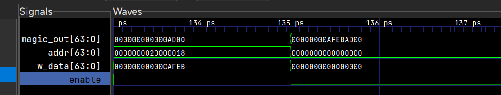

# MagicBox

> 某用户在自定义硬件上运行了一份程序, 该程序怀疑有后门序列

## 题解

逆向 `SOC_run_sim`，可以看到主项目是由 [https://github.com/Nambers/0dMIPS](https://github.com/Nambers/0dMIPS)
派生出来的，从中可以找到项目的使用方法。和分发的源码对比，不难发现多了 magic 指令，
当向魔法地址范围写入内容时，会取出低 16 位数据，然后放入 `magic_out` 中，分四次填充满。
注意 `magic_out` 和 `buffer` 是同步的。

```verilog
        end else if (enable & (addr >= MAGIC_BASE_ADDR && addr < MAGIC_BASE_ADDR + 8)) begin
            if (|mem_store_type) begin
                buffer[(i*16)+15-:16] <= w_data[15:0];
                i <= i + 1;
            end
```

类比成C语言就是下面这样：

```c
uint8_t magic_out[8];
((uint16_t *)magic_out)[0] = num0;
((uint16_t *)magic_out)[1] = num1;
((uint16_t *)magic_out)[2] = num2;
((uint16_t *)magic_out)[3] = num3;
```

接下来观察给的 memory.mem 文件，开头 8 字节是内核代码地址，即从 `syscall` 进入的位置，0x390。
根据 `configure.sv`，主代码从 0x100 开始，由于项目代码针对的是 MIPS 架构 64 位小端，
所以我们可以使用 Capstone 来反汇编指令，得到

```mipsasm
_start:
0x100:  addiu   $sp, $zero, 0x600
0x104:  addiu   $gp, $zero, 0x3e0
0x108:  addiu   $ra, $zero, 0xd00
0x10c:  addiu   $t9, $zero, 0x200
0x110:  jr      $t9
0x114:  nop
print:
0x118:  lb      $a1, ($a0)
0x11c:  beqz    $a1, 0x188
0x120:  nop
0x124:  addiu   $a3, $zero, 7
0x128:  lui     $t0, 0x2000
0x12c:  daddiu  $sp, $sp, -0x10
0x130:  daddiu  $v1, $a0, 1
0x134:  move    $v0, $zero
0x138:  daddu   $a2, $sp, $v0
0x13c:  move    $a0, $v1
0x140:  sb      $a1, ($a2)
0x144:  daddiu  $v0, $v0, 1
0x148:  lb      $a1, ($v1)
0x14c:  daddiu  $v1, $v1, 1
0x150:  beqz    $a1, 0x160
0x154:  nop
0x158:  bne     $v0, $a3, 0x138
0x15c:  nop
0x160:  daddu   $v0, $sp, $v0
0x164:  sb      $zero, ($v0)
0x168:  ld      $v0, ($sp)
0x16c:  sd      $v0, 0x10($t0)
0x170:  lb      $a1, ($a0)
0x174:  bnez    $a1, 0x130
0x178:  nop
0x17c:  daddiu  $sp, $sp, 0x10
0x180:  jr      $ra
0x184:  nop
0x188:  jr      $ra
0x18c:  nop
hexify:
0x190:  lui     $v1, 0
0x194:  lui     $v0, 0
0x198:  daddiu  $v1, $v1, 0
0x19c:  daddiu  $sp, $sp, -0x20
0x1a0:  dsll32  $v1, $v1, 0
0x1a4:  lui     $a2, 0x2000
0x1a8:  daddu   $v1, $v1, $v0
0x1ac:  daddiu  $v0, $v1, 0x3b0
0x1b0:  ld      $a1, 0x3b0($v1)
0x1b4:  ld      $a3, 8($v0)
0x1b8:  addiu   $v1, $zero, 0x1c
0x1bc:  lbu     $v0, 0x10($v0)
0x1c0:  sd      $a1, ($sp)
0x1c4:  addiu   $a1, $zero, -4
0x1c8:  sd      $a3, 8($sp)
0x1cc:  sb      $v0, 0x10($sp)
0x1d0:  srlv    $v0, $a0, $v1
0x1d4:  addiu   $v1, $v1, -4
0x1d8:  andi    $v0, $v0, 0xf
0x1dc:  daddu   $v0, $sp, $v0
0x1e0:  lb      $v0, ($v0)
0x1e4:  sb      $v0, 0x10($a2)
0x1e8:  bne     $v1, $a1, 0x1d0
0x1ec:  nop
0x1f0:  daddiu  $sp, $sp, 0x20
0x1f4:  jr      $ra
0x1f8:  nop
0x1fc:  nop
main:
0x200:  daddiu  $sp, $sp, -0x10
0x204:  sd      $ra, 8($sp)
0x208:  addiu   $at, $zero, 0xd00
0x20c:  syscall 0xd00
0x210:  lui     $t1, 0
0x214:  lui     $v0, 0
0x218:  daddiu  $t1, $t1, 0
0x21c:  daddiu  $v0, $v0, 0x3e0
0x220:  dsll32  $t1, $t1, 0
0x224:  daddu   $t1, $t1, $v0
0x228:  daddiu  $v1, $t1, 6
0x22c:  move    $v0, $t1
0x230:  move    $a1, $at
0x234:  nop
0x238:  lhu     $a0, ($v0)
0x23c:  daddiu  $v0, $v0, 2
0x240:  xor     $a0, $a0, $a1
0x244:  sh      $a0, -2($v0)
0x248:  bne     $v0, $v1, 0x234
0x24c:  nop
0x250:  lui     $at, 0xc
0x254:  ori     $at, $at, 0xafeb
0x258:  syscall 0xcafeb
0x25c:  move    $v0, $t1
0x260:  move    $a1, $at
0x264:  nop
0x268:  lhu     $a0, 6($v0)
0x26c:  daddiu  $v0, $v0, 2
0x270:  xor     $a0, $a0, $a1
0x274:  sh      $a0, 4($v0)
0x278:  bne     $v0, $v1, 0x264
0x27c:  nop
0x280:  addiu   $at, $zero, 2
0x284:  break   2
0x288:  move    $v0, $t1
0x28c:  move    $a1, $at
0x290:  nop
0x294:  lhu     $a0, 0xc($v0)
0x298:  daddiu  $v0, $v0, 2
0x29c:  xor     $a0, $a0, $a1
0x2a0:  sh      $a0, 0xa($v0)
0x2a4:  bne     $v0, $v1, 0x290
0x2a8:  nop
0x2ac:  addiu   $at, $zero, 0xcb
0x2b0:  break   0xcb
0x2b4:  move    $v0, $t1
0x2b8:  move    $a1, $at
0x2bc:  nop
0x2c0:  lhu     $a0, 0x12($v0)
0x2c4:  daddiu  $v0, $v0, 2
0x2c8:  xor     $a0, $a0, $a1
0x2cc:  sh      $a0, 0x10($v0)
0x2d0:  bne     $v0, $v1, 0x2bc
0x2d4:  nop
0x2d8:  lui     $v0, 0x2000
0x2dc:  lw      $a0, 0x18($v0)
0x2e0:  ld      $t0, 0x18($v0)
0x2e4:  jal     0x190
0x2e8:  nop
0x2ec:  lui     $v0, 0xfa4d
0x2f0:  daddiu  $v0, $v0, 0x4b1f
0x2f4:  dsll    $v0, $v0, 0x10
0x2f8:  daddiu  $v0, $v0, 0xc1b
0x2fc:  dsll    $v0, $v0, 0x11
0x300:  daddiu  $v0, $v0, 0x752c
0x304:  beq     $t0, $v0, 0x340
0x308:  nop
0x30c:  lui     $v0, 0x2000
0x310:  addiu   $v1, $zero, 0xa
0x314:  lui     $a0, 0
0x318:  sb      $v1, 0x10($v0)
0x31c:  daddiu  $a0, $a0, 0
0x320:  lui     $v0, 0
0x324:  daddiu  $v0, $v0, 0x3d8
0x328:  dsll32  $a0, $a0, 0
0x32c:  daddu   $a0, $a0, $v0
0x330:  jal     0x118
0x334:  nop
0x338:  b       0x338
0x33c:  nop
0x340:  lui     $a0, 0
0x344:  lui     $v0, 0
0x348:  daddiu  $a0, $a0, 0
0x34c:  daddiu  $v0, $v0, 0x3c8
0x350:  dsll32  $a0, $a0, 0
0x354:  daddu   $a0, $a0, $v0
0x358:  jal     0x118
0x35c:  nop
0x360:  lui     $v0, 0x2000
0x364:  daddiu  $a0, $t1, 0x30
0x368:  lb      $v1, 1($t1)
0x36c:  daddiu  $t1, $t1, 2
0x370:  sb      $v1, 0x10($v0)
0x374:  lb      $v1, -2($t1)
0x378:  sb      $v1, 0x10($v0)
0x37c:  bne     $a0, $t1, 0x368
0x380:  nop
0x384:  b       0x30c
0x388:  nop
0x38c:  nop
interupt_handler:
0x390:  mfc0    $k0, $t0, 1
0x394:  srl     $k1, $k0, 6
0x398:  lui     $k1, 0x2000
0x39c:  ori     $k1, $k1, 0x18
0x3a0:  sw      $at, ($k1)
0x3a4:  eret
0x3a8:  b       0x3a8
0x3ac:  nop
```

利用 0dmips 的基础设施，定位好函数后，整段反汇编写到 `magic.S` 中，
要把0x390处的 `mfc0` 指令删除，因为无法正常汇编（可能是反汇编的问题）。
接下来将 `memory.mem` 中的数据放到文件开始的数据声明区，并将硬编码的地址换成标签，
就可以借助项目，将文件编译为 `magic.elf`，放在 `build/example_asm` 下。
将其拖入Ghidra，可以大致反编译得到如下信息：

> [!NOTE]
> 其实从官方给的案例中可以看出，题目是写了C文件编译成的，由于我们是在逆向回去，
> 因此不能做到各部分地址和题目给的memory一样，请根据我的解释分析。

```c
void print(char *param_1) {
  longlong lVar1;
  longlong lVar2;
  char cVar3;
  undefined8 local_10;
  
  cVar3 = *param_1;
  if (cVar3 == '\0')
    return;
  do {
    lVar1 = 0;
    do {
      lVar2 = lVar1;
      param_1 = param_1 + 1;
      *(char *)((longlong)&local_10 + lVar2) = cVar3;
      cVar3 = *param_1;
      if (cVar3 == '\0') break;
      lVar1 = lVar2 + 1;
    } while (lVar2 + 1 != 7);
    *(undefined1 *)((longlong)&local_10 + lVar2 + 1) = 0;
    _DAT_20000010 = local_10;
    cVar3 = *param_1;
    if (cVar3 == '\0')
      return;
  } while( true );
}

void hexify(uint param_1) {
  uint uVar1;
  uint uVar2;
  char local_20 [8];
  char local_18 [8];
  char local_10;
  
  uVar2 = 0x1c;
  local_20 = (char  [8])dict._0_8_;
  local_18 = (char  [8])dict._8_8_;
  local_10 = dict[0x10];
  do {
    uVar1 = uVar2 & 0x1f;
    uVar2 = uVar2 - 4;
    DAT_20000010 = local_20[(longlong)(int)(param_1 >> uVar1) & 0xf];
  } while (uVar2 != 0xfffffffc);
  return;
}

void main(void) {
  ushort *puVar1;
  ushort *puVar2;
  longlong lVar3;
  ushort *puVar4;
  
  syscall(0xd00);
  puVar4 = (ushort *)&somedata; // encrypted flag
  puVar2 = puVar4;
  do {
    puVar1 = puVar2 + 1;
    *puVar2 = *puVar2 ^ 0xd00;
    puVar2 = puVar1;
  } while (puVar1 != &DAT_00000427);
  syscall(0xcafeb);
  puVar2 = puVar4;
  do {
    puVar1 = puVar2 + 1;
    puVar2[3] = puVar2[3] ^ 0xafeb;
    puVar2 = puVar1;
  } while (puVar1 != &DAT_00000427);
  trap(0x800);
  puVar2 = puVar4;
  do {
    puVar1 = puVar2 + 1;
    puVar2[6] = puVar2[6] ^ 2;
    puVar2 = puVar1;
  } while (puVar1 != &DAT_00000427);
  trap(0x32c00);
  puVar2 = puVar4;
  do {
    puVar1 = puVar2 + 1;
    puVar2[9] = puVar2[9] ^ 0xcb;
    puVar2 = puVar1;
  } while (puVar1 != &DAT_00000427);
  lVar3 = CONCAT44(uRam000000002000001c,_DAT_20000018);
  hexify(_DAT_20000018);
  if (lVar3 == -0xb6569c1e7c98ad4) {
    print(0x417);
    if (puVar4 + 0x18 == puVar4 + 1)
      while( true );
  }
  DAT_20000010 = 10;
  print(0x411);
  while( true );
}
```

对于这种向标准输出打印内容是向 `0x20000010` 写地址，程序中还有裸的 syscall 的情况，
反编译确实不能做得尽善尽美，但至少能看个逻辑。 `interupt_handler`，即内核代码的逻辑，
是向 `0x20000018` 写系统调用号的（ `mfc0` 和后面那条指令是无效的，被接下来的指令逻辑覆盖了）。
结合反编译，以及 `magic` 单元，可以知道这是在往 `magic_out` 中填充数据。

主函数除了系统调用写数据以外，还会拿系统调用号和密文做异或，每次异或半字，
每轮异或三次，总共4轮，4个密钥，最后全部异或完24字节密文。
接下来从 `0x20000018` 处抽取出了双字，先将其低32位用16进制打印出来，
再判断这个双字是否和 `-0xb6569c1e7c98ad4` 相等，如果不相等，就打印 `HALT`，
然后进入死循环。我们看到的情况就是运行模拟器，打印 `00000000` 和 `HALT`，
模拟器终止。难道写入 `magic_out` 都是无效的吗？那多这一段判断有什么必要呢？

> [!TIP]
> 反编译中的 `0x417` 是 `:) flag=` 的地址，`0x411` 是 `HALT` 的地址。
>
> MIPS 一个“字”是4个字节。模拟器支持 `syscall` 和 `break` 两种方式陷入内核，
> 不用管反编译的结果，关注反汇编中调用时携带的数据即可。

难道 magic 单元就没有工作？使用 GTKWave 检查输出的 `trace.vcd`，可以发现是有值的。



既然 `magic_out` 正常工作，那可能只是因为无法读取这个地址，因此显示为全0，
不影响逻辑，接着分析当 `magic_out` 是 `-0xb6569c1e7c98ad4` 的情况，发现先打印了 `:) flag=`，
然后打印了解密后 flag 的位置（这部分在反编译中没有显示，对应 0x360-0x37c 处的反汇编），
也就是说，将正确的 flag 打印出来。要注意的是打印 flag 的逻辑，并非从低地址到高地址依次打印，
而是按两个字节为一组，组内交换打印的方式，说人话即索引从0开始，按 1, 0, 3, 2, 5, 4
顺序去打印 flag 字节。

结合这个逻辑，可以推测出之前用来解密的密钥是错误的，所以拿那些密钥来还原密文自然是不可读的，
用正确的密钥，按逻辑解密密文，就可以打印出真正的 flag。例如可以用 Python 写以下解密脚本：

```python
from pwn import *
# -0xb6569c1e7c98ad4 == 2c 75 36 18 3e 96 9a f4

def revert(hexcode: str, passwd: int) -> str:
    decoded = list(xor(bytes.fromhex(hexcode), p16(passwd)).decode())
    for i in range(0, 6, 2):
        decoded[i], decoded[i + 1] = decoded[i + 1], decoded[i]
    return ''.join(decoded)

"""
encrypted flag:
40 13 4b 14
5f 0e 45 61
02 7b 5a 74
7f c9 61 c2
56 f5 f9 91
bb 9f 9a 89
"""

parts = [
    revert('40 13 4b 14 5f 0e', 0x752c),
    revert('45 61 02 7b 5a 74', 0x1836),
    revert('7f c9 61 c2 56 f5', 0x963e),
    revert('f9 91 bb 9f 9a 89', 0xf49a),
]
print(''.join(parts))

# flag{sysc4ll_AT_check!}\x00
```

## 题外话

原本是想把 magic 单元编译到 0dMIPS 中的，但是怎么改 CMakeLists.txt
都会报一个 verilator 编译失败的错误，导致我没法一步一步跟调，
就只能用这种比较麻烦的办法。

## 参考

[Nambers/0dMIPS WIP in-order 5-stages pipeline MIPS64r6el SoC implementation](https://github.com/Nambers/0dMIPS)
